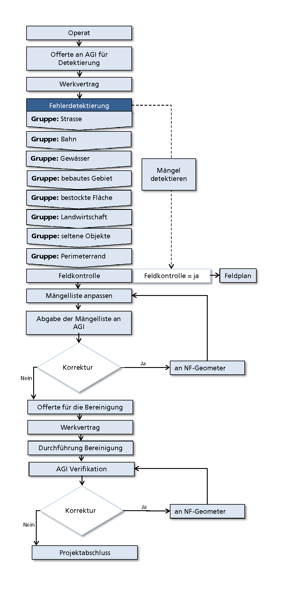

Allgemein
=========
Ziel und Zweck
--------------
Das vorliegende Dokument soll als Richtlinie für Durchführung der periodischen Nachführung und Homogenisierung im Kanton Solothurn dienen. 
Ziel ist es, dass die periodischen Nachführung und Homogenisierung im Kanton Solothurn im Bereich des Möglichen einheitlich ausgeführt werden. 

.. important:: 
   Im Rahmen der periodischen Nachführung und Homogeniserung werden nicht alle Objekt gemäss `Handbuch der amtlichen Vermessung Kanton Solothurn` korrigiert. 
   In diesem Dokument ist festgelegt, welche Objekte in der periodischen Nachführung und Homogenisierung zu korrigieren sind und welche nicht zu korrigieren sind.

                                                  
                                                                 
Begriffe                                                                                            
--------

Laufende Nachführung                                                                                    
^^^^^^^^^^^^^^^^^^^^

Laufend nachgeführt werden alle Objekte der amtlichen Vermessung bei denen ein Meldewesen organisiert werden kann. 
Demnach sind alle Objekte deren Errichtung oder Änderung bewilligungspflichtig sind, laufend nachzuführten.
Mit der laufenden Nachführung soll die amtliche Vermessung vor allem im bebauten Gebiet aktuell gehalten werden.

| Beispiel: Bau eines Gebäudes 

.. important::                                   
   Die laufende Nachführung wird nach `Handbuch der amtlichen Vermessung Kanton Solothurn` ausgeführt.   
                                         
Periodische Nachführung (PNF)
^^^^^^^^^^^^^^^^^^^^^^^^^^^^^
Periodisch nachgeführt werden alle Objekte, für die **kein** Meldewesen organisiert werden kann. Solche Objekte sind auf Grund von natürliche Veränderungen nachzuführen. 
Mit der periodische Nachführung soll die amtliche Vermessung vor allem ausserhalb des Baugebietes aktuell gehalten werden.

| Beispiel: Waldrand

Homogenisierung
^^^^^^^^^^^^^^^
Infolge des technischen Wandels, neuer Erkenntnisse, unterschiedlicher bzw. sich wandelnder Richtlinien und unterschiedlicher Praxis sind die Vermessungswerke 
auch im Standard AV93 nicht einheitlich. Sobald die Daten der amtlichen Vermessung über die Operatsgrenze hinaus verwendet werden, sind diese strukturellen und inhaltlichen
Inhomogenitäten störend oder führen bei den Benutzerinnen und Benutzern zu einem erheblichen Nachbearbeitungsaufwand. Bestehende Vermessungswerke sind zu bereinigen,
so dass strukturellen und inhaltlichen Inhomogenitäten nur noch geringfügig existieren.

Gesetzlische Grundlage
----------------------
* Bundesgesetz über die Geoinformation (Geoinformationsgesetz, GeoIG)

.. code-block:: none

   Art. 8: "Beim Erheben und Nachführen von Geobasisdaten sind Doppelspurigkeiten zu vermeiden. Für das Erheben und Nachführen von Geobasisdaten besteht Methodenfreiheit, 
   sofern die Vergleichbarkeit der Ergebnisse gewährleistet ist."
     
* Verordnung über die amtliche Vermessung (VAV) 211.432.2
 

.. code-block:: none

   Art. 22: "Sämtliche Bestandteile der amtlichen Vermessung unterliegen der Nachführungspflicht."
   Art. 24: "Alle Daten, die nicht der laufenden Nachführung unterliegen, sind periodisch nachzuführen. Jede periodische Nachführung hat sich jeweils über ein 
   grösseres zusammenhängendes Gebiet zu erstrecken."
     
* Technische Verordnung des VBS über die amtlichen Vermessung (TVAV) 211.432.21
* Verordnung über die amtliche Vermessung (VaV-AO) 212.477.1 

.. code-block:: none

   Art. 16: "Daten, die nicht laufend nachgeführt werden, sind in der Regel alle sechs bis zwölf Jahre periodisch nachzuführen
* Handbuch der amtlichen Vermessung des Kantons Solothurn 
* Richtlinie der Arbeitsgruppe KKVA „Periodische Nachführung der amtlichen Vermessung“

.. _ref_RefDaten:

Referenzdaten
-------------

Als Referenz dient hauptsächlich das aktuelle Orthofoto. 
Weiter Referenzdaten, sind in der QGIS-Fachschale integriert. Diese sind:

.. important::    
   Die Richtigkeit und Vollständigkeit dieser Daten wir nicht garantiert.

=========================  ===========================================================  =============================================     ===================================                  
Layername (QGIS)            Beschreibung                                                 Herkunft                                         Erhebungszeitpunkt 
=========================  ===========================================================  =============================================     ===================================  
GEWISSO	                   Gewässerinformationssystem                                   Digitalisiert ab Übersichtsplans 1:10 000         2012
Wanderwege                 kantonal flächendeckende Grundlage der Fuss- und Wanderwege  Digitalisiert ab lk 25 000                        2012
Freileitungen (ARP)        Freileitung                                                  Digitalisiert ab lk 25 000 / SIKOSO-Daten         2007  
Abbaustellen (AFU)         Richtplan - Abbaustellen                                                                                       2012
Flachmoore (AFU)           Flachmoore                                                   Feldbegehung durch ANL AG, Digitalisiert          2006
Flachmoore (BAFU)          Bundesinventar der Flachmoore von nationaler Bedeutung       Feldbegehung durch ANL AG, Digitalisiert          1990, 1996, 1998, 2000, 2003, 2007
Hochmoore (BAFU)           Bundesinventar der Hochmoore von nationaler Bedeutung        Digitalisiert LK                                  1990-2002, 2007
Reservoir                  Gewässeranalyse Datenbank Solothurn GASO                     Digitale Eingabe der Koordinaten                  2006-2008
Waldplan		   Forstliche Plangrundlagen			                AV als Grundlage/ Feldkontrolle durch Förster     alle 10 Jahre neu erstellt 
Radio- und Fernsehsender   Daten von geo.admin.ch                                         
Mobilfunkantennen UMTS     Daten von geo.admin.ch                                                                                           
Mobilfunkantennen GSM      Daten von geo.admin.ch                                                                                                
=========================  ===========================================================  =============================================     ===================================

                                                                                                                                 

                                                         

Vorgehen beim Projekt: Periodische Nachführung und Homogenisierung 
------------------------------------------------------------------
.. _Diagramm_Vorgehen:                                   
                                                         

                                                        

In einem ersten Schritt werden die Objekte die nachzuführen resp. die zu homogenisieren sind detektiert. Eine QGIS Fachschale unterstützt die Detektierung.  
Dazu ist das AV-Operat im Interlis Format in die QGIS Fachschale zu importieren gemäss (https://docs.google.com/document/d/1cA-7Qe-clG3pW9366pJQoRACNlejM9B9hvu0ljdrKQw/edit?pli=1#heading=h.f2eudjvbbct5 ).

Als Referenz für die Detektierung wird hauptsächlich ein aktuelle Orthofoto verwenden. Dabei ist zu berücksichtigen, dass Mutationen in der AV jünger als das Orthofoto sind ja nicht nach Situation des Orthofotos korrigiert werden.
Zum Beispiel bei Strassen kann ein Strassenobjekt in der AV aktueller sein als auf dem Orthofoto.       

Detektierung nach Gruppen
^^^^^^^^^^^^^^^^^^^^^^^^^
Um den Überblick über die Detektion zu erhalten, werden die Objekte Gruppenweise untersucht. Der Vorteil beim Gruppenweisen vorgehen ist, dass man sich auf ein Thema konzentrieren kann. 
Folgenden Gruppen wurden gebildet:

==================  ==============================================================================================
Gruppe              Bemerkung  
==================  ==============================================================================================
Strasse             Alle Objekte im Strassenbereich werden kontrolliert
Bahn                Alle Objekte im Bahnbereich werden kontrolliert
Gewässer            Alle Objekte entlang dem fliessenden Gewässer und stehende Gewässer werden kontrolliert
Bebautes Gebiet     Alle Objekte in bebauten Gebieten werden Kontrolliert. Dazu zählen auch Höfe und Reservoir im TS3/4
Bestockte Fläche    Alle bestockten Objekte werden kontrolliert
Landwirtschaft      Alle Objekte die für die Landwirtschaft als Nutzfläche dienen werden kontrolliert
Seltene Objekte     Alle Objekte die nicht häufig vorkommen
Perimeterrand       Kontrolle der Objekt über den Perimeterrand hinaus
==================  ==============================================================================================
   
Mängelpunkte erfassen
^^^^^^^^^^^^^^^^^^^^^     
Werden Objekte gefunden bei denen die AV angepasst werden muss, sind diese mit einem Mängelpunkt oder -linie zu kennzeichnen. Mängellinien werden nur erfasst bei Lagedifferenzen oder bei fehlenden Objekten.    
                             

| Zu dem Mängelpunkt/-linien werden folgende Attribute erfasst:

+------------------------------+-----------------------------------------------------------------------------------------------------------------------------------------------------------+                      
| Attributname                 |  Beschreibung                                                                                                                                             |
+------------------------------+-----------------------------------------------------------------------------------------------------------------------------------------------------------+  
| Gruppe                       | Zuweisung der Gruppe (Strasse, Bahn, Gewässer, Bebautes Gebiet, Bestockte Fläche, Landwirtschaft, Seltene Objekte, Perimeterrand)                         |      
+------------------------------+-----------------------------------------------------------------------------------------------------------------------------------------------------------+           
| Art                          | Auswahl der BB.Art oder EO.Art die momentan in der AV vorhanden ist.                                                                                      |
|                              | Ausnahme bei Objekten die fehlen. Da soll die BB.Art oder EO.Art abgefüllt werden, die eben neu zu erheben ist.                                           |   
+------------------------------+-----------------------------------------------------------------------------------------------------------------------------------------------------------+                                                                                                               
| Fehler                       | ====================================  ====================================================================================================================|                             
|                              | Lagedifferenz                         Feststellung einer Lagedifferenz grösser als die Toleranz (siehe :ref:`ref_Tz`) zwischen der AV und dem Orthofoto . |                             
|                              | Löschen                               Objekt ist aus der AV zu löschen. Dies ist auch der Fall, wenn das Objekt den Aufnahmekriterien nicht genügt.       |                             
|                              | fehlt                                 Objekt fehlt in der AV                                                                                              |                            
|                              | umattribuieren                        Objekt ist falsch attribuiert und eventuell in der falschen Topic (EO <-> BB). Geometrie wird nicht verändert.      |                     
|                              | Darstellung nicht nach Richtlinie     Objekt ist nicht nach Richtlinie dargestellt                                                                        |                     
|                              | weitere                               Falls ein Fehler in keine Fehlerart passt kann dieser unter "weitere" erfasst werden                                |                             
|                              | ====================================  ====================================================================================================================|                            
+------------------------------+-----------------------------------------------------------------------------------------------------------------------------------------------------------+
| Feldkontrolle                | Falls eine Interpretation auf dem Orthofoto schwierig ist (z.B. durch Schatten oder Sichthindernisse wie Bäume) könne die betroffenen Objekte auf dem Feld|
|                              | kontrolliert werden. Dazu ist ein Häklein zu setzen. So könne die Objekte auf dem Feld gezielt begangen werden.                                           |
|                              | Falls die Feldkontrolle ergibt dass keine Bereingung in der AV vorgenommen werden muss, kann der Mängelpunkt resp. die Mängellinien gelöscht werden.      |                                          
+------------------------------+-----------------------------------------------------------------------------------------------------------------------------------------------------------+                        
| Laufende Nachführung         | Für die Kostenverteilung der Bereinigungsarbeiten muss zwingen zwischen laufender und periodischer Nachführung unterschieden werden.                      | 
+------------------------------+-----------------------------------------------------------------------------------------------------------------------------------------------------------+  
| digitalisieren ab Orthofoto  | Für die Berechnung der Kosten ist die Information, ob ab dem Orthofoto digitalisiert werden kann, relevant. (siehe :ref:`ref_Metherei`)                   |
+------------------------------+-----------------------------------------------------------------------------------------------------------------------------------------------------------+ 
| Bemerkung                    | Jegliche Bemerkungen können hier angebracht werden. Falls ein Objekt umattribuiert wird, ist hier die neu BB.Art oder EO.Art aufzuführen.                 |
+------------------------------+-----------------------------------------------------------------------------------------------------------------------------------------------------------+

.. note::
   Falls mehrere der vordefinierten Attributwerte unter dem Attribut "Fehler" zum Mängelpunkt resp. Mängellinie passt, ist nur ein Mängelpunkt resp. Mängellinie zu erfassen. Evtl. ist bei solchen Fällen der Attributwert "weitere" zu verwenden.

   
.. _ref_Metherei:

Bereinigung der Mängel
^^^^^^^^^^^^^^^^^^^^^^

Die Mängel sind zu bereinigen. Dazu können die Objekte wenn möglich ab dem aktuellen Orthofoto (Auflösung 12.5 cm) digitalisiert werden.
 

+--------------------------------------------------------------------------------------------------+--------------------------------------------------------------------+
|.. _Erfassungsmethode:                                                                            |.. _Erfassungsmethode_Legede:                                       |
|                                                                                                  |                                                                    |
|.. figure:: _static/Erfassungsmethode.png                                                         |.. figure:: _static/Legende_Erfassungsmethode.png                   |
|   :width: 600px                                                                                  |   :width: 350px                                                    |
|   :target: _static/Erfassungsmethode.png                                                         |   :target: _static/Legende_Erfassungsmethode.png                   |
|                                                                                                  |                                                                    |
|   Beurteilung der Methoden; Quelle: Richtlinie der Arbeitsgruppe KKVA                            |                                                                    |
|   periodischen Nachführung der amtlichen Vermessung                                              |                                                                    |
+--------------------------------------------------------------------------------------------------+--------------------------------------------------------------------+ 

  
                                                                                                                                                 
Kosten
------
                                                                                                 
Die Kosten für die laufende Nachführung werden dem Verursacher in Rechnung gestellt. Die laufende Nachführung kann zeitlich mit der PNF/ Homogenisierung oder nachträglcih erfolgen. 
Für die Kostenverteilung der Bereinigungsarbeiten muss zwingen zwischen laufender und periodischer Nachführung/ Homogenisierung unterschieden werden.          
 
========================      =============================================================================
Kostenverteilung              Beschreibung
========================      =============================================================================                           
 Laufende Nachführung         | ``BB.Gebäude`` fehlt/ löschen ????? Baujahr jünger 10 Jahre  
                              | ``EO.Unterstand`` fehlt/ löschen ????? Baujahr jünger 10 Jahre 
                              | ``EO.Unterirdisches Gebäude`` fehlt/ löschen ????? Baujahr jünger 10 Jahre 
                              | ``BB.Wasserbecken`` fehlt/ löschen ????? Baujahr jünger 10 Jahre                       
                              | ``EO.Reservoir`` fehlt/ löschen ????? Baujahr jünger 10 Jahre  
                              | ``EO.Lärmschutzwand`` fehlt/ löschen ????? Baujahr jünger 10 Jahre     
                              | ``BB.Strasse_Weg`` fehlt Baujahr jünger 10 Jahre ???????
                              | ``BB.Parkplatz`` fehlt/ löschen Baujahr jünger 10 Jahre 
                              | ``BB.Steinbruch`` fehlt/ Lagedifferenz auf Grund von Bauarbeiten ????
                              | ``BB.Kiesgrube`` fehlt/ Lagedifferenz auf Grund von Bauarbeiten ????
                              | ``BB.Deponie`` fehlt/ Lagedifferenz auf Grund von Bauarbeiten ????
                              | ``BB.uebriger_Abbau`` fehlt/ Lagedifferenz auf Grund von Bauarbeiten ????

                                            
 PNF/Homogenisierung          | alle Lagedifferenz (ausgenommen Abbau oder Deponien)
                              | alle Objekte auf öffentlichem Grund die fehlen resp. zu löschen sind
                              | alle Objekte die umzuattribuieren sind     
                              | alle Objekte die nicht nach Richtlinien dargestellt sind  
========================      =============================================================================                                            

Die Kosten der Periodische Nachführung und Homogenisierung werden Pauschal vom zuständigen Nachführungsgeometer resp. der zuständigen Nachführungsgeometerin in zwei Etappen offeriert.??????????
                
=================   ==============     
Etappe 1            Detektierung
Etappe 2            Bereinigung
=================   ==============  
         
          
   

                                                                                                                                                                                          
Dokumentation
--------------

Plan für Feldkontrolle
^^^^^^^^^^^^^^^^^^^^^^
Die Objekte die auf dem Orthofoto schwierig zu interpretieren sind werden auf dem Feld kontrolliert. Dazu sind alle Mängel mit dem Häklein Feldkontrolle zu selektieren und auf einem Plan darzustellen. Auf dem Feld werden die Bemerkungen der Kontrollergebnisse direkt in den Plan notiert.  

Bereinigung
^^^^^^^^^^^
|  Können Objekte nur durch Aufnahmen (GNSS oder Tachymeter) im Feld erfasst werden, sind diese Aufnahmen gemäss Anhang B der TVAV zu protokollieren. 
|  Objekte die digitalisiert werden können direkt angepasst werden. 
   Ein itf Stand (an AGI abzugeben) vor der Bereinigung sichert den alten Zustand. Durch das Attribut `digitalisieren ab Orthofoto` in der Mängelliste ist genau nachzuvollziehen wo digitalisiert wurde. 
 
.. important:: 
   Auf korrekte Erfassung in Tabelle BBNachführung und EONachführung achten!

                                                                                                                                                         
Unternehmerbericht
^^^^^^^^^^^^^^^^^^                          
Nach Abschluss der Arbeiten wir ein Unternehmerbericht zu verfassen gemäss dem vordefinierten Raster .......

Verifikation
------------
Die Verifikation wir in zwei Schritten durchgeführt. 

1. Verifikation  wird nach der Mängeldetektion durchgeführt. Dazu sind die detektierten Mängel als Shapefile und der Plan der Feldkontrolle (analog) ans AGI abzugeben.
2. Verifikation wird nach der Bereinigung der Mängel durchgeführt. An das AGI ist hierbei das Operat in Interlis-Format (kontrolliert mit MOCHECKSO2) abzugeben.    
                                                                                       
                                                                                                                                                                                         
                        

QGIS Fachschale PNF/HOM
------------------------
Anleitungen zu QGIS Fachschale PNF/HOM .......    

-  Raster für Überblick

.. index:: 
                                                                                                                                                                                                      
