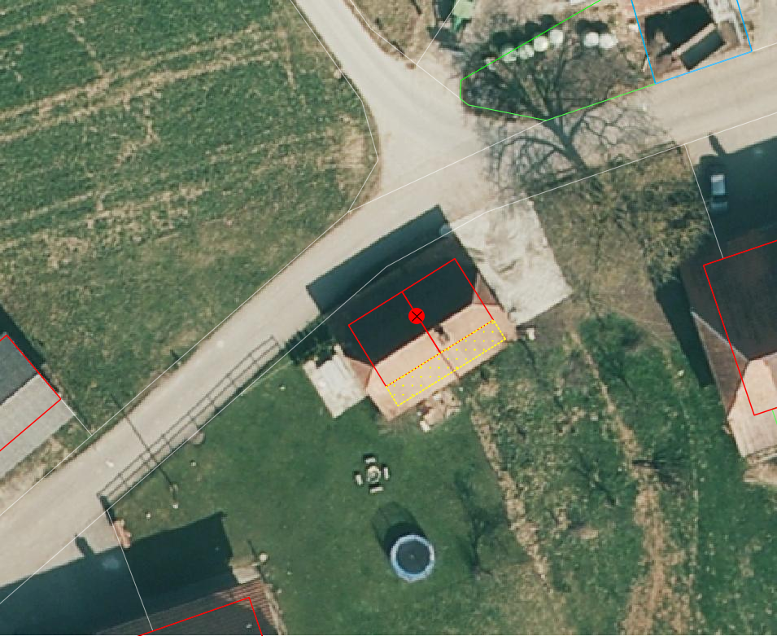

.. _ref_BebautesGebiet:

Bebautes Gebiet
===============
In dieser Mängelgruppe wird das bebaute Gebiet überprüft. Das bebaute Gebiet beinhaltet die TS2 und sämtliche Bauten inkl. Umschwung in der TS3 und TS4. Die Toleranzen bleiben TS-abhängig (siehe :ref:`ref_Tz`). Folgende Objekte werden geprüft:

==================  ==================
Topic  		    Art    
==================  ================== 
Bodenbedeckung      Gebaeude 
Bodenbedeckung      Gartenanlage
Bodenbedeckung      Wasserbecken
Bodenbedeckung      Lagerplatz
Bodenbedeckung      Gebaeudeerschliessung
Bodenbedeckung      Parkplatz
Bodenbedeckung      uebrige_befestigte
Bodenbedeckung      Objektname
Einzelobjekt        Mauer
Einzelobjekt        unterirdisches_Gebaeude
Einzelobjekt        uebriger_Gebaeudeteil
Einzelobjekt        wichtige_Treppe
Einzelobjekt        Reservoir
Einzelobjekt        Unterstand
Einzelobjekt        Silo_Turm_Gasometer
Einzelobjekt        Objektname
==================  ==================

BB.Gebaeude
-----------

Lagedifferenz
^^^^^^^^^^^^^
Lagemässig fehlerhaft erfasste Gebäude (z.B. Verdrehungen des Grundrisses) zu korrigieren. Können die Gebäude nicht aus bestehenden Aufnahmen korrekt gerechnet werden, muss die Neuaufnahme terrestrisch erfolgen. 

.. note::
   Fehler aus der laufenden Nachführung können nicht über die PNF/Homogenisierung abgerechnet werden.

Benötigte Layer in QGIS:

.. code-block:: none

   Bebautes Gebiet / Lagekontrolle

Beispiele:

.. _fig_bebaut_1:

.. figure:: _static/Bebaut_Lagedifferenz_Gebauede.png
   :width: 450px
   :target: _static/Bebaut_Lagedifferenz_Gebauede.png

   Das verdrehte Gebäude muss korrekt erfasst werden. Entweder mittels vorhandenen Unterlagen oder durch Neuaufnahme.

Objekt fehlt
^^^^^^^^^^^^
Fehlende Gebäude müssen terrestrisch erfasst werden. Betreffend Aufnahmepflicht gelten die Regeln des *Handbuches der amtlichen Vermessung Kanton Solothurn*. Eventuell muss während der Feldkontrolle die Aufnahmepflicht überprüft werden.

.. note::
   Sofern das Gebäude **nicht** älter als 10 Jahre ist, muss es über die laufende Nachführung abgerechnet werden.

Benötigte Layer in QGIS:

.. code-block:: none

   Bebautes Gebiet / Lagekontrolle

Objekt löschen
^^^^^^^^^^^^^^
Gebäude, die kleiner 6 m2 sind oder nicht mehr vorhandens sind, sind zu löschen.

Benötigte Layer in QGIS:

.. code-block:: none

   Bebautes Gebiet / Lagekontrolle
   Bebautes Gebiet / Checklayer / BB.Gebaeude < 6m2

Beispiele:

+---------------------------------------------------------------------+-----------------------------------------------------------------------+
|.. _fig_bebaut_2:                                                    |.. _fig_bebaut_3:                                                      |
|                                                                     |                                                                       |
|.. figure:: _static/Bebaut_Loeschen_Gebaeude_6m2.png                 |.. figure:: _static/Bebaut_Loeschen_Gebaeude.png                       |
|   :width: 550px                                                     |   :width: 550px                                                       |
|   :target: _static/Bebaut_Loeschen_Gebaeude_6m2.png                 |   :target: _static/Bebaut_Loeschen_Gebaeude.png                       |
|                                                                     |                                                                       |
|   ``BB.Gebaeude`` ist zu löschen, da kleiner 6 m2.                  |   ``BB.Gebaeude`` ist zu löschen, da es nicht mehr vorhanden ist.     |
+---------------------------------------------------------------------+-----------------------------------------------------------------------+

Objekt umattribuieren
^^^^^^^^^^^^^^^^^^^^^
Silos, die mit dem gesamten Grundriss auf einem Fundament stehen, sind als Gebäude zu erfassen.

Benötigte Layer in QGIS:

.. code-block:: none

   Bebautes Gebiet / Lagekontrolle

Darstellung nicht nach Richtlinie
^^^^^^^^^^^^^^^^^^^^^^^^^^^^^^^^^
Aneinandergebaute Gebäude sind korrekt zu unterteilen. Terassenhäuser werden als ein Gebäude erfasst und mittels ``EO.uebriger_Gebaeudeteil`` getrennt. 

Benötigte Layer in QGIS:

.. code-block:: none

   Bebautes Gebiet / Lagekontrolle
   Bebautes Gebiet / Checklayer / BB.Gebaeude mit mehreren Adressen

Beispiele:

+---------------------------------------------------------------------+-----------------------------------------------------------------------+
|.. _fig_bebaut_4:                                                    |.. _fig_bebaut_5:                                                      |
|                                                                     |                                                                       |
|.. figure:: _static/Bebaut_Richtlinie_Unterteilung_ortho.png         |.. figure:: _static/Bebaut_Richtlinie_Unterteilung_avwms.png           |
|   :width: 550px                                                     |   :width: 550px                                                       |
|   :target: _static/Bebaut_Richtlinie_Unterteilung_ortho.png         |   :target: _static/Bebaut_Richtlinie_Unterteilung_avwms.png           |
|                                                                     |                                                                       |
|   ``BB.Gebaeude`` ist zu unterteilen.                               |   ``BB.Gebaeude`` ist gemäss roter Linie zu unterteilen.              |
+---------------------------------------------------------------------+-----------------------------------------------------------------------+
|.. _fig_bebaut_6:                                                    |.. _fig_bebaut_7:                                                      |
|                                                                     |                                                                       |
|.. figure:: _static/Bebaut_Richtlinie_Terassen_falsch.png            |.. figure:: _static/Bebaut_Richtlinie_Terassen_richtig.png             |
|   :width: 550px                                                     |   :width: 550px                                                       |
|   :target: _static/Bebaut_Richtlinie_Terassen_falsch.png            |   :target: _static/Bebaut_Richtlinie_Terassen_richtig.png             |
|                                                                     |                                                                       |
|   Die Terassenhäuser sind als einzelne ``BB.Gebaeude`` erfasst.     |   Terassenhäuser sind als ein Gebäude zu erfassen und mittels         | 
|                                                                     |   ``EO.uebriger_Gebaeudeteil`` zu unterteilen.                        |
+---------------------------------------------------------------------+-----------------------------------------------------------------------+

BB.Wasserbecken
---------------

Objekt fehlt/löschen
^^^^^^^^^^^^^^^^^^^^
Fehlende Wasserbecken und Schwimmteiche sind gemäss Kriterien des *Handbuches der amtlichen Vermessung Kanton Solothurn* zu erfassen. Falsch erfasste (z.B. zu kleine oder oberirdische Bassins aus Kunststoff, Holz etc.) sind zu löschen. Mauern um das Wasserbecken sind zu löschen.

Benötigte Layer in QGIS:

.. code-block:: none

   Bebautes Gebiet / Lagekontrolle
   Bebautes Gebiet / Checklayer / BB.Wasserbecken mit EO.Mauer

Beispiele:

+---------------------------------------------------------------------+-----------------------------------------------------------------------+
|.. _fig_bebaut_8:                                                    |.. _fig_bebaut_9:                                                      |
|                                                                     |                                                                       |
|.. figure:: _static/Bebaut_Wasserbecken_aufnehmen.png                |.. figure:: _static/Bebaut_Wasserbecken_nicht_aufnehmen.png            |
|   :width: 550px                                                     |   :width: 550px                                                       |
|   :target: _static/Bebaut_Wasserbecken_aufnehmen.png                |   :target: _static/Bebaut_Wasserbecken_nicht_aufnehmen.png            |
|                                                                     |                                                                       |
|   ``BB.Wasserbecken`` fehlt und ist zu erfassen.                    |   ``BB.Wasserbecken`` ist mit grosser Wahrscheinlichkeit **nicht** zu |
|                                                                     |   erfassen.                                                           |
+---------------------------------------------------------------------+-----------------------------------------------------------------------+
|.. _fig_bebaut_10:                                                   |.. _fig_bebaut_11:                                                     |
|                                                                     |                                                                       |
|.. figure:: _static/Bebaut_Wasserbecken_mit_Mauer_falsch.png         |.. figure:: _static/Bebaut_Wasserbecken_mit_Mauer_richtig.png          |
|   :width: 550px                                                     |   :width: 550px                                                       |
|   :target: _static/Bebaut_Wasserbecken_mit_Mauer_falsch.png         |   :target: _static/Bebaut_Wasserbecken_mit_Mauer_richtig.png          |
|                                                                     |                                                                       |
|   Mauern entlang des Wasserbeckens werden nicht erfasst.            |   ``BB.Wasserbecken`` gemäss roter Linie erfassen. (Blaue Linie       |
|                                                                     |   entspricht alter Abgrenzung).                                       |
+---------------------------------------------------------------------+-----------------------------------------------------------------------+

BB.Gebaeudeerschliessung
------------------------

Lagedifferenz
^^^^^^^^^^^^^
Es werden nur grobe Lagedifferenzen korrigiert.

Benötigte Layer in QGIS:

.. code-block:: none

   Bebautes Gebiet / Lagekontrolle

Beispiele:

+---------------------------------------------------------------------+-----------------------------------------------------------------------+
|.. _fig_bebaut_12:                                                   |.. _fig_bebaut_13:                                                     |
|                                                                     |                                                                       |
|.. figure:: _static/Bebaut_Geberschliessung_falsch.png               |.. figure:: _static/Bebaut_Geberschliessung_nicht_korrigieren.png      |
|   :width: 550px                                                     |   :width: 550px                                                       |
|   :target: _static/Bebaut_Geberschliessung_falsch.png               |   :target: _static/Bebaut_Geberschliessung_nicht_korrigieren.png      |
|                                                                     |                                                                       |
|   ``BB.Gebaeuderschliessung`` ist grob falsch und muss korrigiert   |   ``BB.Gebaeuderschliessung`` ist **nicht** grob falsch und muss      |
|   werden.                                                           |   **nicht** korrigiert werden.                                        |
+---------------------------------------------------------------------+-----------------------------------------------------------------------+

Objekt fehlt
^^^^^^^^^^^^
Fehlende Gebäudeerschliessungen sind zu erfassen.

Benötigte Layer in QGIS:

.. code-block:: none

   Bebautes Gebiet / Lagekontrolle
   Bebautes Gebiet / Checklayer / BB.Gebaeude ohne Gartenanlage oder Erschliessung

.. _fig_bebaut_14:

   Bei beiden Gebäuden fehlt die Gebäuderschliessung.

Objekt umattribuieren
^^^^^^^^^^^^^^^^^^^^^
???? Wäre so ein Fall. In Zuchwil ist Garten als Geb.erschliessung erfasst. Geometrisch korrekt. -> Müssen wir das hier explizit schreiben??

BB.Parkplatz
------------

Lagedifferenz
^^^^^^^^^^^^^
Wird eine Lagedifferenz zwischen der AV und dem aktuellen Othofoto grösser als die Toleranz (siehe :ref:`ref_Tz`) und der Feststellungsgenauigkeit detektiert, so ist das Objekt in der AV zu korrigieren. 

Benötigte Layer in QGIS:

.. code-block:: none

   Bebautes Gebiet / Lagekontrolle

Beispiele:

+---------------------------------------------------------------------+-----------------------------------------------------------------------+
|.. _fig_bebaut_15:                                                   |.. _fig_bebaut_16:                                                     |
|                                                                     |                                                                       |
|.. figure:: _static/Bebaut_Parkplatz_Lagefehler1.png                 |.. figure:: _static/Bebaut_Parkplatz_Lagefehler2.png                   |
|   :width: 550px                                                     |   :width: 550px                                                       |
|   :target: _static/Bebaut_Parkplatz_Lagefehler1.png                 |   :target: _static/Bebaut_Parkplatz_Lagefehler2.png                   |
|                                                                     |                                                                       |
|   ``BB.Parkplatz`` falsch definiert und muss korrigiert werden.     |   ``BB.Parkplatz`` falsch definiert falsch und muss korrigiert werden.|
|   Ein Teil ist als Gartenanlage erfasst                             |                                                                       |
+---------------------------------------------------------------------+-----------------------------------------------------------------------+

Objekt fehlt
^^^^^^^^^^^^
???? Gibts fehlende Parkplätze???

Objekt umattribuieren
^^^^^^^^^^^^^^^^^^^^^
Parkplätze kleiner 100 m2 sind zu löschen resp. umzuattribuieren. Können z.B. durch Strassen getrennte Parkplätze als Einheit angesehen werden, werden jedoch einzelne Parkplätz kleiner 100 m2 nicht gelöscht.

Benötigte Layer in QGIS:

.. code-block:: none

   Bebautes Gebiet / Lagekontrolle
   Bebautes Gebiet / Checklayer / BB.Parkplatz < 100 m2 

Beispiele:

+---------------------------------------------------------------------+-----------------------------------------------------------------------+
|.. _fig_bebaut_17:                                                   |.. _fig_bebaut_18:                                                     |
|                                                                     |                                                                       |
|.. figure:: _static/Bebaut_Parkplatz_loeschen.png                    |.. figure:: _static/Bebaut_Parkplatz_nicht_loeschen.png                |
|   :width: 550px                                                     |   :width: 550px                                                       |
|   :target: _static/Bebaut_Parkplatz_loeschen.png                    |   :target: _static/Bebaut_Parkplatz_nicht_loeschen.png                |
|                                                                     |                                                                       |
|   ``BB.Parkplatz`` ist kleiner 100 m2 und wird zu                   |   Der westliche Teil des Parkplatzes ist kleiner 100 m2. Er wird      |
|   ``BB.Gebaeudeerschliessung``umattribuiert.                        |   **nicht** umattribuiert, da er mit dem östlichen Teil eine Einheit  |
|                                                                     |   bildet.                                                             |
+---------------------------------------------------------------------+-----------------------------------------------------------------------+

BB.uebrige_befestigte
---------------------

Lagedifferenz / Objekt fehlt
^^^^^^^^^^^^^^^^^^^^^^^^^^^^
Wird eine Lagedifferenz bei Panzersperren zwischen der AV und dem aktuellen Othofoto grösser als die Toleranz (siehe :ref:`ref_Tz`) und der Feststellungsgenauigkeit detektiert, so ist das Objekt in der AV zu korrigieren. Das Objekt muss erfasst werden falls es in der amtlichen Vermessung fehlt.

Benötigte Layer in QGIS:

.. code-block:: none

   Bebautes Gebiet / Lagekontrolle

BB.Gartenanlage
---------------

Lagedifferenz
^^^^^^^^^^^^^

BB.Weide
--------

Objekt umattribuieren
^^^^^^^^^^^^^^^^^^^^^
Die Unterscheidung zwischen ``BB.Acker_Wiese`` und ``BB.Weide`` wird nicht länger gemacht. Weiden sind als ``Acker_Wiese`` zu attribuieren und Unterteilungslinien zu löschen. 

Benötigte Layer in QGIS:

.. code-block:: none

   Landwirtschaft / Checklayer / BB.Weide

BB.Reben / BB.Obstkultur / BB.uebrige_Intensivkulturen
------------------------------------------------------

Die drei Bodenbedeckungsarten ``BB.Reben``, ``BB.Obstkultur`` und ``BB.uebrige_Intensivkulturen`` sind auf ihre Vollständigkeit, Aktualität sowie Lagekorrektheit zu prüfen:

Lagedifferenz
^^^^^^^^^^^^^
Die korrekte Lage ist mit dem aktuellen Orthofoto zu prüfen. Korrigiert werden Abweichungen ausserhalb der Toleranzbereiche (gemäss :ref:`toleranz`)

Benötigte Layer in QGIS:

.. code-block:: none

   Landwirtschaft / Lagekontrolle
   Landwirtschaft / Checklayer / BB.Kulturen < 1000 m2

Beispiele:

+---------------------------------------------------------------------+-----------------------------------------------------------------------+
|.. _fig_landw_2:                                                     |.. _fig_landw_3:                                                       |
|                                                                     |                                                                       |
|.. figure:: _static/Landwirtschaft_Lagedifferenz_Kulturen.png        |.. figure:: _static/Landwirtschaft_Lagedifferenz_Kulturen_korr.png     |
|   :width: 550px                                                     |   :width: 550px                                                       |
|   :target: _static/Landwirtschaft_Lagedifferenz_Kulturen.png        |   :target: _static/Landwirtschaft_Lagedifferenz_Kulturen_korr.png     |
|                                                                     |                                                                       |
|   ``BB.Obstkultur`` (gelbe Linie) ist zu korrigieren.               |   Die Obstkultur kann ausgeschieden werden (rote Linie) werden sofern |
|                                                                     |   sie grösser 1000 m2 ist.                                            |
+---------------------------------------------------------------------+-----------------------------------------------------------------------+

Objekt fehlt
^^^^^^^^^^^^
Fehlende Objekte sind zu erfassen sofern sie grösser 1000 m2 sind.

Benötigte Layer in QGIS:

.. code-block:: none

   Landwirtschaft / Lagekontrolle

Objekt löschen
^^^^^^^^^^^^^^
Zu kleine oder nicht mehr vorhanden Intensivkulturen sind zu löschen.

Benötigte Layer in QGIS:

.. code-block:: none

   Landwirtschaft / Lagekontrolle
   Landwirtschaft / Checklayer / BB.Kulturen < 1000 m2

Alle Objekte
------------
Überflüssige Unterteilungslinien sind zu löschen.

.. index:: Acker, Wiese, Weide, Acker_Wiese, Reben, Intensivkultur, uebrige_Intensivkultur

