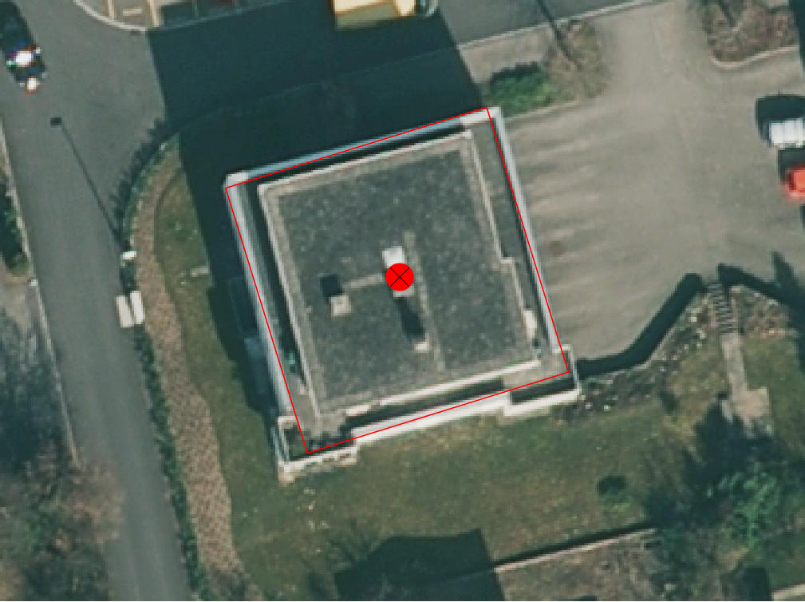

.. _ref_BebautesGebiet:

Bebautes Gebiet
===============
In dieser Mängelgruppe wird das bebaute Gebiet überprüft. Das bebaute Gebiet beinhaltet die TS2 und sämtliche Bauten inkl. Umschwung in der TS3 und TS4. Die Toleranzen bleiben TS-abhängig (siehe :ref:`ref_Tz`). Folgende Objekte werden geprüft:

==================  ==================
Topic  		    Art    
==================  ================== 
Bodenbedeckung      Gebaeude 
Bodenbedeckung      Gartenanlage
Bodenbedeckung      Wasserbecken
Bodenbedeckung      Lagerplatz
Bodenbedeckung      Gebaeudeerschliessung
Bodenbedeckung      Parkplatz
Bodenbedeckung      uebrige_befestigte
Bodenbedeckung      Objektname
Einzelobjekt        Mauer
Einzelobjekt        unterirdisches_Gebaeude
Einzelobjekt        uebriger_Gebaeudeteil
Einzelobjekt        wichtige_Treppe
Einzelobjekt        Reservoir
Einzelobjekt        Unterstand
Einzelobjekt        Silo_Turm_Gasometer
Einzelobjekt        Objektname
==================  ==================

BB.Gebaeude
-----------

Lagedifferenz
^^^^^^^^^^^^^
Lagemässig fehlerhaft erfasste Gebäude (z.B. Verdrehungen des Grundrisses) zu korrigieren. Können die Gebäude nicht aus bestehenden Aufnahmen korrekt gerechnet werden, muss die Neuaufnahme terrestrisch erfolgen. 

.. note::
   Fehler aus der laufenden Nachführung können nicht über die PNF/Homogenisierung abgerechnet werden.

Benötigte Layer in QGIS:

.. code-block:: none

   Bebautes Gebiet / Lagekontrolle

Beispiele:

.. _fig_bebaut_1:

   Das verdrehte Gebäude muss korrekt erfasst werden. Entweder mittels vorhandenen Unterlagen oder durch Neuaufnahme.

Objekt fehlt
^^^^^^^^^^^^
Fehlende Gebäude müssen terrestrisch erfasst werden. Betreffend Aufnahmepflicht gelten die Regeln des *Handbuches der amtlichen Vermessung Kanton Solothurn*. Eventuell muss während der Feldkontrolle die Aufnahmepflicht überprüft werden.

.. note::
   Sofern das Gebäude **nicht** älter als 10 Jahre ist, muss es über die laufende Nachführung abgerechnet werden.

Benötigte Layer in QGIS:

.. code-block:: none

   Bebautes Gebiet / Lagekontrolle

Beispiele:

.. _fig_landw_1:

.. figure:: _static/Landwirtschaft_umattribuieren_Acker_Wiese.png
   :width: 450px
   :target: _static/Landwirtschaft_umattribuieren_Acker_Wiese.png

   Die beiden Acker_Wiesen-Objekte (rosa Linie) sind in Gartenanlage umzuattribuieren.

BB.Weide
--------

Objekt umattribuieren
^^^^^^^^^^^^^^^^^^^^^
Die Unterscheidung zwischen ``BB.Acker_Wiese`` und ``BB.Weide`` wird nicht länger gemacht. Weiden sind als ``Acker_Wiese`` zu attribuieren und Unterteilungslinien zu löschen. 

Benötigte Layer in QGIS:

.. code-block:: none

   Landwirtschaft / Checklayer / BB.Weide

BB.Reben / BB.Obstkultur / BB.uebrige_Intensivkulturen
------------------------------------------------------

Die drei Bodenbedeckungsarten ``BB.Reben``, ``BB.Obstkultur`` und ``BB.uebrige_Intensivkulturen`` sind auf ihre Vollständigkeit, Aktualität sowie Lagekorrektheit zu prüfen:

Lagedifferenz
^^^^^^^^^^^^^
Die korrekte Lage ist mit dem aktuellen Orthofoto zu prüfen. Korrigiert werden Abweichungen ausserhalb der Toleranzbereiche (gemäss :ref:`toleranz`)

Benötigte Layer in QGIS:

.. code-block:: none

   Landwirtschaft / Lagekontrolle
   Landwirtschaft / Checklayer / BB.Kulturen < 1000 m2

Beispiele:

+---------------------------------------------------------------------+-----------------------------------------------------------------------+
|.. _fig_landw_2:                                                     |.. _fig_landw_3:                                                       |
|                                                                     |                                                                       |
|.. figure:: _static/Landwirtschaft_Lagedifferenz_Kulturen.png        |.. figure:: _static/Landwirtschaft_Lagedifferenz_Kulturen_korr.png     |
|   :width: 550px                                                     |   :width: 550px                                                       |
|   :target: _static/Landwirtschaft_Lagedifferenz_Kulturen.png        |   :target: _static/Landwirtschaft_Lagedifferenz_Kulturen_korr.png     |
|                                                                     |                                                                       |
|   ``BB.Obstkultur`` (gelbe Linie) ist zu korrigieren.               |   Die Obstkultur kann ausgeschieden werden (rote Linie) werden sofern |
|                                                                     |   sie grösser 1000 m2 ist.                                            |
+---------------------------------------------------------------------+-----------------------------------------------------------------------+

Objekt fehlt
^^^^^^^^^^^^
Fehlende Objekte sind zu erfassen sofern sie grösser 1000 m2 sind.

Benötigte Layer in QGIS:

.. code-block:: none

   Landwirtschaft / Lagekontrolle

Objekt löschen
^^^^^^^^^^^^^^
Zu kleine oder nicht mehr vorhanden Intensivkulturen sind zu löschen.

Benötigte Layer in QGIS:

.. code-block:: none

   Landwirtschaft / Lagekontrolle
   Landwirtschaft / Checklayer / BB.Kulturen < 1000 m2

Alle Objekte
------------
Überflüssige Unterteilungslinien sind zu löschen.

.. index:: Acker, Wiese, Weide, Acker_Wiese, Reben, Intensivkultur, uebrige_Intensivkultur

