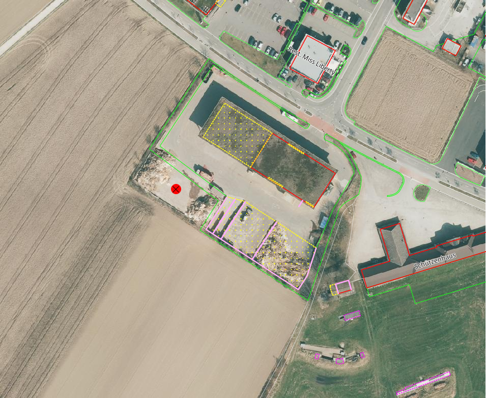
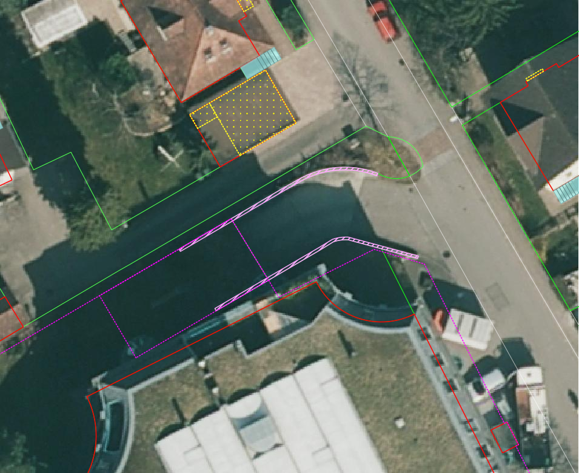
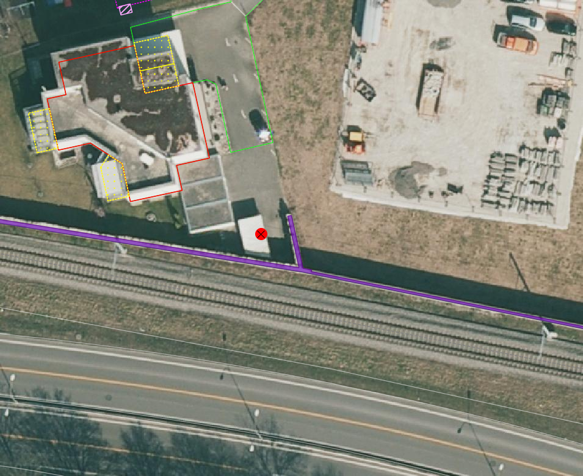
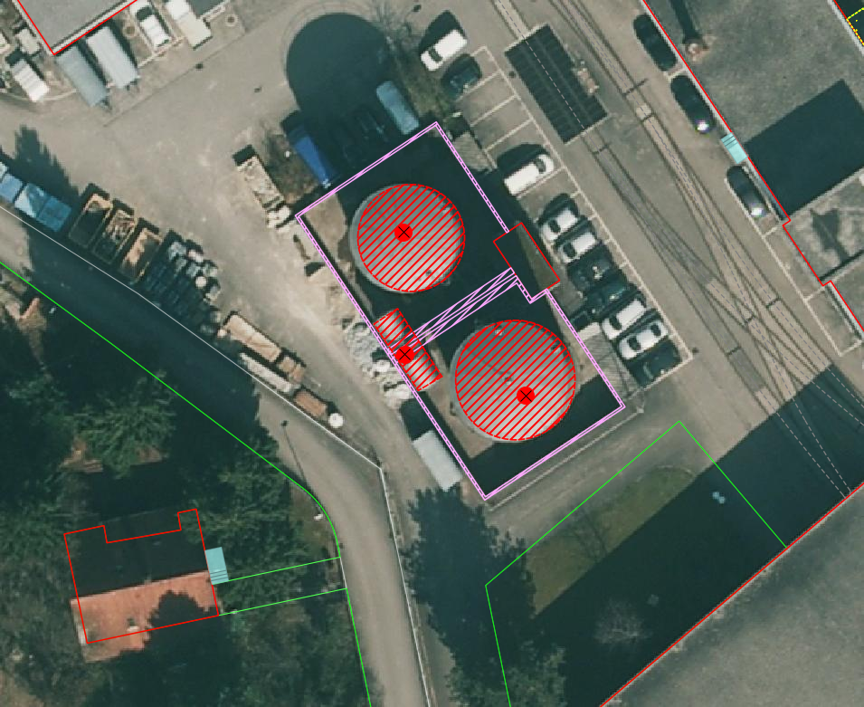

.. _ref_BebautesGebiet:

Bebautes Gebiet
===============
.. index:: bebautes Gebiet

In dieser Mängelgruppe wird das bebaute Gebiet überprüft. Das bebaute Gebiet beinhaltet die TS2 und sämtliche Bauten inkl. Umschwung in der TS3 und TS4. Die Toleranzen bleiben TS-abhängig (siehe :ref:`ref_Tz`). Folgende Objekte werden geprüft:

==================  ==================
Topic  		    Art    
==================  ================== 
Bodenbedeckung      Gebaeude 
Bodenbedeckung      Gartenanlage
Bodenbedeckung      Wasserbecken
Bodenbedeckung      Lagerplatz
Bodenbedeckung      Gebaeudeerschliessung
Bodenbedeckung      Parkplatz
Bodenbedeckung      uebrige_befestigte
Bodenbedeckung      Objektname
Einzelobjekt        Mauer
Einzelobjekt        unterirdisches_Gebaeude
Einzelobjekt        uebriger_Gebaeudeteil
Einzelobjekt        wichtige_Treppe
Einzelobjekt        Reservoir
Einzelobjekt        Unterstand
Einzelobjekt        Silo_Turm_Gasometer
Einzelobjekt        Objektname
==================  ==================

BB.Gebaeude
-----------
.. index:: Gebäude

Lagedifferenz
^^^^^^^^^^^^^
Lagemässig fehlerhaft erfasste Gebäude (z.B. Verdrehungen des Grundrisses) sind zu korrigieren. Verkippungen von Gebäuden in Orthofotos sind keine Lagedifferenzen. Können die Gebäude nicht aus bestehenden Aufnahmen korrekt gerechnet werden, muss die Neuaufnahme terrestrisch erfolgen. 

.. note::
   Fehler aus der laufenden Nachführung können nicht über die PNF/Homogenisierung abgerechnet werden.

Benötigte Layer in QGIS:

.. code-block:: none

   Bebautes Gebiet / Lagekontrolle

Beispiele:

.. _fig_bebaut_1:

   Das verdrehte Gebäude muss korrekt erfasst werden. Entweder mittels vorhandenen Unterlagen oder durch Neuaufnahme.

Objekt fehlt
^^^^^^^^^^^^
Fehlende Gebäude müssen terrestrisch erfasst werden. Betreffend Aufnahmepflicht gelten die Regeln des *Handbuches der amtlichen Vermessung Kanton Solothurn*. 

.. note::
   Sofern das Gebäude **nicht** älter als 10 Jahre ist, muss es über die laufende Nachführung abgerechnet werden.

Benötigte Layer in QGIS:

.. code-block:: none

   Bebautes Gebiet / Lagekontrolle

Objekt löschen
^^^^^^^^^^^^^^
Gebäude, die kleiner 6 m2 sind und keine Hausnummer haben oder nicht mehr vorhandens sind, sind zu löschen.

Benötigte Layer in QGIS:

.. code-block:: none

   Bebautes Gebiet / Lagekontrolle
   Bebautes Gebiet / Checklayer / BB.Gebaeude < 6m2

Beispiele:

+---------------------------------------------------------------------+-----------------------------------------------------------------------+
|.. _fig_bebaut_2:                                                    |.. _fig_bebaut_3:                                                      |
|                                                                     |                                                                       |
|.. figure:: _static/Bebaut_Loeschen_Gebaeude_6m2.png                 |.. figure:: _static/Bebaut_Loeschen_Gebaeude.png                       |
|   :width: 550px                                                     |   :width: 550px                                                       |
|   :target: _static/Bebaut_Loeschen_Gebaeude_6m2.png                 |   :target: _static/Bebaut_Loeschen_Gebaeude.png                       |
|                                                                     |                                                                       |
|   ``BB.Gebaeude`` ist zu löschen, da kleiner 6 m2.                  |   ``BB.Gebaeude`` ist zu löschen, da es nicht mehr vorhanden ist.     |
+---------------------------------------------------------------------+-----------------------------------------------------------------------+

Objekt umattribuieren
^^^^^^^^^^^^^^^^^^^^^
Silos, die mit dem gesamten Grundriss auf einem Fundament stehen, sind als Gebäude zu erfassen.

Benötigte Layer in QGIS:

.. code-block:: none

   Bebautes Gebiet / Lagekontrolle

Darstellung nicht nach Richtlinie
^^^^^^^^^^^^^^^^^^^^^^^^^^^^^^^^^
Aneinandergebaute Gebäude sind - falls sie mehrere Adressen haben und baulich möglich resp. die Unterteilung sichtbar ist - korrekt zu unterteilen. Terassenhäuser werden als ein Gebäude erfasst und mittels ``EO.uebriger_Gebaeudeteil`` getrennt. 

Benötigte Layer in QGIS:

.. code-block:: none

   Bebautes Gebiet / Lagekontrolle
   Bebautes Gebiet / Checklayer / BB.Gebaeude mit mehreren Adressen

Beispiele:

+---------------------------------------------------------------------+-----------------------------------------------------------------------+
|.. _fig_bebaut_4:                                                    |.. _fig_bebaut_5:                                                      |
|                                                                     |                                                                       |
|.. figure:: _static/Bebaut_Richtlinie_Unterteilung_ortho.png         |.. figure:: _static/Bebaut_Richtlinie_Unterteilung_avwms.png           |
|   :width: 550px                                                     |   :width: 550px                                                       |
|   :target: _static/Bebaut_Richtlinie_Unterteilung_ortho.png         |   :target: _static/Bebaut_Richtlinie_Unterteilung_avwms.png           |
|                                                                     |                                                                       |
|   ``BB.Gebaeude`` ist zu unterteilen.                               |   ``BB.Gebaeude`` ist gemäss roter Linie zu unterteilen.              |
+---------------------------------------------------------------------+-----------------------------------------------------------------------+
|.. _fig_bebaut_6:                                                    |.. _fig_bebaut_7:                                                      |
|                                                                     |                                                                       |
|.. figure:: _static/Bebaut_Richtlinie_Terassen_falsch.png            |.. figure:: _static/Bebaut_Richtlinie_Terassen_richtig.png             |
|   :width: 550px                                                     |   :width: 550px                                                       |
|   :target: _static/Bebaut_Richtlinie_Terassen_falsch.png            |   :target: _static/Bebaut_Richtlinie_Terassen_richtig.png             |
|                                                                     |                                                                       |
|   Die Terassenhäuser sind als einzelne ``BB.Gebaeude`` erfasst.     |   Terassenhäuser sind als ein Gebäude zu erfassen und mittels         | 
|                                                                     |   ``EO.uebriger_Gebaeudeteil`` zu unterteilen.                        |
+---------------------------------------------------------------------+-----------------------------------------------------------------------+

BB.Gartenanlage
---------------
.. index:: Gartenanlage

Lagedifferenz
^^^^^^^^^^^^^
Wird eine Lagedifferenz zwischen der AV und dem aktuellen Othofoto grösser als die Toleranz (siehe :ref:`ref_Tz`) und der Feststellungsgenauigkeit detektiert, so ist das Objekt in der AV zu korrigieren. 

Benötigte Layer in QGIS:

.. code-block:: none

   Bebautes Gebiet / Lagekontrolle

Beispiele:

+---------------------------------------------------------------------+-----------------------------------------------------------------------+
|.. _fig_bebaut_19:                                                   |.. _fig_bebaut_20:                                                     |
|                                                                     |                                                                       |
|.. figure:: _static/Bebaut_Abgrenzung_Gartenanlage.png               |.. figure:: _static/Bebaut_Abgrenzung_Gartenanlage_2.png               |
|   :width: 550px                                                     |   :width: 550px                                                       |
|   :target: _static/Bebaut_Abgrenzung_Gartenanlage.png               |   :target: _static/Bebaut_Abgrenzung_Gartenanlage_2.png               |
|                                                                     |                                                                       |
|   Die Abgrenzung zwischen ``BB.Gartenanlage`` und                   |   Die Abgrenzung zwischen ``BB.Gartenanlage`` und ``BB.Acker_Wiese``  |
|   ``BB.Acker_Wiese`` ist zu löschen und alles ist als               |   ist falsch und gemäss roter Linie zu korrigieren.                   |
|   ``BB.Gartenanlage`` zu attribuieren.                              |                                                                       |
+---------------------------------------------------------------------+-----------------------------------------------------------------------+

Objekt löschen
^^^^^^^^^^^^^^
Sind in der AV Gartenanlagen  erfasst, die gemäss Kriterium *Handbuch der amtlichen Vermessung Kanton Solothurn* nicht zu ``BB.Gartenanlage`` gehören, sind die Objekte löschen resp. umzuattribuieren.

Objekt fehlt
^^^^^^^^^^^^
Fehlende Gartenanlagen sind zu erfassen. Alleinstehende Gebäude in ``BB.Acker_Wiese`` erhalten nicht in jedem Fall eine Gartenanlage.

Benötigte Layer in QGIS:

.. code-block:: none

   Bebautes Gebiet / Lagekontrolle
   Bebautes Gebiet / Checklayer / BB.Gebaeude ohne Gartenanlage oder Erschliessung

Beispiele:

+---------------------------------------------------------------------+-----------------------------------------------------------------------+
|.. _fig_bebaut_21:                                                   |.. _fig_bebaut_22:                                                     |
|                                                                     |                                                                       |
|.. figure:: _static/Bebaut_Gartenanlage_fehlt_1.png                  |.. figure:: _static/Bebaut_Gartenanlage_fehlt_2.png                    |
|   :width: 550px                                                     |   :width: 550px                                                       |
|   :target: _static/Bebaut_Gartenanlage_fehlt_1.png                  |   :target: _static/Bebaut_Gartenanlage_fehlt_2.png                    |
|                                                                     |                                                                       |
|   Fehlende Gartenanlage ist zu erfassen.                            |   Fehlende Gartenanlage ist zu erfassen.                              |
+---------------------------------------------------------------------+-----------------------------------------------------------------------+
|.. _fig_bebaut_23:                                                   |.. _fig_bebaut_24:                                                     |
|                                                                     |                                                                       |
|.. figure:: _static/Bebaut_Gartenanlage_fehlt_nicht_1.png            |.. figure:: _static/Bebaut_Gartenanlage_fehlt_nicht_2.png              |
|   :width: 550px                                                     |   :width: 550px                                                       |
|   :target: _static/Bebaut_Gartenanlage_fehlt_nicht_1.png            |   :target: _static/Bebaut_Gartenanlage_fehlt_nicht_2.png              |
|                                                                     |                                                                       |
|   Fehlende Gartenanlage ist **nicht** zu erfassen.                  |   Fehlende Gartenanlage ist **nicht** zu erfassen.                    |
+---------------------------------------------------------------------+-----------------------------------------------------------------------+

Objekt umattribuieren  
^^^^^^^^^^^^^^^^^^^^^
Sind in der AV Gebäudeerschliessungen erfasst, die gemäss Kriterium *Handbuch der amtlichen Vermessung Kanton Solothurn* nicht zu ``BB.Gebaeudeerschliessungen`` gehören, sind die Objekte umzuattribuieren

Darstellung nicht nach Richtlinie  
^^^^^^^^^^^^^^^^^^^^^^^^^^^^^^^^^
Im Rahmen der PNF/Homogenisierung werden **keine** Änderungen vorgenommen.

BB.Wasserbecken
---------------
.. index:: Wasserbecken

Lagedifferenz  
^^^^^^^^^^^^^
Im Rahmen der PNF/Homogenisierung werden **keine** Änderungen vorgenommen.

Objekt fehlt/löschen
^^^^^^^^^^^^^^^^^^^^
Fehlende Wasserbecken und Schwimmteiche sind gemäss Kriterien des *Handbuches der amtlichen Vermessung Kanton Solothurn* zu erfassen. Falsch erfasste (z.B. zu kleine oder oberirdische Bassins aus Kunststoff, Holz etc.) sind zu löschen. Oberirdische Bassins sind womöglich am Schattenwurf auf dem Orthofoto zu erkennen.

Benötigte Layer in QGIS:

.. code-block:: none

   Bebautes Gebiet / Lagekontrolle
   Bebautes Gebiet / Checklayer / BB.Wasserbecken mit EO.Mauer

Beispiele:

+---------------------------------------------------------------------+-----------------------------------------------------------------------+
|.. _fig_bebaut_8:                                                    |.. _fig_bebaut_9:                                                      |
|                                                                     |                                                                       |
|.. figure:: _static/Bebaut_Wasserbecken_aufnehmen.png                |.. figure:: _static/Bebaut_Wasserbecken_nicht_aufnehmen.png            |
|   :width: 550px                                                     |   :width: 550px                                                       |
|   :target: _static/Bebaut_Wasserbecken_aufnehmen.png                |   :target: _static/Bebaut_Wasserbecken_nicht_aufnehmen.png            |
|                                                                     |                                                                       |
|   ``BB.Wasserbecken`` fehlt und ist zu erfassen.                    |   ``BB.Wasserbecken`` ist mit grosser Wahrscheinlichkeit **nicht** zu |
|                                                                     |   erfassen.                                                           |
+---------------------------------------------------------------------+-----------------------------------------------------------------------+

Objekt umattribuieren  
^^^^^^^^^^^^^^^^^^^^^
Schwimmteiche sind gemäss Kriterien des *Handbuches der amtlichen Vermessung Kanton Solothurn* zu umzuattribuieren.

Darstellung nicht nach Richtlinie  
^^^^^^^^^^^^^^^^^^^^^^^^^^^^^^^^^
Mauern um das Wasserbecken sind zu löschen.

Benötigte Layer in QGIS:

.. code-block:: none

   Bebautes Gebiet / Lagekontrolle
   Bebautes Gebiet / Checklayer / BB.Wasserbecken mit EO.Mauer

Beispiele:

+---------------------------------------------------------------------+ 
|.. _fig_bebaut_10:                                                   | 
|                                                                     |
|.. figure:: _static/Bebaut_Wasserbecken_mit_Mauer_falsch.png         |
|   :width: 550px                                                     |
|   :target: _static/Bebaut_Wasserbecken_mit_Mauer_falsch.png         |
|                                                                     |
|   Mauern entlang des Wasserbeckens werden nicht erfasst und müssen  |
|   gelöscht werden.                                                  |
+---------------------------------------------------------------------+

BB.Lagerplatz
-------------
.. index:: Lagerplatz

Lagedifferenz / Objekt fehlt
^^^^^^^^^^^^^^^^^^^^^^^^^^^^
Massive Lagedifferenzen resp. fehlende Lagerplätze sind nur bei Industrieanlagen o.ä. zu korrigieren resp. zu erfassen. Nicht erfasst werden fehlende Miststöcke etc.

Benötigte Layer in QGIS:

.. code-block:: none

   Bebautes Gebiet / Lagekontrolle

Beispiel:

.. _fig_bebaut_40:

   Die Lagedifferenz ist zu korrigieren.

Objekt löschen / Objekt umattribuieren / Darstellung nicht nach Richtlinie
^^^^^^^^^^^^^^^^^^^^^^^^^^^^^^^^^^^^^^^^^^^^^^^^^^^^^^^^^^^^^^^^^^^^^^^^^^
Lagerplätze, die als Gebäudeerschliessung attribuiert sind, werden **nicht** als Lagerplatz ausgeschieden. Falls in der AV ein Lagerplatz vorhanden ist, der auf dem aktuellen Orthofoto nicht mehr zu erkennen ist, ist dieser Objekt zu löschen.

BB.Gebaeudeerschliessung
------------------------
.. index:: Gebäudeerschliessung

Lagedifferenz
^^^^^^^^^^^^^
Es werden nur grobe Lagedifferenzen korrigiert.

Benötigte Layer in QGIS:

.. code-block:: none

   Bebautes Gebiet / Lagekontrolle

Beispiele:

+---------------------------------------------------------------------+-----------------------------------------------------------------------+
|.. _fig_bebaut_12:                                                   |.. _fig_bebaut_13:                                                     |
|                                                                     |                                                                       |
|.. figure:: _static/Bebaut_Geberschliessung_falsch.png               |.. figure:: _static/Bebaut_Geberschliessung_nicht_korrigieren.png      |
|   :width: 550px                                                     |   :width: 550px                                                       |
|   :target: _static/Bebaut_Geberschliessung_falsch.png               |   :target: _static/Bebaut_Geberschliessung_nicht_korrigieren.png      |
|                                                                     |                                                                       |
|   ``BB.Gebaeuderschliessung`` ist grob falsch und muss korrigiert   |   ``BB.Gebaeuderschliessung`` ist **nicht** grob falsch und muss      |
|   werden.                                                           |   **nicht** korrigiert werden.                                        |
+---------------------------------------------------------------------+-----------------------------------------------------------------------+

Objekt fehlt / Objekt löschen
^^^^^^^^^^^^^^^^^^^^^^^^^^^^^
Fehlende Gebäudeerschliessungen sind zu erfassen. Falls in der AV eine Gebäudeerschliessung vorhanden ist, welche auf dem aktuellen Orthofoto nicht mehr zu erkennen ist, ist diese Objekt zu löschen.

Benötigte Layer in QGIS:

.. code-block:: none

   Bebautes Gebiet / Lagekontrolle
   Bebautes Gebiet / Checklayer / BB.Gebaeude ohne Gartenanlage oder Erschliessung

Beispiel:

.. _fig_bebaut_14:

   Bei beiden Gebäuden fehlt die Gebäuderschliessung.

Darstellung nicht nach Richtlinie  
^^^^^^^^^^^^^^^^^^^^^^^^^^^^^^^^^
Siehe :ref:`ref_strasse_mehrere_liegenschaften`. 

BB.Parkplatz
------------
.. index:: Parkplatz

Lagedifferenz
^^^^^^^^^^^^^
Wird eine Lagedifferenz zwischen der AV und dem aktuellen Othofoto grösser als die Toleranz (siehe :ref:`ref_Tz`) und der Feststellungsgenauigkeit detektiert, so ist das Objekt in der AV zu korrigieren. 

Benötigte Layer in QGIS:

.. code-block:: none

   Bebautes Gebiet / Lagekontrolle

Beispiele:

+---------------------------------------------------------------------+-----------------------------------------------------------------------+
|.. _fig_bebaut_15:                                                   |.. _fig_bebaut_16:                                                     |
|                                                                     |                                                                       |
|.. figure:: _static/Bebaut_Parkplatz_Lagefehler1.png                 |.. figure:: _static/Bebaut_Parkplatz_Lagefehler2.png                   |
|   :width: 550px                                                     |   :width: 550px                                                       |
|   :target: _static/Bebaut_Parkplatz_Lagefehler1.png                 |   :target: _static/Bebaut_Parkplatz_Lagefehler2.png                   |
|                                                                     |                                                                       |
|   ``BB.Parkplatz`` falsch definiert und muss korrigiert werden.     |   ``BB.Parkplatz`` falsch definiert falsch und muss korrigiert werden.|
|   Ein Teil ist als Gartenanlage erfasst                             |                                                                       |
+---------------------------------------------------------------------+-----------------------------------------------------------------------+

Objekt fehlt / Objekt löschen
^^^^^^^^^^^^^^^^^^^^^^^^^^^^^
Fehlende Parkplätze, die als Gebäudeerschliessung attribuiert sind, werden nicht umattribuiert.

Objekt umattribuieren
^^^^^^^^^^^^^^^^^^^^^
Parkplätze kleiner 100 m2 sind zu löschen resp. umzuattribuieren. Können z.B. durch Strassen getrennte Parkplätze als Einheit angesehen werden, werden jedoch einzelne Parkplätz kleiner 100 m2 nicht gelöscht.

Benötigte Layer in QGIS:

.. code-block:: none

   Bebautes Gebiet / Lagekontrolle
   Bebautes Gebiet / Checklayer / BB.Parkplatz < 100 m2 

Beispiele:

+---------------------------------------------------------------------+-----------------------------------------------------------------------+
|.. _fig_bebaut_17:                                                   |.. _fig_bebaut_18:                                                     |
|                                                                     |                                                                       |
|.. figure:: _static/Bebaut_Parkplatz_loeschen.png                    |.. figure:: _static/Bebaut_Parkplatz_nicht_loeschen.png                |
|   :width: 550px                                                     |   :width: 550px                                                       |
|   :target: _static/Bebaut_Parkplatz_loeschen.png                    |   :target: _static/Bebaut_Parkplatz_nicht_loeschen.png                |
|                                                                     |                                                                       |
|   ``BB.Parkplatz`` ist kleiner 100 m2 und wird zu                   |   Der östliche Teil des Parkplatzes ist kleiner 100 m2. Er wird       |
|   ``BB.Gebaeudeerschliessung``umattribuiert.                        |   **nicht** umattribuiert, da er mit dem westlichen Teil eine Einheit |
|                                                                     |   bildet.                                                             |
+---------------------------------------------------------------------+-----------------------------------------------------------------------+

Darstellung nicht nach Richtlinie  
^^^^^^^^^^^^^^^^^^^^^^^^^^^^^^^^^
Im Rahmen der PNF/Homogenisierung werden **keine** Änderungen vorgenommen.

BB.uebrige_befestigte
---------------------
.. index:: übrige befestigte

Lagedifferenz / Objekt fehlt
^^^^^^^^^^^^^^^^^^^^^^^^^^^^
Wird eine Lagedifferenz bei Panzersperren zwischen der AV und dem aktuellen Othofoto grösser als die Toleranz (siehe :ref:`ref_Tz`) und der Feststellungsgenauigkeit detektiert, so ist das Objekt in der AV zu korrigieren. Das Objekt muss erfasst werden falls es in der amtlichen Vermessung fehlt.

Benötigte Layer in QGIS:

.. code-block:: none

   Bebautes Gebiet / Lagekontrolle

Darstellung nicht nach Richtlinie  
^^^^^^^^^^^^^^^^^^^^^^^^^^^^^^^^^
Im Rahmen der PNF/Homogenisierung werden **keine** Änderungen vorgenommen.

EO.Mauer
--------

Lagedifferenz
^^^^^^^^^^^^^
Im Rahmen der PNF/Homogenisierung werden **keine** Änderungen vorgenommen.

Objekt fehlt
^^^^^^^^^^^^
Im Rahmen der PNF/Homogenisierung werden **keine** Änderungen vorgenommen.

Objekt löschen
^^^^^^^^^^^^^^
Mauern, die nicht den Erfassungsrichtlinien gemäss *Handbuch der amtlichen Vermessung Kanton Solothurn* entsprechen sind zu löschen. Freistehende Mauer-Linienelemente und Maueranzüge < 30 cm sind ebenfalls zu löschen. Sind in der AV Mauern erfasst, die gemäss Kriterium *Handbuch der amtlichen Vermessung Kanton Solothurn* nicht zu ``EO.Mauer`` gehören, sind die Objekte zu löschen.

Benötigte Layer in QGIS:

.. code-block:: none

   Bebautes Gebiet / Checklayer / EO.Mauer freistehend
   Bebautes Gebiet / Checklayer / EO.Linielement Mauer ausserhalb EO.Flächenelement Mauer
   Bebautes Gebiet / Checklayer / EO.Linienelement Mauer

+---------------------------------------------------------------------+-----------------------------------------------------------------------+
|.. _fig_bebaut_25:                                                   |.. _fig_bebaut_26:                                                     |
|                                                                     |                                                                       |
|.. figure:: _static/Bebaut_Mauer_loeschen_1.png                      |.. figure:: _static/Bebaut_Mauer_loeschen_2.png                        |
|   :width: 550px                                                     |   :width: 550px                                                       |
|   :target: _static/Bebaut_Mauer_loeschen_1.png                      |   :target: _static/Bebaut_Mauer_loeschen_2.png                        |
|                                                                     |                                                                       |
|   Mauer ist zu löschen.                                             |   Mauer ist zu löschen.                                               |
+---------------------------------------------------------------------+-----------------------------------------------------------------------+
|.. _fig_bebaut_27:                                                   |.. _fig_bebaut_28:                                                     |
|                                                                     |                                                                       |
|.. figure:: _static/Bebaut_Mauer_nicht_loeschen_1.png                |.. figure:: _static/Bebaut_Mauer_Linie_loeschen.png                    |
|   :width: 550px                                                     |   :width: 550px                                                       |
|   :target: _static/Bebaut_Mauer_nicht_loeschen_1.png                |   :target: _static/Bebaut_Mauer_Linie_loeschen.png                    |
|                                                                     |                                                                       |
|   Mauer erfüllt Aufnahmekritieren und wird **nicht** gelöscht.      |   ``EO.Mauer`` Linienelement ausserhalb des Flächenelements ist zu    |
|                                                                     |   löschen.                                                            |
+---------------------------------------------------------------------+-----------------------------------------------------------------------+

Objekt umattribuieren  
^^^^^^^^^^^^^^^^^^^^^
Im Rahmen der PNF/Homogenisierung werden **keine** Änderungen vorgenommen.

Darstellung nicht nach Richtlinie
^^^^^^^^^^^^^^^^^^^^^^^^^^^^^^^^^
Die Modellbildung von Mauern ist zu kontrollieren und ggf. zu korrigieren. Jede Mauer (inkl. Anzug) entspricht einem EO.Objekt.

Benötigte Layer in QGIS:

.. code-block:: none

   Bebautes Gebiet / Checklayer / EO.Mauer freistehend

Beispiel:

.. _fig_bebaut_29:

   Es sind zwei EO.Objekte ``Mauer`` zu erfassen (rose schraffiert).

EO.unterirdisches_Gebaeude
--------------------------
.. index:: unterirdisches Gebäude

Lagefehler
^^^^^^^^^^
Es sind lediglich Plausibilitätskontrollen möglich.

Objekt fehlt
^^^^^^^^^^^^
Fehlende und aufnahmepflichtige unterirdische Gebäude sind zu erfassen.

Benötigte Layer in QGIS:

.. code-block:: none

   Bebautes Gebiet / Lagekontrolle

Objekt löschen
^^^^^^^^^^^^^^
Nicht aufnahmepflichte oder nicht mehr vorhandene unterirdische Gebäude sind zu löschen.

Benötigte Layer in QGIS:

.. code-block:: none

   Bebautes Gebiet / Lagekontrolle

Objekt umattribuieren  
^^^^^^^^^^^^^^^^^^^^^
Scheibenstände sind als ``EO.unterirdisches_Gebaeude`` zu definieren. 

Benötigte Layer in QGIS:

.. code-block:: none

   Bebautes Gebiet / Lagekontrolle

Darstellung nicht nach Richtlinie
^^^^^^^^^^^^^^^^^^^^^^^^^^^^^^^^^
Im Rahmen der PNF/Homogenisierung werden **keine** Änderungen vorgenommen.

EO.uebriger_Gebaeudeteil
------------------------
.. index:: übriger Gebäudeteil

Lagedifferenz  
^^^^^^^^^^^^^
Im Rahmen der PNF/Homogenisierung werden **keine** Änderungen vorgenommen.

.. _ref_eo_uebriger_gebteil_umattr:

Objekt löschen / fehlt / umattribuieren
^^^^^^^^^^^^^^^^^^^^^^^^^^^^^^^^^^^^^^^
**Freistehende** flächige übrige Gebäudeteile sind entweder zu löschen oder umzuattribuieren (z.B. ``EO.Unterstand``). Flächige übrige Gebäudeteile **innerhalb** eines Gebäudes sind in ein EO.Linienobjekt umzuattribuieren. EO.Linienelemente der Art ``EO.uebriger_Gebaeudeteil`` **ausserhalb** von Gebäuden sind entweder zu löschen oder in ein EO.Flächenelement zumzuwandeln. 

Zu kleine Zwischenstützen sowie nicht plausible Kleinstobjekte sind zu löschen (Layer: EO.Flächenelement < 1.5 m2).

Benötigte Layer in QGIS:

.. code-block:: none

   Bebautes Gebiet / Lagekontrolle
   Bebautes Gebiet / Checklayer / EO.Flächenelement 'übrig. Geb.teil' freistehend   
   Bebautes Gebiet / Checklayer / EO.Linienelement 'übrig. Geb.teil' ausserhalb Gebäude
   Bebautes Gebiet / Checklayer / EO.Flächenelement 'übrig. Geb.teil' innerhalb Gebäude
   Bebautes Gebiet / Checklayer / EO.Flächenelement < 1.5 m2

Beispiele:

+---------------------------------------------------------------------+-----------------------------------------------------------------------+
|.. _fig_bebaut_31:                                                   |.. _fig_bebaut_32:                                                     |
|                                                                     |                                                                       |
|.. figure:: _static/Bebaut_uebrigGeb_Flaeche_falsch.png              |.. figure:: _static/Bebaut_uebrigGeb_Flaeche_innerhalb.png             |
|   :width: 550px                                                     |   :width: 550px                                                       |
|   :target: _static/Bebaut_uebrigGeb_Flaeche_falsch.png              |   :target: _static/Bebaut_uebrigGeb_Flaeche_innerhalb.png             |
|                                                                     |                                                                       |
|   Freistehende flächige übrige Gebäudeteile sind nicht erlaubt.     |   Die EO.Flächenelemente sind in Linienelemente umzuwandeln.          |
|   Das Objekt ist in ein Unterstanz umzuattribuieren ?????           |                                                                       |
+---------------------------------------------------------------------+-----------------------------------------------------------------------+
|.. _fig_bebaut_33:                                                   |                                                                       |
|                                                                     |                                                                       |
|.. figure:: _static/Bebaut_uebrigGeb_Linie_ausserhalb.png            |                                                                       |
|   :width: 550px                                                     |                                                                       |
|   :target: _static/Bebaut_uebrigGeb_Linie_ausserhalb.png            |                                                                       |
|                                                                     |                                                                       |
|   Die Trennlinien (= EO.Linienelement) im                           |                                                                       |
|   EO.Flächenelement sind zu löschen.                                |                                                                       |
+---------------------------------------------------------------------+-----------------------------------------------------------------------+

Darstellung nicht nach Richtlinie
^^^^^^^^^^^^^^^^^^^^^^^^^^^^^^^^^
Eckpfeiler mit einem Versatz > 10 cm sind als Teil des Gebäudes zu definieren und nicht als ``EO.Pfeiler``.

Benötigte Layer in QGIS:

.. code-block:: none

   Bebautes Gebiet / Checklayer / EO.Pfeiler im Gebäude

EO.wichtige_Treppe
------------------
.. index:: wichtige Treppe, Treppe

Lagedifferenz
^^^^^^^^^^^^^
Im Rahmen der PNF/Homogenisierung werden **keine** Änderungen vorgenommen.

Objekt fehlt
^^^^^^^^^^^^
Wichtige Treppen bei öffentlichen Bauten und Anlagen sind zu erfassen.

Benötigte Layer in QGIS:

.. code-block:: none

   Bebautes Gebiet / Lagekontrolle

Beispiele:

+---------------------------------------------------------------------+-----------------------------------------------------------------------+
|.. _fig_bebaut_34:                                                   |.. _fig_bebaut_35:                                                     |
|                                                                     |                                                                       |
|.. figure:: _static/Bebaut_wichtige_Treppe_fehlt.png                 |.. figure:: _static/Bebaut_wichtige_Treppe_erfasst.png                 |
|   :width: 550px                                                     |   :width: 550px                                                       |
|   :target: _static/Bebaut_wichtige_Treppe_fehlt.png                 |   :target: _static/Bebaut_wichtige_Treppe_erfasst.png                 |
|                                                                     |                                                                       |
|   Die Treppe zur Kirche fehlt und ist zu erfassen.                  |   Treppe korrekt erfasst.                                             |
+---------------------------------------------------------------------+-----------------------------------------------------------------------+

Objekt löschen
^^^^^^^^^^^^^^
Private Treppen (z.B. zu Hauseingänge und Kellerabgänge) sind zu löschen.

Benötigte Layer in QGIS:

.. code-block:: none

   Bebautes Gebiet / Lagekontrolle

Beispiele:

+---------------------------------------------------------------------+-----------------------------------------------------------------------+
|.. _fig_bebaut_36:                                                   |.. _fig_bebaut_37:                                                     |
|                                                                     |                                                                       |
|.. figure:: _static/Bebaut_Treppe_loeschen_1.png                     |.. figure:: _static/Bebaut_Treppe_loeschen_2.png                       |
|   :width: 550px                                                     |   :width: 550px                                                       |
|   :target: _static/Bebaut_Treppe_loeschen_1.png                     |   :target: _static/Bebaut_Treppe_loeschen_2.png                       |
|                                                                     |                                                                       |
|   Die Treppe ist zu löschen.                                        |   Die Treppe ist zu löschen.                                          |
+---------------------------------------------------------------------+-----------------------------------------------------------------------+

Objekt umattribuieren  
^^^^^^^^^^^^^^^^^^^^^
Im Rahmen der PNF/Homogenisierung werden **keine** Änderungen vorgenommen.

Darstellung nicht nach Richtlinie
^^^^^^^^^^^^^^^^^^^^^^^^^^^^^^^^^
Die Modellbildung von Treppen ist zu kontrollieren und ggf. zu korrigieren. Jede Treppe (inkl. einzelner Treppentritte) entspricht einem EO.Objekt.

Benötigte Layer in QGIS:

.. code-block:: none

   Bebautes Gebiet / Checklayer / EO.Treppe nicht ein Objekt

EO.Reservoir
------------
.. index:: Reservoir

Lagedifferenz
^^^^^^^^^^^^^
Wird eine Lagedifferenz (Plausibilität beachten) zwischen der AV und dem aktuellen Othofoto grösser als die Toleranz (siehe :ref:`ref_Tz`) und der Feststellungsgenauigkeit detektiert, so ist das Objekt in der AV zu korrigieren.

Benötigte Layer in QGIS:

.. code-block:: none

   Bebautes Gebiet / Lagekontrolle

Objekt fehlt
^^^^^^^^^^^^
Fehlende Reservoirs, die im Datensatz des Amtes für Umwelt vorhanden sind, sind zu erfassen. Eventuell können Pläne bei der Gemeinde bezogen werden.

Benötigte Layer in QGIS:

.. code-block:: none

   Bebautes Gebiet / Lagekontrolle
   Bebautes Gebiet / Lagekontrolle / Reservoir (AfU)

Objekt löschen  
^^^^^^^^^^^^^^
Im Rahmen der PNF/Homogenisierung werden **keine** Änderungen vorgenommen.

Objekt umattribuieren  
^^^^^^^^^^^^^^^^^^^^^
Nicht mehr vorhandene Reservoirs sind zu löschen. Eine Feldkontrolle ist nur durchzuführen falls die Situation auf dem Orthofoto nicht klar ist und im AfU-Datensatz kein Reservoir mehr vorhanden ist.

Darstellung nicht nach Richtlinie
^^^^^^^^^^^^^^^^^^^^^^^^^^^^^^^^^
Der sichtbare Teil des Reservoirs muss als ``BB.Gebaeude``, der unsichtbare Teil als ``EO.Reservoir`` erfasst sein. Nicht korrekt erfasste Reservoirs sind zu korrigieren.

Benötigte Layer in QGIS:

.. code-block:: none

   Bebautes Gebiet / Lagekontrolle
   Bebautes Gebiet / Lagekontrolle / Reservoir (AfU)

EO.Unterstand
-------------
.. index:: Unterstand

Lagedifferenz
^^^^^^^^^^^^^
Im Rahmen der PNF/Homogenisierung werden **keine** Änderungen vorgenommen.

Objekt fehlt
^^^^^^^^^^^^
Fehlende Unterstände sind zu erfassen.

Benötigte Layer in QGIS:

.. code-block:: none

   Bebautes Gebiet / Lagekontrolle

Beispiel:

.. _fig_bebaut_38:

   Der Unterstand fehlt in der AV und ist aufnahmepflichtig.

Objekt löschen  
^^^^^^^^^^^^^^
Falls in der AV ein Unterstand vorhanden ist, der auf dem aktuellen Orthofoto nicht mehr zu erkennen ist, ist dieses Objekt zu löschen.

Objekt umattribuieren  
^^^^^^^^^^^^^^^^^^^^^
Siehe ``EO.uebriger_Gebaeudeteil`` :ref:`ref_eo_uebriger_gebteil_umattr`. 

Darstellung nicht nach Richtlinie
^^^^^^^^^^^^^^^^^^^^^^^^^^^^^^^^^
Im Rahmen der PNF/Homogenisierung werden **keine** Änderungen vorgenommen.

EO.Silo_Turm_Gasometer
----------------------
.. index:: Silo, Turm, Gasometer, Silo_Turm_Gasometer

Lagedifferenz / Objekt fehlt / Objekt löschen
^^^^^^^^^^^^^^^^^^^^^^^^^^^^^^^^^^^^^^^^^^^^^
Wird eine Lagedifferenz zwischen der AV und dem aktuellen Othofoto grösser als die Toleranz (siehe :ref:`ref_Tz`) und der Feststellungsgenauigkeit detektiert, so ist das Objekt in der AV zu korrigieren. Fehlende Objekte sind zu erfassen, nicht mehr vorhandene zu löschen.

Benötigte Layer in QGIS:

.. code-block:: none

   Bebautes Gebiet / Lagekontrolle

Objekt umattribuieren
^^^^^^^^^^^^^^^^^^^^^
Silos ohne festes Fundament sind als Einzelobjekt zu erfassen. Silos mit festem Fundament sind als Gebäude im Topic BB zu erfassen.

Benötigte Layer in QGIS:

.. code-block:: none

   Bebautes Gebiet / Lagekontrolle

Beispiel:

.. _fig_bebaut_38:

   Die Silos sind fest mit dem Boden verbunden und müssen im Topic BB als Gebäude erfasst werden.

Darstellung nicht nach Richtlinie
^^^^^^^^^^^^^^^^^^^^^^^^^^^^^^^^^
Im Rahmen der PNF/Homogenisierung werden **keine** Änderungen vorgenommen.

EO.alle
-------
Darstellung nicht nach Richtlinie
^^^^^^^^^^^^^^^^^^^^^^^^^^^^^^^^^
Die Modellbildung ist bei jeder Art zu überprüfen. Es darf nicht nur pro Gemeinde ein Objekt pro EO-Art existieren. Sondern es muss für jedes erfasste Objekt ein EO-Objekt erfasst werden.

Benötigte Layer in QGIS:

.. code-block:: none

   Bebautes Gebiet / Checklayer / Ein EO.Objekt pro Element

BB/EO.Objektname
----------------
.. index:: Objektename

Objekt fehlt / Objekt löschen
^^^^^^^^^^^^^^^^^^^^^^^^^^^^^

Fehlende oder nicht mehr korrekte Objektnamen sind nachzuführen. Objektnamen "u." (für unterirdische Bauten) sind zu löschen.

Benötigte Layer in QGIS:

.. code-block:: none

   Bebautes Gebiet / Lagekontrolle
   Bebautes Gebiet / Checklayer / BB.Objektname 'u.'
   Bebautes Gebiet / Checklayer / EO.Objektname 'u.'

Objekt umattribuieren
^^^^^^^^^^^^^^^^^^^^^
Im Rahmen der PNF/Homogenisierung werden **keine** Änderungen vorgenommen.

