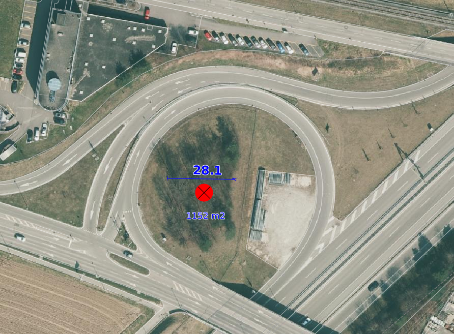
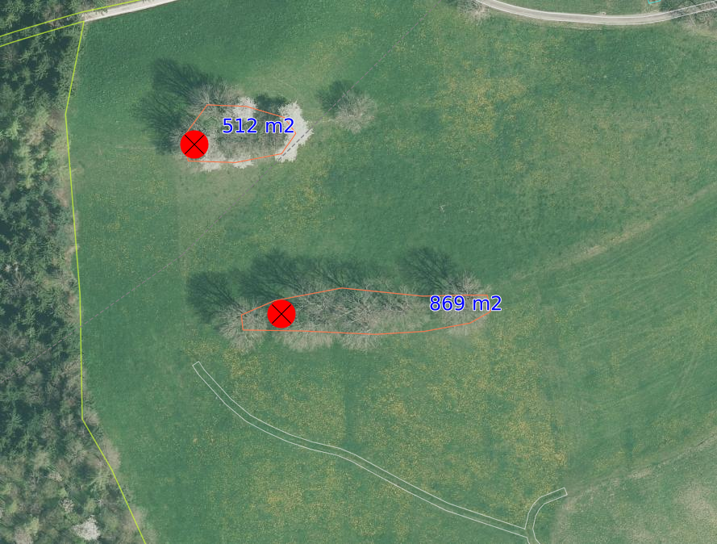
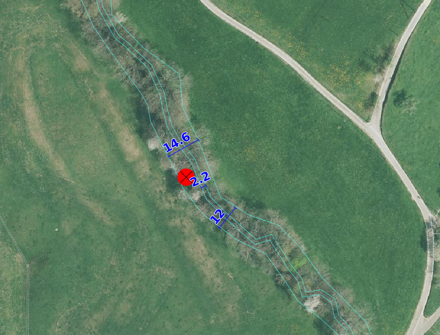

Bestockte Fläche
=====================
Bei dieser Gruppe werden alle bestockten Flächen aus der amtlichen Vermessung auf deren Vollständigkeit und Richtigkeit in der Lage so wie in der Darstellung überprüft.

Folgende Objekte werden geprüft:

=============================  ========================================
Topic  		               Art    
=============================  ========================================
Bodenbedeckung                 geschlossener Wald
Bodenbedeckung                 Parkanlage bestockt
Bodenbedeckung                 Hecke
Bodenbedeckung		       übrige bestockte	
Einzelobjekt                   schmale best. Fläche
=============================  ========================================

.. note::
   Das Orthofoto mit der Darstellung des Infrarot-Kanals kann für eine besser Interpretation dre bestockten Flächen dienen.

+------------------------------------------------------------------------------+------------------------------------------------------------------------------------+ 
|.. _Orthofoto_RGB:                                                            |.. _Orthofoto_CIR:                                                                  | 
|                                                                              |                                                                                    |
|.. figure:: _static/bestockte_Flaeche_geschlossener_Wald_Lagedifferenz_RGB.png|.. figure:: _static/bestockte_Flaeche_geschlossener_Wald_Lagedifferenz_IR.png       | 
|   :width: 550px                                                              |   :width: 550px                                                                    |
|   :target: _static/bestockte_Flaeche_geschlossener_Wald_Lagedifferenz_RGB.png|   :target: _static/bestockte_Flaeche_geschlossener_Wald_Lagedifferenz_IR.png       |
|                                                                              |                                                                                    |
|   Orthofoto mit den Kanälen Rot, Grün und Blau.                              |    Orthofoto mit den Kanälen Infrarot, Rot und Grün.                               |
+------------------------------------------------------------------------------+------------------------------------------------------------------------------------+

BB.geschlossener Wald
---------------------  
.. index:: Wald, geschlossener Wald   
                               
Lagedifferenz  
^^^^^^^^^^^^^                        
                         
Wird eine Lagedifferenz zwischen der AV und dem aktuelle Othofoto grösser als die Toleranz (siehe :ref:`ref_Tz`) und die interpetier Genauigkeit detektiert, so ist das Objekt in der AV zu korrigieren.                                                 
Liegt die Differenz innerhalb der Toleranz, wird das Objekt nicht angepasst. 

Benötigende Layer im QGIS:

.. code-block:: none

   Bestockte Fläche/ Lagekontrolle   
                                

Beispiele:

+------------------------------------------------------------------------------+------------------------------------------------------------------------------------+ 
|.. _bestockte_Flaeche_geschlossener_Wald_Lagedifferenz:                       |.. _bestockte_Flaeche_geschlossener_Wald_Lagedifferenz_korr:                        | 
|                                                                              |                                                                                    |
|.. figure:: _static/bestockte_Flaeche_geschlossener_Wald_Lagedifferenz.png    |.. figure:: _static/bestockte_Flaeche_geschlossener_Wald_Lagedifferenz_korr.png     | 
|   :width: 550px                                                              |   :width: 550px                                                                    |
|   :target: _static/bestockte_Flaeche_geschlossener_Wald_Lagedifferenz.png    |   :target: _static/bestockte_Flaeche_geschlossener_Wald_Lagedifferenz_korr.png     |
|                                                                              |                                                                                    |
|   ``BB.geschlossener Wald`` ist zu korrigieren, weil die Lagedifferenz       |   ``BB.geschlossener Wald`` ist zu korrigieren gemäss den rot dargestellten Linie  |
|   grösser als die Toleranz (TS3: 3.0 m) und interpretier Genauigkeit ist.    |                                                                                    |
+------------------------------------------------------------------------------+------------------------------------------------------------------------------------+        
|.. _bestockte_Flaeche_geschlossener_Wald_Lagedifferenz2:                      |.. _bestockte_Flaeche_geschlossener_Wald_Lagedifferenz_korr2:                       | 
|                                                                              |                                                                                    |
|.. figure:: _static/bestockte_Flaeche_geschlossener_Wald_Lagedifferenz2.png   |.. figure:: _static/bestockte_Flaeche_geschlossener_Wald_Lagedifferenz2_korr.png    | 
|   :width: 550px                                                              |   :width: 550px                                                                    |
|   :target: _static/bestockte_Flaeche_geschlossener_Wald_Lagedifferenz2.png   |   :target: _static/bestockte_Flaeche_geschlossener_Wald_Lagedifferenz2_korr.png    |
|                                                                              |                                                                                    |
|   ``BB.geschlossener Wald`` ist zu korrigieren, weil die Lagedifferenz       |   ``BB.geschlossener Wald`` ist zu korrigieren gemäss den rot dargestellten Linie  |
|   grösser als die Toleranz (TS3: 3.0 m) und interpretier Genauigkeit ist.    |                                                                                    |
+------------------------------------------------------------------------------+------------------------------------------------------------------------------------+ 
|.. _bestockte_Flaeche_geschlossener_Wald_Lagedifferenz_iO:                    |                                                                                    | 
|                                                                              |                                                                                    |
|.. figure:: _static/bestockte_Flaeche_geschlossener_Wald_Lagedifferenz_iO.png |                                                                                    | 
|   :width: 550px                                                              |                                                                                    |
|   :target: _static/bestockte_Flaeche_geschlossener_Wald_Lagedifferenz_iO.png |                                                                                    |
|                                                                              |                                                                                    |
|   ``BB.geschlossener Wald`` ist **nicht** zu korrigieren, weil die           |                                                                                    |
|   Lagedifferenz  grösser als die Toleranz (TS3: 3.0 m) und interpretier      |                                                                                    |
|   Genauigkeit ist.                                                           |                                                                                    |
+------------------------------------------------------------------------------+------------------------------------------------------------------------------------+ 

Objekt fehlt/Löschen
^^^^^^^^^^^^^^^^^^^^
Ist auf dem aktuellen Orthofoto ein geschlossener Wald zu erkennen, welcher das Flächenkriterium von 500m2 erfüllt und die Breit >12m ist, ist diese im Rahmen der PNF/Homogenisierung neu in der AV zu erfassen. 
Ist in der AV ein geschlossener Wald vorhanden, der auf dem aktuellen Orthofoto nicht mehr zu erkennen ist, ist dieses Objekt zu löschen. 
                                                                                                                                                                   
Benötigende Layer im QGIS:

.. code-block:: none

   Bestockte Fläche/ Lagekontrolle  

Beispiel:
                                                                     
.. _Gewaesser_stehendes_Gewaesser_loeschen:                                                                                                                                                               
                                                                     

   
   ``BB.geschlossener Wald`` fehlt und ist deshalb neu zu erfassen. 
                                                               

                                                                      
Objekt umattribuieren
^^^^^^^^^^^^^^^^^^^^^                                                                                                                                                                                                                            
Sind in der AV ``BB.geschlosener Wald`` erfasst, die das Flächenkriterium von 500m2 und die Breite > 12m nicht erfüllen, sind diese umzuattribuieren.    

.. note::
   | Waldstücke die durch ``BB.Strasse_Weg`` getrennt werden, gehören zu BB.geschlossenre Wald. Für das Flächenkriterium zu beurteilen sind diese Teilfächen als eine Fläche zubtrachten.
   | Waldzungen deren Breite zischen 6m und 12m liegt, gehört die Bestockung ab 20 m nicht mehr zu  ``BB.geschlossener Wald``. Waldzungen mit einer Breite kleiner 6 m gehören nicht zu ``BB.geschlossener Wald``.
   
Benötigende Layer im QGIS:

.. code-block:: none

   Bestockte Fläche/ Lagekontrolle 

Beispiele:

+-----------------------------------------------------------------------------+------------------------------------------------------------------------------------+ 
|.. _bestockte_Flaeche_geschlossener_Wald_umattribuieren:                     |.. _bestockte_Flaeche_geschlossener_Wald_umattribuieren_korr:                       | 
|                                                                             |                                                                                    |
|.. figure:: _static/bestockte_Flaeche_geschlossener_Wald_umattribuieren.png  |.. figure:: _static/bestockte_Flaeche_geschlossener_Wald_umattribuieren_korr.png    | 
|   :width: 550px                                                             |   :width: 550px                                                                    |
|   :target: _static/bestockte_Flaeche_geschlossener_Wald_umattribuieren.png  |   :target: _static/bestockte_Flaeche_geschlossener_Wald_umattribuieren_korr.png    |
|                                                                             |                                                                                    |
|   ``BB.geschlosener Wald`` > 12m ist umzuattribuieren in ``BB.Hecke``.      |   ``BB.geschlossener Wald`` ist zu korrigieren gemäss den rot dargestellten Linien.|
+-----------------------------------------------------------------------------+------------------------------------------------------------------------------------+                     

BB. übrige Bestockte
--------------------
.. index:: übrige Bestockte  
                               
Lagedifferenz  
^^^^^^^^^^^^^                        
                         
Wird eine Lagedifferenz zwischen der AV und dem aktuelle Othofoto grösser als die Toleranz (siehe :ref:`ref_Tz`) und die interpetier Genauigkeit detektiert, so ist das Objekt in der AV zu korrigieren.                                                 
Liegt die Differenz innerhalb der Toleranz un der interpretier Genauigkeit, wird das Objekt nicht angepasst. 

Benötigende Layer im QGIS:

.. code-block:: none

   Bestockte Fläche/ Lagekontrolle   
                                

Objekt umattribuieren
^^^^^^^^^^^^^^^^^^^^^ 
Sind in der AV ``BB.übrige Bestocke`` erfasst, die gemäss Kriterium Handbuch zu ``BB.Hecke`` oder ``BB.geschlossener`` Wald gehören, sind dem entsprechend anzupassen.

.. note::
   Aufforstungen gehören zur ``BB.geschlosener Wald``

Beispiel:

+---------------------------------------------------------------------------+-----------------------------------------------------------------------------------+                                                                     
|.. _bestockte_Flaeche_uebrige_Bestockte_umattribuieren:                    |.. _bestockte_Flaeche_uebrige_Bestockte_umattribuieren2:                           | 
|                                                                           |                                                                                   |
|.. figure:: _static/bestockte_Flaeche_uebrige_Bestockte_umattribuieren.png |.. figure:: _static/bestockte_Flaeche_uebrige_Bestockte_umattribuieren2.png        | 
|   :width: 550px                                                           |   :width: 550px                                                                   |
|   :target: _static/bestockte_Flaeche_uebrige_Bestockte_umattribuieren.png |   :target: _static/bestockte_Flaeche_uebrige_Bestockte_umattribuieren2.png        |
|                                                                           |                                                                                   |
|   ``BB.übrige Bestocke`` ist umzuattribuieren in ``BB.geschlosener Wald``.|   ``BB.übrige Bestocke`` ist umzuattribuieren in ``BB.Hecke``.                    |  
+---------------------------------------------------------------------------+-----------------------------------------------------------------------------------+ 

Objekt fehlt/Löschen  
^^^^^^^^^^^^^^^^^^^^
Ist auf dem aktuellen Orthofoto ein Bestockung zu erkennen, welcher das Flächenkriterium von 500m2 nicht erfüllt für ``BB.geschlossener Wald`` un eine Berit > 12m hat, ist diese bestockte Fläche im Rahmen der PNF/Homogenisierung neu in der AV als ``BB.übrige Bestockte`` zu erfassen. 
Ist in der AV ein übrige Bestockte Objekt vorhanden, der auf dem aktuellen Orthofoto nicht mehr zu erkennen ist, ist dieses Objekt zu löschen. 

Benötigende Layer im QGIS:

.. code-block:: none

   Bestockte Fläche/ Lagekontrolle  

BB. Hecke
---------
.. index:: Hecke
                               
Lagedifferenz  
^^^^^^^^^^^^^                        
                         
Wird eine Lagedifferenz zwischen der AV und dem aktuelle Othofoto grösser als die Toleranz (siehe :ref:`ref_Tz`) und die interpetier Genauigkeit detektiert, so ist das Objekt in der AV zu korrigieren.                                                 
Liegt die Differenz innerhalb der Toleranz un der interpretier Genauigkeit, wird das Objekt nicht angepasst. 

Benötigende Layer im QGIS:

.. code-block:: none

   Bestockte Fläche/ Lagekontrolle   

Objekt fehlt/ löschen
^^^^^^^^^^^^^^^^^^^^^
Ist auf dem aktuellen Orthofoto ein Bestockung zu erkennen, welcher das Flächenkriterium gemäss TVAV Art. 13  erfüllt, ist diese bestockte Fläche im Rahmen der PNF/Homogenisierung neu in der AV als ``BB.Hecke`` zu erfassen. 
Ist in der AV eine ``BB.Hecke`` erfasst, der auf dem aktuellen Orthofoto nicht mehr zu erkennen ist oder das Flächenkriterium gemäss TVAV Art. 13 nicht genügt, ist dieses Objekt zu löschen.

Beispiel:

.. _bestockte_Flaeche_Heck_loeschen:                             
                               

                                                                  
   Beide ``BB.Hecke`` sind zu löschen, da diese das Flächenkriterium (TS3: 1000 m2) nicht erfüllen. 
    

Objekt umattribuieren
^^^^^^^^^^^^^^^^^^^^^ 
Sind in der AV ``Hecken`` erfasst, die gemäss Kriterium *Handbuches der amtlichen Vermessung Kanton Solothurn*  zu ``BB.übrige Bestockte`` oder ``BB.geschlossener Wald`` gehören, sind dem entsprechend anzupassen.

                
.. code-block:: none

   Bestockte Fläche/ Lagekontrolle          

Beispiel:

.. _bestockte_Flaeche_Heck_umattribuieren:                             
                               

                                                                  
   ``BB.Hecke`` ist umzuattribuieren auf ``BB.geschlossener Wald``. Weil die Bachbreite kleiner 4m ist, wird die Bestockung als zusammenhängende Einheit betrachtet.
   
                                                                   
  
   
                                                                                                                                                   
                                                                    
