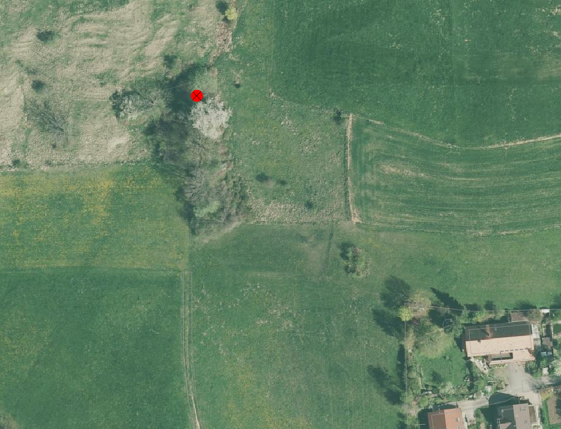

.. _ref_BestockteFlaechen:

Bestockte Fläche
================
In dieser Gruppe werden alle bestockten Flächen aus der amtlichen Vermessung auf deren Vollständigkeit und Richtigkeit in der Lage so wie in der Darstellung überprüft.

.. note::
   Unter Berücksichtigung von Sonderregelungen (z.B. Gebäude und Strassen) sind überflüssige Unterteilungslinien zu löschen. 

Folgende Objekte werden geprüft:

=============================  ========================================
Topic  		               Art    
=============================  ========================================
Bodenbedeckung                 geschlossener Wald
Bodenbedeckung                 Parkanlage bestockt
Bodenbedeckung                 Hecke
Bodenbedeckung		           übrige bestockte	
Einzelobjekt                   schmale best. Fläche
=============================  ========================================

.. note::
   Das Orthofoto mit der Darstellung des Infrarot-Kanals und das digitale Oberflächenmodell (DOM) können für eine bessere Interpretation der bestockten Flächen hinzugefügt werden.

+-------------------------------------------------------------------------------+------------------------------------------------------------------------------------+ 
|.. _Orthofoto_RGB:                                                             |.. _Orthofoto_CIR:                                                                  | 
|                                                                               |                                                                                    |
|.. figure:: _static/bestockte_Flaeche_geschlossener_Wald_Lagedifferenz_RGB.png |.. figure:: _static/bestockte_Flaeche_geschlossener_Wald_Lagedifferenz_IR.png       | 
|   :width: 550px                                                               |   :width: 550px                                                                    |
|   :target: _static/bestockte_Flaeche_geschlossener_Wald_Lagedifferenz_RGB.png |   :target: _static/bestockte_Flaeche_geschlossener_Wald_Lagedifferenz_IR.png       |
|                                                                               |                                                                                    |
|   Orthofoto mit den Kanälen Rot, Grün und Blau.                               |   Orthofoto mit den Kanälen Infrarot, Rot und Grün.                                |
+-------------------------------------------------------------------------------+------------------------------------------------------------------------------------+

BB.geschlossener_Wald
---------------------  
.. index:: Wald, geschlossener Wald   
                               
Lagedifferenz  
^^^^^^^^^^^^^                        
.. index:: Wald, geschlossener Wald   
                               
Wird eine Lagedifferenz zwischen der AV und dem aktuellen Othofoto grösser als die Toleranz (siehe :ref:`ref_Tz`) und der Feststellungsgenauigkeit detektiert, so ist das Objekt in der AV zu korrigieren. Liegt die Differenz innerhalb der Toleranz, wird das Objekt nicht angepasst.  

Ist die Lagekontrolle mit dem Orthofoto auf Grund von Interpretationsschwierigkeiten (z.B. durch Schaffenwurf oder Sichthindernisse) nicht möglich, kann das aktuelle digitale Oberflächenmodell hinzugeschaltet werden. Ist selbst mithilfe des digitalen Oberflächenmodells nicht klar ersichtlich, wo der Waldrand verläuft, wird in der AV keine Korrektur vorgenommen.

.. important:: 
   * Nicht unnötig zusätzlichen Wald generieren! Wald eher knapp als zu grosszügig definieren.
   * Nur offensichtliche Unstimmigkeiten korrigieren. Falls die Waldgrenze auf dem Orthofoto nicht klar ersichtlich ist, wird keine Korrektur in der AV vorgenommen.
   * Falls Bäume 10 m auseinander stehen ist diese Bestockung kein ``BB.geschlossener Wald``.

.. note::
   Durch die Kreisförster wird im Zyklus von 10 Jahren der Wald anhand des Waldgesetzes auf dem Waldplan erhoben. Als Grundlage für diese Waldpläne dient die AV. Die Anpassungen auf dem Waldplan durch die Kreisförster sind jeweils bei der PNF zu berücksichtigen.
   Stand der Waldpläne siehe  `Planung der Waldpläne <_static/WAP_BST_Jahr_Operate_20130521.pdf>`_

Benötigende Layer im QGIS:

.. code-block:: none

   Bestockte Fläche / Lagekontrolle   
   Waldplan
                                
Beispiele:

+--------------------------------------------------------------------------------------------+------------------------------------------------------------------------------------+ 
|.. _bestockte_Flaeche_geschlossener_Wald_Lagedifferenz:                                     |.. _bestockte_Flaeche_geschlossener_Wald_Lagedifferenz_korr:                        | 
|                                                                                            |                                                                                    |
|.. figure:: _static/bestockte_Flaeche_geschlossener_Wald_Lagedifferenz.png                  |.. figure:: _static/bestockte_Flaeche_geschlossener_Wald_Lagedifferenz_korr.png     | 
|   :width: 550px                                                                            |   :width: 550px                                                                    |
|   :target: _static/bestockte_Flaeche_geschlossener_Wald_Lagedifferenz.png                  |   :target: _static/bestockte_Flaeche_geschlossener_Wald_Lagedifferenz_korr.png     |
|                                                                                            |                                                                                    |
|   ``BB.geschlossener_Wald`` ist zu korrigieren, weil die Lagedifferenz                     |   ``BB.geschlossener_Wald`` ist zu korrigieren gemäss der rot dargestellten Linie. |
|   grösser als die Toleranz (TS3: 6.0 m) und Feststellungsgenauigkeit ist.                  |                                                                                    |
+--------------------------------------------------------------------------------------------+------------------------------------------------------------------------------------+        
|.. _bestockte_Flaeche_geschlossener_Wald_Lagedifferenz2:                                    |.. _bestockte_Flaeche_geschlossener_Wald_Lagedifferenz_korr2:                       | 
|                                                                                            |                                                                                    |
|.. figure:: _static/bestockte_Flaeche_geschlossener_Wald_Lagedifferenz2.png                 |.. figure:: _static/bestockte_Flaeche_geschlossener_Wald_Lagedifferenz2_korr.png    | 
|   :width: 550px                                                                            |   :width: 550px                                                                    |
|   :target: _static/bestockte_Flaeche_geschlossener_Wald_Lagedifferenz2.png                 |   :target: _static/bestockte_Flaeche_geschlossener_Wald_Lagedifferenz2_korr.png    |
|                                                                                            |                                                                                    |
|   ``BB.geschlossener_Wald`` ist zu korrigieren, weil die Lagedifferenz                     |   ``BB.geschlossener_Wald`` ist zu korrigieren gemäss der rot dargestellten Linie  |
|   grösser als die Toleranz (TS4: 6.0 m) und Feststellungsgenauigkeit ist.                  |                                                                                    |
+--------------------------------------------------------------------------------------------+------------------------------------------------------------------------------------+ 
|.. _bestockte_Flaeche_geschlossener_Wald_Lagedifferenz3:                                    |.. _bestockte_Flaeche_geschlossener_Wald_Lagedifferenz_korr3:                       | 
|                                                                                            |                                                                                    |
|.. figure:: _static/bestockte_Flaeche_geschlossener_Wald_Lagedifferenz_3.png                |.. figure:: _static/bestockte_Flaeche_geschlossener_Wald_Lagedifferenz_korr_3.png   | 
|   :width: 550px                                                                            |   :width: 550px                                                                    |
|   :target: _static/bestockte_Flaeche_geschlossener_Wald_Lagedifferenz_3.png                |   :target: _static/bestockte_Flaeche_geschlossener_Wald_Lagedifferenz_korr_3.png   |
|                                                                                            |                                                                                    |
|   ``BB.geschlossener_Wald`` ist zu korrigieren, weil die Lagedifferenz                     |   ``BB.geschlossener_Wald`` ist zu korrigieren gemäss der rot dargestellten Linie. |
|   grösser als die Toleranz (TS4: 6.0 m) und Feststellungsgenauigkeit ist.                  |   Da die Bäume im rechten Bereich weiter auseinander stehen als 10 m, ist diese    |
|   Hinweis: Die Dichte der Bestockung gegen Süden nimmt ab (Distanz zwischen den Bäumen     |   Bestockung nicht zu erfassen.                                                    |
|   > 10 m) und erfüllt die Kriterien des ``BB.geschlossener_Wald`` nicht mehr.              |                                                                                    |
+--------------------------------------------------------------------------------------------+------------------------------------------------------------------------------------+ 
|.. _bestockte_Flaeche_geschlossener_Wald_Lagedifferenz6:                                    |.. _bestockte_Flaeche_geschlossener_Wald_Lagedifferenz_korr6:                       | 
|                                                                                            |                                                                                    |
|.. figure:: _static/bestockte_Flaeche_geschlossener_Wald_Lagedifferenz_6.png                |.. figure:: _static/bestockte_Flaeche_geschlossener_Wald_Lagedifferenz_korr_6.png   | 
|   :width: 550px                                                                            |   :width: 550px                                                                    |
|   :target: _static/bestockte_Flaeche_geschlossener_Wald_Lagedifferenz_6.png                |   :target: _static/bestockte_Flaeche_geschlossener_Wald_Lagedifferenz_korr_6.png   |
|                                                                                            |                                                                                    |
|   ``BB.geschlossener_Wald`` ist zu korrigieren, weil die Lagedifferenz                     |   ``BB.geschlossener_Wald`` ist zu korrigieren gemäss der rot dargestellten Linie. |
|   grösser als die Toleranz (TS3: 6.0 m) und Feststellungsgenauigkeit ist.                  |                                                                                    |
+--------------------------------------------------------------------------------------------+------------------------------------------------------------------------------------+ 
|.. _bestockte_Flaeche_geschlossener_Wald_Lagedifferenz_iO_2:                                |.. _bestockte_Flaeche_geschlossener_Wald_Lagedifferenz_iO:                          | 
|                                                                                            |                                                                                    |
|.. figure:: _static/bestockte_Flaeche_geschlossener_Wald_Lagedifferenz_iO_2.png             |.. figure:: _static/bestockte_Flaeche_geschlossener_Wald_Lagedifferenz_iO.png       | 
|   :width: 550px                                                                            |   :width: 550px                                                                    |
|   :target: _static/bestockte_Flaeche_geschlossener_Wald_Lagedifferenz_iO_2.png             |   :target: _static/bestockte_Flaeche_geschlossener_Wald_Lagedifferenz_iO.png       |
|                                                                                            |                                                                                    |
|   ``BB.geschlossener_Wald`` ist **nicht** zu korrigieren, weil die                         |   ``BB.geschlossener_Wald`` ist **nicht** zu korrigieren, weil die                 |
|   Lagedifferenz  kleiner als die Toleranz (TS3: 6.0 m) ist.                                |   Lagedifferenz kleiner als die Toleranz (TS3: 6.0 m) ist.                         |
+--------------------------------------------------------------------------------------------+------------------------------------------------------------------------------------+ 
|.. _Wald_Lidar_Ortho:                                                                       |.. _Wald_Lidar_DTM:                                                                 |
|                                                                                            |                                                                                    |
|.. figure:: _static/OrthoWald.jpg                                                           |.. figure:: _static/LidarWald.jpg                                                   |     
|   :width:  550px                                                                           |   :width:  550px                                                                   |
|   :target: _static/OrthoWald.jpg                                                           |   :target: _static/LidarWald.jpg                                                   |
|                                                                                            |                                                                                    | 
|   ``BB.geschlossener_Wald`` ist überhaupt nicht resp. nur sehr schlecht                    |   ``BB.geschlossener_Wald`` ist im DOM gut sichtbar (und muss **nicht** korrigiert | 
|   sichtbar.                                                                                |   werden).                                                                         |
+--------------------------------------------------------------------------------------------+------------------------------------------------------------------------------------+
|.. _Wald_Lidar_Ortho2:                                                                      |.. _Wald_Lidar_DTM2:                                                                |
|                                                                                            |                                                                                    |
|.. figure:: _static/Wald2_Ortho.jpg                                                         |.. figure:: _static/Wald2_Lidar.jpg                                                 |     
|   :width:  550px                                                                           |   :width:  550px                                                                   |
|   :target: _static/Wald2_Ortho.jpg                                                         |   :target: _static/Wald2_Lidar.jpg                                                 |
|                                                                                            |                                                                                    | 
|   ``BB.geschlossener_Wald`` ist schlecht sichtbar.                                         |   ``BB.geschlossener_Wald`` ist im DTM aufgrund der Bodenstruktur gut sichtbar     | 
|                                                                                            |   (und muss **nicht** korrigiert werden).                                          |
+--------------------------------------------------------------------------------------------+------------------------------------------------------------------------------------+

Objekt fehlt/ löschen
^^^^^^^^^^^^^^^^^^^^^
Ist auf dem aktuellen Orthofoto ein geschlossener Wald zu erkennen, welcher das Flächenkriterium von 500 m2 erfüllt und die Breite > 12 m ist, ist dieser im Rahmen der PNF/Homogenisierung neu in der AV zu erfassen. Ist in der AV ein geschlossener Wald vorhanden, der auf dem aktuellen Orthofoto nicht mehr zu erkennen ist, ist dieses Objekt zu löschen. 

.. important:: 
   Rodungsflächen gehören zu ``BB.geschlossener_Wald``.
                                                                                                                                                                   
Benötigende Layer im QGIS:

.. code-block:: none

   Bestockte Fläche / Lagekontrolle  
   Bestockte Fläche / Waldplan

Beispiel:
                                                                     
.. _bestockte_Flaeche_geschlossener_Wald_fehlt:                                                                                                                                                               
                                                                     
.. figure:: _static/bestockte_Flaeche_geschlossener_Wald_fehlt.png       
   :width: 550px                                                     
   :target: _static/bestockte_Flaeche_geschlossener_Wald_fehlt.png         
   
   ``BB.geschlossener_Wald`` fehlt und ist deshalb neu zu erfassen. 
                                                               

                                                                      
Objekt umattribuieren
^^^^^^^^^^^^^^^^^^^^^                                                                                                                                                                                                                            
Ist in der AV geschlossener Wald erfasst, der das Flächenkriterium von 500 m2 und die Breite > 12 m nicht erfüllen, ist dieser umzuattribuieren.    

.. note::
   | Waldstücke die durch ``BB.Strasse_Weg`` getrennt werden, gehören zu ``BB.geschlossener_Wald``. Einzelne Teilflächen sind für die Beurteilung des Flächenkriteriums als eine Fläche zu betrachten.
   | Waldzungen deren Breite zwischen 6 m und 12 m liegt, werden ab einer Länge von 20 m nicht mehr als ``BB.geschlossener_Wald`` attribuiert. Waldzungen mit einer Breite kleiner 6 m gehören nicht zu ``BB.geschlossener_Wald``.
   
Benötigende Layer im QGIS:

.. code-block:: none

   Bestockte Fläche / Lagekontrolle 
   Bestockte Fläche / Checklayer / BB.Wald in TS2
   Bestockte Fläche / Waldplan

Beispiele:

+-----------------------------------------------------------------------------+------------------------------------------------------------------------------------+ 
|.. _bestockte_Flaeche_geschlossener_Wald_umattribuieren:                     |.. _bestockte_Flaeche_geschlossener_Wald_umattribuieren_korr:                       | 
|                                                                             |                                                                                    |
|.. figure:: _static/bestockte_Flaeche_geschlossener_Wald_umattribuieren.png  |.. figure:: _static/bestockte_Flaeche_geschlossener_Wald_umattribuieren_korr.png    | 
|   :width: 550px                                                             |   :width: 550px                                                                    |
|   :target: _static/bestockte_Flaeche_geschlossener_Wald_umattribuieren.png  |   :target: _static/bestockte_Flaeche_geschlossener_Wald_umattribuieren_korr.png    |
|                                                                             |                                                                                    |
|   ``BB.geschlosener Wald`` < 12m ist umzuattribuieren in ``BB.Hecke``.      |   ``BB.geschlossener Wald`` ist zu korrigieren gemäss den rot dargestellten Linien.|
+-----------------------------------------------------------------------------+------------------------------------------------------------------------------------+                     
|.. _bestockte_Flaeche_geschlossener_Wald_umattribuieren2:                    |.. _bestockte_Flaeche_geschlossener_Wald_umattribuieren_korr2:                      | 
|                                                                             |                                                                                    |
|.. figure:: _static/bestockte_Flaeche_geschlossener_Wald_umattribuieren_2.png|.. figure:: _static/bestockte_Flaeche_geschlossener_Wald_umattribuieren_korr_2.png  | 
|   :width: 550px                                                             |   :width: 550px                                                                    |
|   :target: _static/bestockte_Flaeche_geschlossener_Wald_umattribuieren_2.png|   :target: _static/bestockte_Flaeche_geschlossener_Wald_umattribuieren_korr_2.png  |
|                                                                             |                                                                                    |
|   Waldzungen mit Breite zwischen 6 m und 12 m gehört nur bis max. einer     |   ``BB.geschlossener Wald`` ist zu korrigieren gemäss den rot dargestellten Linien.|
|   Länge von 20 m zu ``BB.geschlossener_Wald``.                              |                                                                                    |
+-----------------------------------------------------------------------------+------------------------------------------------------------------------------------+

Darstellung nicht nach Richtlinie  
^^^^^^^^^^^^^^^^^^^^^^^^^^^^^^^^^     
Im Rahmen der PNF/Homogenisierung werden keine Änderungen vorgenommen. Die Waldgrenze wird **nicht** an die Liegenschaftsgrenze angepasst.
 

BB.uebrige_Bestockte
--------------------
.. index:: übrige Bestockte  
                               
Lagedifferenz  
^^^^^^^^^^^^^                        
                         
Wird eine Lagedifferenz zwischen der AV und dem aktuellen Orthofoto grösser als die Toleranz (siehe :ref:`ref_Tz`) und die Feststellungsgenauigkeit detektiert, so ist das Objekt in der AV zu korrigieren. Ist die Lagekontrolle mit dem Orthofoto auf Grund von Interpretationsschwierigkeiten (z.B. durch Schaffenwurf oder Sichthindernisse) nicht möglich, kann das digitale Oberflächenmodell hinzugeschaltet werden. Liegt die Differenz innerhalb der Toleranz und der Feststellungsgenauigkeit, wird das Objekt nicht angepasst. 

Benötigende Layer im QGIS:

.. code-block:: none

   Bestockte Fläche / Lagekontrolle   
                                

Objekt fehlt/ löschen  
^^^^^^^^^^^^^^^^^^^^^
Ist auf dem aktuellen Orthofoto eine Bestockung zu erkennen, welche die Kriterien gemäss *Handbuches der amtlichen Vermessung Kanton Solothurn* erfüllt, ist dieses Objekt zu erfassen. 
Falls in der AV eine Fläche mit Art ``BB.uebrige_Bestockte`` vorhanden ist, das auf dem aktuellen Orthofoto nicht mehr zu erkennen ist oder die Kriterien gemäss *Handbuches der amtlichen Vermessung Kanton Solothurn* nichr erfüllt, ist dieses Objekt zu löschen. 

Benötigende Layer im QGIS:

.. code-block:: none

   Bestockte Fläche / Lagekontrolle  

Objekt umattribuieren
^^^^^^^^^^^^^^^^^^^^^ 
Sind in der AV ``BB.uebrige_Bestockte``-Objekte erfasst, die zu ``BB.Hecke`` oder ``BB.geschlossener_Wald`` gehören, sind diese umzuattribuieren.

.. note::
   * Aufforstungen gehören zu ``BB.geschlossener_Wald``.

Beispiel:

+-----------------------------------------------------------------------------+-----------------------------------------------------------------------------------+                                                                     
|.. _bestockte_Flaeche_uebrige_Bestockte_umattribuieren:                      |.. _bestockte_Flaeche_uebrige_Bestockte_umattribuieren2:                           | 
|                                                                             |                                                                                   |
|.. figure:: _static/bestockte_Flaeche_uebrige_Bestockte_umattribuieren.png   |.. figure:: _static/bestockte_Flaeche_uebrige_Bestockte_umattribuieren2.png        | 
|   :width: 550px                                                             |   :width: 550px                                                                   |
|   :target: _static/bestockte_Flaeche_uebrige_Bestockte_umattribuieren.png   |   :target: _static/bestockte_Flaeche_uebrige_Bestockte_umattribuieren2.png        |
|                                                                             |                                                                                   |
|   ``BB.uebrige_Bestocke`` ist umzuattribuieren in ``BB.geschlossener_Wald``.|   ``BB.uebrige_bestocke`` ist umzuattribuieren in ``BB.Hecke``.                   |  
+-----------------------------------------------------------------------------+-----------------------------------------------------------------------------------+ 

Darstellung nicht nach Richtlinie  
^^^^^^^^^^^^^^^^^^^^^^^^^^^^^^^^^     
Im Rahmen der PNF/Homogenisierung werden **keine** Änderungen vorgenommen.   
   
   
   
BB.Parkanlage_bestockt
----------------------
.. index:: Parkanlage bestockt
                               
Lagedifferenz  
^^^^^^^^^^^^^                        
                         
Wird eine Lagedifferenz zwischen der AV und dem aktuellen Orthofoto grösser als die Toleranz (siehe :ref:`ref_Tz`) und die Feststellungsgenauigkeit detektiert, so ist das Objekt in der AV zu korrigieren. Ist die Lagekontrolle mit dem Orthofoto auf Grund von Interpretationsschwierigkeiten (z.B. durch Schaffenwurf oder Sichthindernisse) nicht möglich, kann das digitale Oberflächenmodell hinzugeschaltet werden. Liegt die Differenz innerhalb der Toleranz und der Feststellungsgenauigkeit, wird das Objekt nicht angepasst. 

Benötigende Layer im QGIS:

.. code-block:: none

   Bestockte Fläche / Lagekontrolle   

Objekt fehlt / löschen / umattribuieren
^^^^^^^^^^^^^^^^^^^^^^^^^^^^^^^^^^^^^^^^^^^^^^^^^^^^
Ist auf dem aktuellen Orthofoto eine bestockte Parkanlage zu erkennen, die nicht in der AV erfasst ist, ist diese bestockte Fläche im Rahmen der PNF/Homogenisierung **nicht** neu in der AV als ``BB.Parkanlage_bestockt`` zu erfassen. 
Ist in der AV eine ``BB.Parkanlage_bestockt`` erfasst, die auf dem aktuellen Orthofoto nicht mehr zu erkennen ist oder das Aufnahmekriterium nicht erfüllt, ist dieses Objekt zu löschen.
Sind in der AV bestockte Parkanlagen erfasst, die gemäss Kriterium *Handbuch der amtlichen Vermessung Kanton Solothurn*  zu ``BB.übrige Bestockte``, ``BB.Hecke`` oder ``BB.geschlossener Wald`` gehören, sind die Objekte umzuattribuieren.

Benötigte Layer in QGIS:

.. code-block:: none

   Bestockte Fläche / Lagekontrolle   

BB.Hecke
---------
.. index:: Hecke
                               
Lagedifferenz  
^^^^^^^^^^^^^                        
                         
Wird eine Lagedifferenz zwischen der AV und dem aktuellen Orthofoto grösser als die Toleranz (siehe :ref:`ref_Tz`) und die Feststellungsgenauigkeit detektiert, so ist das Objekt in der AV zu korrigieren. Ist die Lagekontrolle mit dem Orthofoto auf Grund von Interpretationsschwierigkeiten (z.B. durch Schaffenwurf oder Sichthindernisse) nicht möglich, kann das digitale Oberflächenmodell hinzugeschaltet werden. Liegt die Differenz innerhalb der Toleranz und der Feststellungsgenauigkeit, wird das Objekt nicht angepasst. 

Benötigende Layer im QGIS:

.. code-block:: none

   Bestockte Fläche / Lagekontrolle   

Objekt fehlt/ löschen
^^^^^^^^^^^^^^^^^^^^^
Ist auf dem aktuellen Orthofoto eine Bestockung zu erkennen, die das Minimalflächenkriterium von 250m2 erfüllt, ist diese bestockte Fläche im Rahmen der PNF/Homogenisierung neu in der AV als ``BB.Hecke`` zu erfassen. 
Ist in der AV eine ``BB.Hecke`` erfasst, die auf dem aktuellen Orthofoto nicht mehr zu erkennen ist oder das Aufnahmekriterium (Fläche zischen 250m2 bis <500m2 oder Fläche > 500m2 aber Breite <12m) nicht erfüllt, ist dieses Objekt zu löschen.

Benötigte Layer in QGIS:

.. code-block:: none

   Bestockte Fläche / Lagekontrolle   

Beispiel:

.. _bestockte_Flaeche_Hecke_fehlt:                             
                               

                                                                  
   Die ``BB.Hecke`` ist zu erfassen, da diese das Flächenkriterium von 250 m2 erfüllen. Die Baumgruppe unten rechts wird nicht als Hecke erfasst. Diese Baumgruppe gehört zu Gartenanlage.
    

Objekt umattribuieren
^^^^^^^^^^^^^^^^^^^^^ 
Sind in der AV Hecken erfasst, die gemäss Kriterium *Handbuches der amtlichen Vermessung Kanton Solothurn*  zu ``BB.übrige Bestockte`` oder ``BB.geschlossener Wald`` gehören, sind sie dementsprechend anzupassen.
    
Benötigte Layer in QGIS:
      
.. code-block:: none

   Bestockte Fläche / Lagekontrolle          

Beispiel:

.. _bestockte_Flaeche_Heck_umattribuieren:                             
                               
.. figure:: _static/bestockte_Flaeche_Heck_umattribuieren.png
   :width: 550px               
   :target: _static/bestockte_Flaeche_Heck_umattribuieren.png  
                                                                  
   ``BB.Hecke`` ist umzuattribuieren in ``BB.geschlossener Wald``. Weil die Bachbreite kleiner 4m ist, wird die Bestockung als zusammenhängende Einheit betrachtet.

Darstellung nicht nach Richtlinie  
^^^^^^^^^^^^^^^^^^^^^^^^^^^^^^^^^     
Im Rahmen der PNF/Homogenisierung werden **keine** Änderungen vorgenommen.   
   
   
EO.schmale_bestockte_Fläche
---------------------------
.. index:: schmale bestockte Fläche                                                             

In den Daten der AV dürfen keine Objekte mit der Art ``EO.schmale_bestockte_Fläche`` erfasst sein.

Objekt löschen
^^^^^^^^^^^^^^
                       
Erfasste ``EO.schmale_bestockte_Fläche`` in der AV sind zu löschen. 

Benötigte Layer in QGIS:

.. code-block:: none

   Bestockte Fläche / Checklayer / EO.schmale_bestockte_Flaeche

   
                                                                                                                                                   
                                                                    
