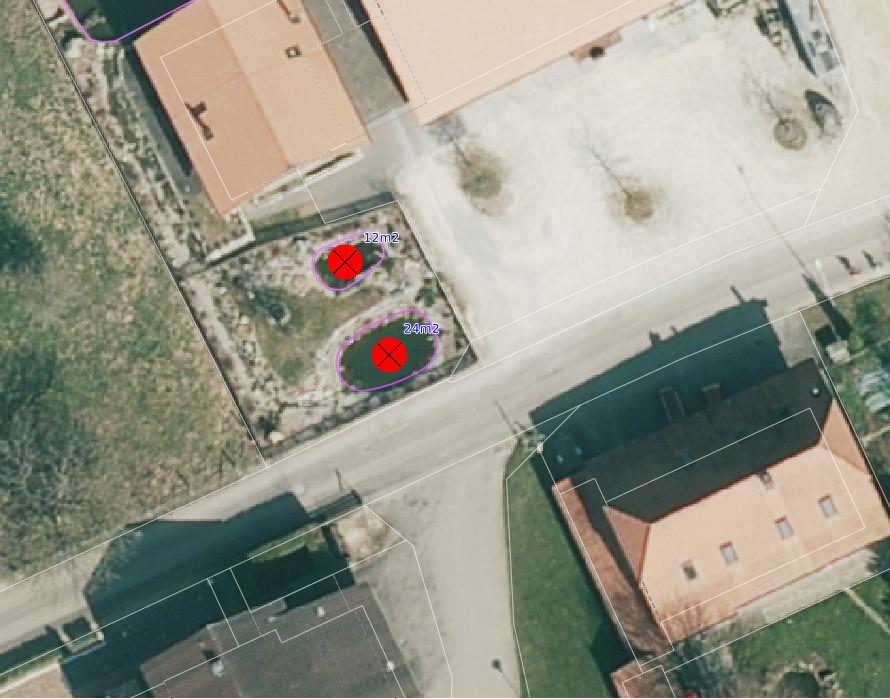
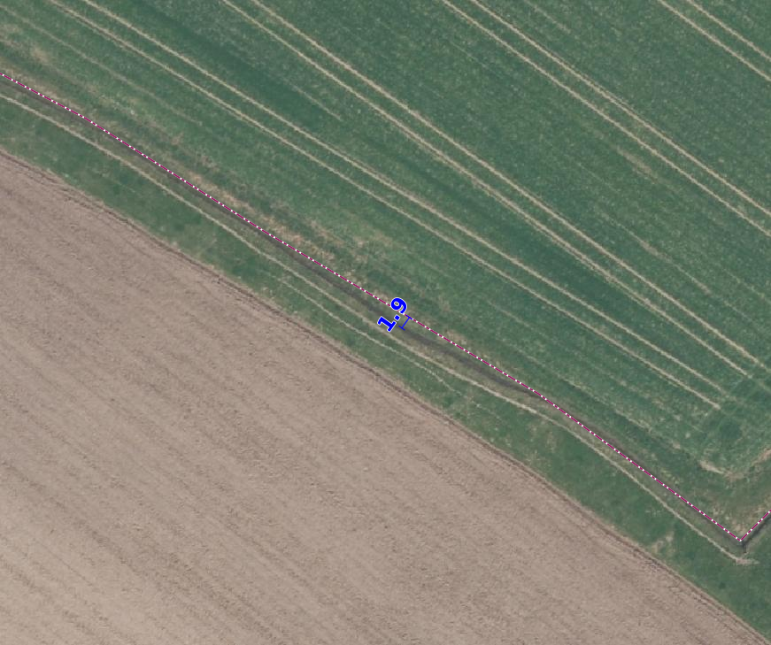

Gewässer
========
In dieser Gruppe werden alle Elemente des Gewässers aus der amtlichen Vermessung auf dessen Vollständigkeit und Richtigkeit in der Lage so wie in der Darstellung überprüft.

.. note::
   Unter Berücksichtigung von Sonderregelungen (z.B. Gebäude und Strassen) sind überflüssige Unterteilungslinien zu löschen. 

Folgende Objekte werden geprüft:

=============================  =========================
Topic  		               Art    
=============================  =========================
Bodenbedeckung                 stehendes Gewässer
Bodenbedeckung                 fliessendes Gewässer
Bodenbedeckung                 Schilfgürtel
Einzelobjekt                   Einged. öff. Gewässer
Einzelobjekt                   Brücke, Passerelle
Einzelobjekt                   Schwelle
Einzelobjekt	               Rinnsal
Einzelobjekt                   Quelle
=============================  =========================

BB.stehendes_Gewaesser  
----------------------  
.. index:: stehendes Gewässer, Weiher, See, Biotop, Schwimmteich    
                               
Lagedifferenz  
^^^^^^^^^^^^^                        
                         
Wird eine Lagedifferenz zwischen der AV und dem aktuellen Orthofoto grösser als die Toleranz (siehe :ref:`ref_Tz`) detektiert, so ist das Objekt in der AV zu korrigieren. Liegt die Differenz innerhalb der Toleranz, wird das Objekt nicht angepasst. 

Benötigte Layer im QGIS:

.. code-block:: none

   Gewaesser/ Lagekontrolle   
                                

Beispiele:
                              
+-------------------------------------------------------------------------+-----------------------------------------------------------------------------------+
|.. _Gewasser_stehendes_Gewaesser_Lagedifferenz:                          |.. _Gewasser_stehendes_Gewaesser_Lagedifferenz_korr:                               |
|                                                                         |                                                                                   |
|.. figure:: _static/Gewasser_stehendes_Gewaesser_Lagedifferenz.png       |.. figure:: _static/Gewasser_stehendes_Gewaesser_Lagedifferenz_korr.png            |
|   :width: 550px                                                         |   :width: 550px                                                                   |
|   :target: _static/Gewasser_stehendes_Gewaesser_Lagedifferenz.png       |   :target: _static/Gewasser_stehendes_Gewaesser_Lagedifferenz_korr.png            |
|                                                                         |                                                                                   |
|   ``BB.stehendes_Gewaesser`` ist zu korrigieren, weil die Lagedifferenz |   ``BB.stehendes_Gewaesser`` ist zu korrigieren gemäss den rot dargestellten      |
|   grösser als die Toleranz (TS3: 3.0 m) ist.                            |   Linien.                                                                         |
+-------------------------------------------------------------------------+-----------------------------------------------------------------------------------+
                                                                                                                                                   

Objekt fehlt/löschen  
^^^^^^^^^^^^^^^^^^^^
Ist auf dem aktuellen Orthofoto ein stehendes Gewässer zu erkennen, welches öffentlich ist oder das Flächenkriterium erfüllt und nicht in der AV ist, ist dieses im Rahmen der PNF/Homogenisierung neu in der AV zu erfassen. 
Ist in der AV ein stehendes Gewässer vorhanden, das auf dem aktuellen Orthofoto nicht mehr zu erkennen ist oder das Flächenkriterium nicht erfüllt, ist dieses Objekt zu löschen.

Benötigte Layer im QGIS:

.. code-block:: none

   Gewässer / Lagekontrolle
   Gewässer / Checklayer / BB.stehendes_Gewaesser < 100 m2

Beispiele:

                                                                      

.. _Gewaesser_stehendes_Gewaesser_loeschen:                          
                                                                     

   
   Beide ``BB.stehendes Gewässer`` erfüllt das Flächenkriterium nicht. Die Objekte ``BB.stehendes Gewässer`` sind zu löschen.  
                                                               

                                                                      
Objekt umattribuieren
^^^^^^^^^^^^^^^^^^^^^                                                                                                                                                                                                                            
Sind in der AV stehende Gewässer erfasst, die einen befestigten Abschluss haben, sind diese nach ``BB.Wasserbecken`` umzuattribuieren. Schwimmteiche gehören zu ``BB.stehendes_Gewaesser``. Genauere Erläuterung über die Erfassung der Schwimmteiche sind im *Handbuch der amtlichen Vermessung Kanton Solothurn* zu finden.  

Benötigte Layer im QGIS:

.. code-block:: none

   Gewässer / Lagekontrolle   
   

Darstellung nicht nach Richtlinie  
^^^^^^^^^^^^^^^^^^^^^^^^^^^^^^^^^     
Im Rahmen der PNF/Homogenisierung werden **keine** Änderungen vorgenommen.
   
   
                                                          
BB.fliessendes_Gewaesser
------------------------   
.. index:: fliessendes Gewässer, Bach, Fluss

Lagedifferenz  
^^^^^^^^^^^^^                        
                         
Wird eine Lagedifferenz zwischen der AV und dem aktuellen Orthofoto grösser als die Toleranz (siehe :ref:`ref_Tz`) detektiert, so ist das Objekt in der AV zu korrigieren. Liegt die Differenz innerhalb der Toleranz, wird das Objekt nicht angepasst. 

Benötigte Layer im QGIS:

.. code-block:: none

   Gewaesser/ Lagekontrolle   
                                

Beispiele:
                              
+--------------------------------------------------------------------------+-----------------------------------------------------------------------------------+
|.. _Gewaesser_fliessendes_Gewaesser_Lagedifferenz:                        |.. _Gewaesser_fliessendes_Gewaesser_Lagedifferenz_korr:                            |
|                                                                          |                                                                                   |
|.. figure:: _static/Gewaesser_fliessendes_Gewaesser_Lagedifferenz.png     |.. figure:: _static/Gewaesser_fliessendes_Gewaesser_Lagedifferenz_korr.png         |
|   :width: 550px                                                          |   :width: 550px                                                                   |
|   :target: _static/Gewaesser_fliessendes_Gewaesser_Lagedifferenz.png     |   :target: _static/Gewaesser_fliessendes_Gewaesser_Lagedifferenz_korr.png         |
|                                                                          |                                                                                   |
|   ``BB.fliessendes_Gewaesser`` ist zu korrigieren, weil die Lagedifferenz|   ``BB.fliessendes_Gewaesser`` ist zu korrigieren gemäss den rot dargestellten    |
|   grösser als die Toleranz (TS3: 3.0 m) ist.                             |   Linien.                                                                         |
+--------------------------------------------------------------------------+-----------------------------------------------------------------------------------+
                                                                                                                                                      

Objekt fehlt/löschen  
^^^^^^^^^^^^^^^^^^^^
Ist auf dem aktuellen Orthofoto ein fliessendes Gewässer zu erkennen, das nicht in der AV vorhaden ist, ist diese im Rahmen der PNF/Homogenisierung neu in der AV zu erfassen. 
Ist in der AV ein fliessendes Gewässer vorhanden, das auf dem aktuellen Orthofoto nicht mehr zu erkennen ist, ist dieses Objekt zu löschen.

Benötigte Layer im QGIS:

.. code-block:: none

   Gewässer / Lagekontrolle
   Gewässer / Lagekontrolle/ GEWISSO
   
                                                                       
Objekt umattribuieren
^^^^^^^^^^^^^^^^^^^^^                                                                                                                                                                                                                            
Sind in der AV fliessende Gewässer erfasst, deren Breite kleiner als 50 cm sind, sind diese nach ``EO.Rinnsal`` umzuattribuieren. 

Benötigte Layer im QGIS:

.. code-block:: none

   Gewässer / Lagekontrolle     

Darstellung nicht nach Richtlinie  
^^^^^^^^^^^^^^^^^^^^^^^^^^^^^^^^^     
Im Rahmen der PNF/Homogenisierung werden **keine** Änderungen vorgenommen.

   
   
BB.Schilfgürtel   
---------------   
.. index:: Schilfgürtel

Lagedifferenz  
^^^^^^^^^^^^^   
Wird eine Lagedifferenz zwischen der AV und dem aktuellen Orthofoto grösser als die Toleranz (siehe :ref:`ref_Tz`) detektiert, so ist das Objekt in der AV zu korrigieren. Liegt die Differenz innerhalb der Toleranz, wird das Objekt nicht angepasst. 
 
Benötigte Layer im QGIS:

.. code-block:: none

   Gewässer / Lagekontrolle     

Objekt fehlt/löschen/umattribuieren  
^^^^^^^^^^^^^^^^^^^^^^^^^^^^^^^^^^^^
Ist auf dem aktuellen Orthofoto ein Schilfgürtel vorhanden, welcher das Flächenkriterium erfüllt und nicht in der AV ist, ist dieser im Rahmen der PNF/Homogenisierung neu in der AV zu erfassen. Ist in der AV eine Schilfgürtel vorhanden, der auf dem aktuellen Orthofoto nicht mehr zu erkennen ist, ist dieses Objekt zu löschen.
   
Benötigte Layer im QGIS:

.. code-block:: none

   Gewässer / Lagekontrolle     

Darstellung nicht nach Richtlinie  
^^^^^^^^^^^^^^^^^^^^^^^^^^^^^^^^^     
Im Rahmen der PNF/Homogenisierung werden **keine** Änderungen vorgenommen.

EO.eingedoltes_oeffentliches_Gewaesser
--------------------------------------   
.. index:: eingedoltes öffentliches Gewässer   

Lagedifferenz / Objekt löschen  
^^^^^^^^^^^^^^^^^^^^^^^^^^^^^^
Sind zuverlässige Referenzdaten von eingedolten Gewässer (z.B. aus Leitungskataster) vorhanden, sind die Daten der AV nach diesen zu korrigieren. Falls keine solche Daten vorhanden sind, sind die Objekte aus der AV zu entfernen.

.. important:: 
   Sind keine verlässlichen Geometrien vorhanden, ist auf die Darstellung eines eingedolten Gewässers in der AV zu verzichten.

Benötigte Layer im QGIS:

.. code-block:: none

   Gewässer / Lagekontrolle     
   
Objekt fehlt/umattribuieren
^^^^^^^^^^^^^^^^^^^^^^^^^^^
Es ist zu kontrollieren, ob bei jeder Brücke und bei jedem Durchlass unter Strassen/Bahnlinien ein ``EO.eingedoltes_oeffentliches_Gewaesser`` erfasst ist. Fehlende Objekte sind zu erfassen. Falls ein eingedoltes öffentliches Gewässer falsch attribuiert ist, ist dies entsprechend zu korrigieren.
   
Benötigte Layer im QGIS:

.. code-block:: none

   Gewässer / Lagekontrolle        

Darstellung nicht nach Richtlinie  
^^^^^^^^^^^^^^^^^^^^^^^^^^^^^^^^^
Gewässerfläche, die durch eine andere Bodenbedeckungsart überlagert werden z.B. durch Gebäude oder Parkplätze werden als ``EO.eingedoltes_oeffentliches_Gewaesser`` erfasst.

   
EO.Bruecke_Passerelle   
---------------------   
Lagedifferenz
^^^^^^^^^^^^^
Wird lediglich durch eine Plausibilitätsprüfung kontrolliert. Die Lage wird jeweils nicht mittels einer Feldkontrolle kontrolliert. Eine Korrektur der Ausdehnung auf die Widerlager oder die lichte Weite wird **nicht** vorgenommen.   

Benötigte Layer im QGIS:

.. code-block:: none

   Gewässer / Lagekontrolle     

   
Objekt fehlt/umattribuieren   
^^^^^^^^^^^^^^^^^^^^^^^^^^^^   
Fehlende Objekte sind gemäss *Handbuch der amtlichen Vermessung Kanton Solothurn* zu erfassen. Falls die Brücke/Passerelle falsch attribuiert ist, ist dies entsprechend zu korrigieren. Bei Brücken gilt das Prinzip der Vogelperspektive d.h. die über der Brücke resp. Passerelle verlaufende Bodenbedeckung wird durchgezogen.
   
Benötigte Layer im QGIS:

.. code-block:: none

   Gewässer / Lagekontrolle       
   
Darstellung nicht nach Richtlinie    
^^^^^^^^^^^^^^^^^^^^^^^^^^^^^^^^^       
Der Elemententyp bei ``EO.Brücke, Passerelle`` ist Flächenelement.        
   
EO.Schwelle
-----------
.. index:: Schwelle

Lagedifferenz                                                                                                                                                               
^^^^^^^^^^^^^
Im Rahmen der PNF/Homogenisierung werden **keine** Lagedifferenzen korrigiert.  

Objekt fehlt/löschen/umattribuieren   
^^^^^^^^^^^^^^^^^^^^^^^^^^^^^^^^^^^ 
Ist auf dem aktuellen Orthofoto ein Objekt zu erkennen, das nicht in der AV ist, ist dieses im Rahmen der PNF/Homogenisierung **nicht** neu zu erfassen. Falls in der AV ein Objekt vorhanden ist, welches auf dem aktuellen Orthofoto nicht mehr zu erkennen ist, ist dieses Objekt zu löschen oder evtl. einer anderen EO.Art zu zuweisen.

Benötigte Layer im QGIS:       
                                                                                                                                                                  
.. code-block:: none   

   Seltene Objekte / Lagekontrolle      
   
Darstellung nicht nach Richtlinie    
^^^^^^^^^^^^^^^^^^^^^^^^^^^^^^^^^        
Im Rahmen der PNF/Homogenisierung werden **keine** Änderungen vorgenommen.
   
   
EO.Rinnsal   
----------            
                       
.. index:: Rinnsal

Lagedifferenz  
^^^^^^^^^^^^^                        
                         
Wird eine Lagedifferenz zwischen der AV und dem aktuellen Orthofoto grösser als die Toleranz (siehe :ref:`ref_Tz`) detektiert, so ist das Objekt in der AV zu korrigieren. Liegt die Differenz innerhalb der Toleranz, wird das Objekt nicht angepasst. 

Benötigte Layer im QGIS:

.. code-block:: none

   Gewaesser / Lagekontrolle   

.. _Gewaesser_Rinnsal:                       
                                                                         

                                                                         
   ``EO.Rinnsal`` ist **nicht** zu korrigieren, weil die Lagedifferenz kleiner als die Toleranz (TS3: 3.0 m) ist.                            
                                                                                                                                                      

Objekt fehlt/löschen  
^^^^^^^^^^^^^^^^^^^^
Ist auf dem aktuellen Orthofoto ein Rinnsal zu erkennen, das nicht in der AV vorhanden ist, ist dieses im Rahmen der PNF/Homogenisierung neu in der AV zu erfassen. 
Ist in der AV ein Rinnsal vorhanden, das auf dem aktuellen Orthofoto nicht mehr zu erkennen ist, ist dieses Objekt zu löschen.
                    
Benötigte Layer im QGIS:

.. code-block:: none

   Gewässer / Lagekontrolle
   
.. note::
  Als Referenzdaten dienen zusätzlich die Daten aus dem Gewässerinformationssystem (GEWISSO) (siehe :ref:`ref_RefDaten`).  

Beispiele:   
   
                                                                       
Objekt umattribuieren
^^^^^^^^^^^^^^^^^^^^^                                                                                                                                                                                                                          
Sind in der AV Rinnsale erfasst deren Breite grösser als 50 cm sind, sind diese nach ``BB.fliessendes Gewässer`` umzuattribuieren. 

Benötigte Layer im QGIS:

.. code-block:: none

   Gewässer / Lagekontrolle     
   
Darstellung nicht nach Richtlinie    
^^^^^^^^^^^^^^^^^^^^^^^^^^^^^^^^^       
Der Elemententyp bei ``EO.Rinnsal`` ist Linienelement.                      
                       
EO.Quelle          
---------
.. index:: Quelle

In den Daten der AV dürfen keine Objekte mit der Art ``EO.Quelle`` erfasst sein.

Objekt löschen
^^^^^^^^^^^^^^
                       
Erfasste ``EO.Quellen`` in der AV sind zu löschen. 

Benötigte Layer im QGIS:

.. code-block:: none

   Gewässer / Checklayer / EO.Quelle

Objektnamen
-----------

Die Objektnamen (BB und EO) der Gewässer sind mit den Daten des Gewässerinformationssystem (GEWISSO) zu kontrollieren und wenn nötig zu bereinigen.  

|

