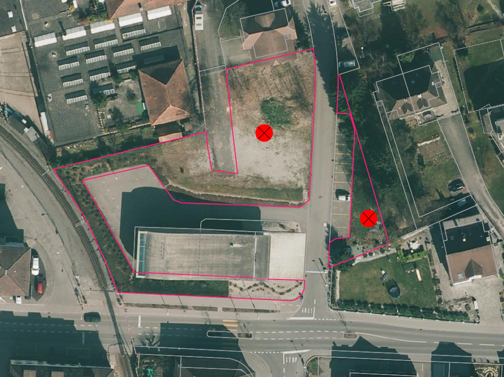

Landwirtschaft
==============
.. index:: Landwirtschaft

In dieser Mängelgruppe wird die landwirtschaftlich genutzte Fläche überprüft.

.. note::
   Unter Berücksichtigung von Sonderregelungen (z.B. Gebäude und Strassen) sind überflüssige Unterteilungslinien zu löschen. 

Folgende Objekte werden geprüft:

==================  =========================
Topic  		    Art    
==================  ========================= 
Bodenbedeckung      Acker_Wiese 
Bodenbedeckung      Weide
Bodenbedeckung      Reben
Bodenbedeckung      Obstkultur
Bodenbedeckung      uebrige_Intensivkultur
==================  =========================

BB.Acker_Wiese / BB.Weide
-------------------------
.. index:: Acker, Wiese, Weide

Lagedifferenz
^^^^^^^^^^^^^
Lagedifferenzen zwischen ``BB.Gartenanlage`` resp. bestockten Flächen und ``BB.Acker_Wiese`` resp. ``BB.Weide`` sind in den Mängelgruppen :ref:`ref_BebautesGebiet` und :ref:`ref_BestockteFlaechen` zu erfassen.

Objekt fehlt / Objekt löschen
^^^^^^^^^^^^^^^^^^^^^^^^^^^^^
Im Rahmen der PNF/Homogenisierung werden **keine** Änderungen vorgenommen.

Objekt umattribuieren
^^^^^^^^^^^^^^^^^^^^^
Falsch attribuierte Acker_Wiesen und Weiden sind der richtigen Bodenbedeckungsart zuzuweisen. 

Benötigte Layer in QGIS:

.. code-block:: none

   Landwirtschaft / Lagekontrolle
   Landwirtschaft / Checklayer / Acker_Wiese in TS2 (TODO)

Beispiele:

.. _fig_landw_1:

   Die beiden Acker_Wiesen-Objekte (rosa Linie) sind in ``BB.Gartenanlage`` umzuattribuieren.

Darstellung nicht nach Richtlinie  
^^^^^^^^^^^^^^^^^^^^^^^^^^^^^^^^^
Im Rahmen der PNF/Homogenisierung werden **keine** Änderungen vorgenommen.

BB.Weide
--------
.. Weide 

Lagedifferenz / Objekt fehlt / Objekt löschen
^^^^^^^^^^^^^^^^^^^^^^^^^^^^^^^^^^^^^^^^^^^^^
Im Rahmen der PNF/Homogenisierung werden **keine** Änderungen vorgenommen.

Objekt umattribuieren
^^^^^^^^^^^^^^^^^^^^^
Die Unterscheidung zwischen ``BB.Acker_Wiese`` und ``BB.Weide`` wird nicht länger gemacht. Weiden sind als ``Acker_Wiese`` zu attribuieren und Unterteilungslinien zu löschen. 

Benötigte Layer in QGIS:

.. code-block:: none

   Landwirtschaft / Checklayer / BB.Weide

Darstellung nicht nach Richtlinie
^^^^^^^^^^^^^^^^^^^^^^^^^^^^^^^^^
Im Rahmen der PNF/Homogenisierung werden **keine** Änderungen vorgenommen.

BB.Reben / BB.Obstkultur / BB.uebrige_Intensivkulturen
------------------------------------------------------
.. index:: Reben, Obstkultur, übrige Intensivkulturen  

Lagedifferenz
^^^^^^^^^^^^^
Die korrekte Lage ist mit dem aktuellen Orthofoto zu prüfen. Korrigiert werden Abweichungen ausserhalb der Toleranzbereiche (siehe :ref:`ref_Tz`)

Benötigte Layer in QGIS:

.. code-block:: none

   Landwirtschaft / Lagekontrolle

Beispiele:

+---------------------------------------------------------------------+-----------------------------------------------------------------------+
|.. _fig_landw_2:                                                     |.. _fig_landw_3:                                                       |
|                                                                     |                                                                       |
|.. figure:: _static/Landwirtschaft_Lagedifferenz_Kulturen.png        |.. figure:: _static/Landwirtschaft_Lagedifferenz_Kulturen_korr.png     |
|   :width: 550px                                                     |   :width: 550px                                                       |
|   :target: _static/Landwirtschaft_Lagedifferenz_Kulturen.png        |   :target: _static/Landwirtschaft_Lagedifferenz_Kulturen_korr.png     |
|                                                                     |                                                                       |
|   ``BB.Obstkultur`` (gelbe Linie) ist zu korrigieren.               |   Die ``BB.Obstkultur`` (> 1000 m2) ist zu korrigieren gemäss der     |
|                                                                     |   rot dargestellten Linie.                                            |
+---------------------------------------------------------------------+-----------------------------------------------------------------------+

Objekt fehlt
^^^^^^^^^^^^
Fehlende Objekte sind zu erfassen sofern sie grösser 1000 m2 sind.

Benötigte Layer in QGIS:

.. code-block:: none

   Landwirtschaft / Lagekontrolle

Objekt löschen
^^^^^^^^^^^^^^
Zu kleine oder nicht mehr vorhanden Intensivkulturen sind zu löschen.

Benötigte Layer in QGIS:

.. code-block:: none

   Landwirtschaft / Lagekontrolle
   Landwirtschaft / Checklayer / BB.Kulturen < 1000 m2
   
Objekt umattribuieren   
^^^^^^^^^^^^^^^^^^^^^
Falsch attribuierte Intensivkulturen sind zu korrigieren.

Darstellung nicht nach Richtlinie
^^^^^^^^^^^^^^^^^^^^^^^^^^^^^^^^^
Im Rahmen der PNF/Homogenisierung werden **keine** Änderungen vorgenommen.

|

