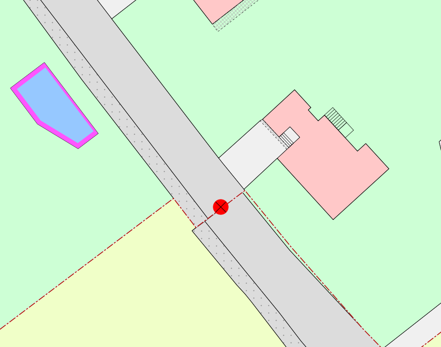

Differenzen am Perimeterrand
============================
.. index:: Perimeterrand

In dieser Mängelgruppe wird der Perimeterrand auf Widersprüche zu Nachbargemeinden überprüft.

Folgende Objekte werden geprüft:

==================  ==================
Topic  		    Art    
==================  ================== 
Bodenbedeckung      alle 
Einzelobjekt        alle
==================  ==================

Bodenbedeckung / Einzelobjekte
------------------------------

Lagedifferenz
^^^^^^^^^^^^^
Lagedifferenzen zwischen den Gemeinden sind zu korrigieren. Betrifft die Korrektur eine Nachbargemeinde eines anderen Nachführungsgeometers ist das AGI zu kontaktieren.

Benötigte Gruppen in QGIS:

.. code-block:: none

   Gemeinde
   AV-WMS (V+D)

Beispiel:

.. _fig_perimeterrand_1:

   Trottoir und Strasse sind anzupassen.

