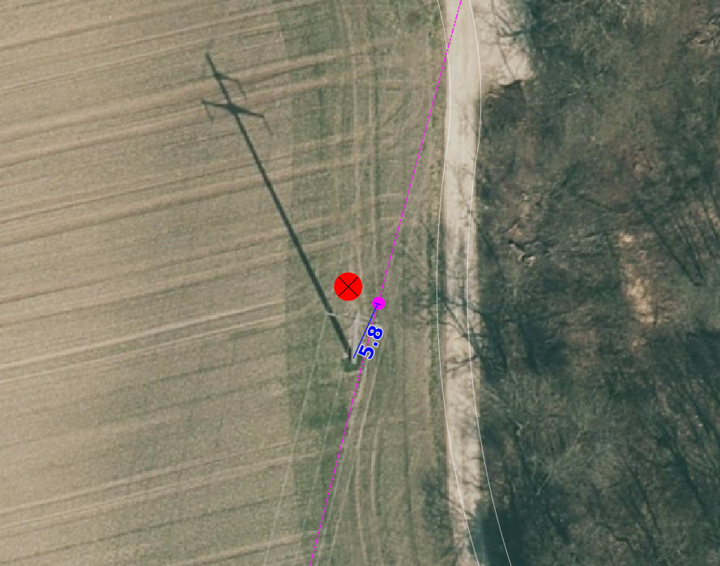

Bebautes Gebiet
===============
In dieser Mängelgruppe werden Objekte überprüft die eher selten sind. Folgende Objekte werden geprüft:

==================  =====================================    
Topic  		    Art    
==================  =====================================    
Bodenbedeckung      Sportanlage_befestigt 
Bodenbedeckung      Böschungsbauwerke
Bodenbedeckung      Sportanlage_humusiert
Bodenbedeckung      Friedhof
Bodenbedeckung      Hoch_Flachmoor
Bodenbedeckung      übrige_humusierte
Bodenbedeckung      Parkanlage_bestockt
Bodenbedeckung      Fels
Bodenbedeckung      Gröll, Sand
Bodenbedeckung      übrige vegetationslose
Bodenbedeckung      Steinbruch
Bodenbedeckung      Kiesgrube
Bodenbedeckung      übriger Abbau
Bodenbedeckung      Deponie
Einzelobjekt        Brunnen
Einzelobjekt        Mast, Antenne
Einzelobjekt        Mast, Leitung
Einzelobjekt        Hochspannungsfreileitung
Einzelobjekt        Einzelner Fels
Einzelobjekt        Gondelbahn, Sesselbahn
Einzelobjekt        Materialseilbahn
Einzelobjekt        Skilift
Einzelobjekt        Luftseilbahn
Einzelobjekt        Aussichtsturm
Einzelobjekt        Hochkamin
Einzelobjekt        Denkmal
Einzelobjekt        Uferverbauung
Einzelobjekt        Lawinenverbauung
Einzelobjekt        massiver Sockel
Einzelobjekt        Ruine, archäologisches Objekt
Einzelobjekt        Landungssteg
Einzelobjekt        Druckleitung
Einzelobjekt        Fähre
Einzelobjekt        Grotte, Höhleneingang
Einzelobjekt        Achse
Einzelobjekt        wichtiger Einzelbaum
Einzelobjekt        Kruzifix, Bildstock
Einzelobjekt        Weitere
==================  =====================================    

BB.Sportanlage befestigt/ BB.Sportanlage humusiert/ BB.Friedhof/ BB.Parkanlage humusiert/ BB.Parkanlage bestockt/ BB.übrige humusierte
------------------------------------------------------------------------------------------------------------------------------------------

Lagedifferenz
^^^^^^^^^^^^^
Wird eine Lagedifferenz zwischen der AV und dem aktuelle Orthofoto grosser als die Toleranz (siehe :ref:`ref_Tz`) detektiert so ist das Objekt in der AV zu korrigieren. Liegt die Differenz innerhalb der Toleranz wird das Objekt nicht angepasst.

Benötigende Layer im QGIS:

.. code-block:: none 

   Seltene Objekte/ Lagekontrolle   
   
   
Beispiele:       
   
+-------------------------------------------------------------------------------------+------------------------------------------------------------------------------------+
|.. _seltene_Objekte_Sportplatz_befestigt_Lagedifferenz:                              |.. _seltene_Objekte_Sportplatz_befestigt_Lagedifferenz_korr:                        |
|                                                                                     |                                                                                    |
|.. figure:: _static/seltene_Objekte_Sportplatz_befestigt_Lagedifferenz.png           |.. figure:: _static/seltene_Objekte_Sportplatz_befestigt_Lagedifferenz_korr.png     |
|   :width: 550px                                                                     |   :width: 550px                                                                    |
|   :target: _static/seltene_Objekte_Sportplatz_befestigt_Lagedifferenz.png           |   :target: _static/seltene_Objekte_Sportplatz_befestigt_Lagedifferenz_korr.png     |
|                                                                                     |                                                                                    |
|   ``BB.Sportanlage befestigt`` ist zu korrigieren, weil  die Lagedifferenz          |   ``BB.Sportanlage befestigt`` ist zu korrigieren gemäss den rot                   |
|   grösser als die Toleranz (TS2: 1m) ist.                                           |   dargestellten Linien.                                                            | 
+-------------------------------------------------------------------------------------+------------------------------------------------------------------------------------+
|.. _seltene_Objekte_Sportplatz_befestigt_Lagedifferenz_nicht:                        |                                                                                    |
|                                                                                     |                                                                                    |
|.. figure:: _static/seltene_Objekte_Sportplatz_befestigt_Lagedifferenz_nicht.png     |                                                                                    | 
|   :width: 550px                                                                     |                                                                                    |
|   :target: _static/seltene_Objekte_Sportplatz_befestigt_Lagedifferenz_nicht.        |                                                                                    |
|                                                                                     |                                                                                    |
|   ``BB.Sportanlage befestigt`` ist **nicht** zu korrigieren, weil die Lagedifferenz |                                                                                    |
|   kleiner als die Toleranz (TS2: 1.5m) ist.                                         |                                                                                    | 
+-------------------------------------------------------------------------------------+------------------------------------------------------------------------------------+

Objekt fehlt/ löschen/ umattribuieren      
^^^^^^^^^^^^^^^^^^^^^^^^^^^^^^^^^^^^^     
Ist auf dem aktuellen Orthofoto ein Sportplatz, Friedhof oder eine Parkanlage die das Flächenkriterium erfüllen zu erkennen, 
sind diesee im Rahmen der PNF/Homogenisierung neu zu erfassen. Falls in der AV in Sportplatz, Friedhof oder eine Parkanlage vorhanden ist, 
welche auf dem aktuellen Orthofoto nicht mehr zu erkennen sind, sind dieses Objekt zu löschen oder evtl. einer anderen BB.Art zu zuweisen.  

Benötigende Layer im QGIS:    

.. code-block:: none

   Seltene Objekte/ Lagekontrolle  

BB.Böschungsbauwerk 
-------------------
Lagedifferenz
^^^^^^^^^^^^^
Wird eine Lagedifferenz zwischen der AV und dem aktuelle Orthofoto grosser als die Toleranz (siehe :ref:`ref_Tz`) detektiert so ist das Objekt in der AV zu korrigieren. 
Liegt die Differenz innerhalb der Toleranz wird das Objekt nicht angepasst.   

Benötigende Layer im QGIS:    

.. code-block:: none

   Seltene Objekte/ Lagekontrolle                             

                                                                                                                                                                          
Objekt fehlt/ löschen/ umattribuieren   
^^^^^^^^^^^^^^^^^^^^^^^^^^^^^^^^^^^^^   
Es werden **keine** neuen Objekte der Art ``BB.Böschungsbauwerk`` in der AV erfasst. Falls Objekte erfasst sind,
welche gemäss *Handbuches der amtlichen Vermessung Kanton Solothurn* nicht als Böschungsbauwerk ausgeschiden werden sind zu löschen oder umzuattriuieren.   

Benötigende Layer im QGIS:    

.. code-block:: none

   Seltene Objekte/ Lagekontrolle 
   Seltene Objekte/ Checklayer/ BB.Boeschungsbauwerk       
                                                          

BB.Hoch_Flachmoor       
-----------------
Lagedifferenz                                                                                                                                                               
^^^^^^^^^^^^^
Wird eine Lagedifferenz zwischen der AV und dem aktuelle Orthofoto grosser als die Toleranz (siehe :ref:`ref_Tz`) detektiert so ist das Objekt in der AV zu korrigieren. 
Liegt die Differenz innerhalb der Toleranz wird das Objekt nicht angepasst.   

Benötigende Layer im QGIS:    

.. code-block:: none

   Seltene Objekte/ Lagekontrolle      

Objekt fehlt/ löschen/ umattribuieren   
^^^^^^^^^^^^^^^^^^^^^^^^^^^^^^^^^^^^^   
Als Referenz für die Vollständigkeitskontrolle der Hoch- und Flachmoore dienen die kantonalen (AfU) und die bundes Daten (BAFU).  (siehe :ref:`ref_RefDaten`)            
Abgrenzungen können übernommen von diesen Referenzdaten übenrommen werden.

.. important:: 
   BB-Arten wie geschlossener Wald, Gewässer, Strasse, Weg, Bahn, Gebäude etc. gehen der BB-Art ``Hoch_Flachmoor`` vor.

Benötigende Layer im QGIS:       

.. code-block:: none

   Seltene Objekte/ Lagekontrolle    
   Seltene Objekte/ Lagekontrolle/Flachmoor (AFU)
   Seltene Objekte/ Lagekontrolle/Flachmoor (BAFU) 
   Seltene Objekte/ Lagekontrolle/Hochmoor (BAFU) 
   
.. note::
   Es gibt keine kantonale Hochmoore                                                           

BB.Fels/ BB.Geröll Sand/ übrige vegetationslose    
----------------------------------------------- 
Lagedifferenz                                                              
^^^^^^^^^^^^^  
Möglichkeiten ??????????

1. ???Wird eine Lagedifferenz zwischen der AV und dem aktuelle Orthofoto grosser als die Toleranz (siehe :ref:`ref_Tz`) detektiert, so ist das Objekt in der AV zu korrigieren.
   Liegt die Differenz innerhalb der Toleranz wird das Objekt nicht angepasst. Bei Objekten bei denen die Abgrenzungen auf dem Orthofoto nicht genau zu erkennen sind,
   sind so zu belassen.    
   
2. **Lagedifferenzen werden nicht korrigiert!**

Benötigende Layer im QGIS:    

.. code-block:: none

   Seltene Objekte/ Lagekontrolle   

Objekt fehlt/ löschen/ umattribuieren   
^^^^^^^^^^^^^^^^^^^^^^^^^^^^^^^^^^^^^ 
Ist auf dem aktuellen Orthofoto eine Fläche mit Fels, Geröll oder übrigen vegetationslos zu erkennen die das Flächenkriterium erfüllt, 
ist diese im Rahmen der PNF/Homogenisierung neu zu erfassen. Falls in der AV eine Fläche mit Fels, Geröll oder übrigen vegetationslos vorhanden ist, 
welche auf dem aktuellen Orthofoto nicht mehr zu erkennen ist, ist dieses Objekt zu löschen oder evtl. einer anderen BB.Art zu zuweisen.

Benötigende Layer im QGIS:    

.. code-block:: none

   Seltene Objekte/ Lagekontrolle   

  
BB.Steinbruch/ BB. Kiesgrube/ BB.übriger Abbau/ BB.Deponie
----------------------------------------------------------

Lagedifferenz  
^^^^^^^^^^^^^             
Wird eine Lagedifferenz zwischen der AV und dem aktuelle Orthofoto grosser als die Toleranz (siehe :ref:`ref_Tz`) detektiert, so ist das Objekt in der AV zu korrigieren. 
Liegt die Differenz innerhalb der Toleranz wird das Objekt nicht angepasst.  

.. note::
   Lagedifferenzen aufgrund von bauarbeiten, müssen über die laufende Nachführung abgerechnet werden.
 
Benötigende Layer im QGIS:    

.. code-block:: none

   Seltene Objekte/ Lagekontrolle   

   
Objekt fehlt/ löschen/ umattribuieren   
^^^^^^^^^^^^^^^^^^^^^^^^^^^^^^^^^^^^^ 

Ist auf dem aktuellen Orthofoto ein Steinbruch, Kiesgrube, übriger Abbau oder eine Deponie zu erkennen, die/der das Flächenkriterium erfüllt, 
ist diese/ dieser im Rahmen der PNF/Homogenisierung neu zu erfassen. Falls in der AV ein Steinbruch, Kiesgrube, übriger Abbau oder eine Deponie vorhanden ist,  
welche auf dem aktuellen Orthofoto nicht mehr zu erkennen ist oder nicht mehr bewirtschaftet wird, ist dieses Objekt zu löschen oder evtl. einer anderen BB.Art zu zuweisen. 

.. important:: 
   In der AV sollen nur die bewirtschafteten Deponien und Abbauflächen vorhandne sein.
   
.. note::
   Neue Objekte, müssen über die laufende Nachführung abgerechnet werden.

Benötigende Layer im QGIS:

.. code-block:: none

   Seltene Objekte/ Lagekontrolle   

EO.Brunnen
----------

Objekt fehlt/ löschen
^^^^^^^^^^^^^^^^^^^^^
Brunnen mit öffentlichen Charakter die in der AV nicht vorhanden sind werden im Rahmen der PNF/Homogenisierung **nicht** erfasst. Private Brunnen die in der AV erfasst sind, sind zu löschen.

Benötigende Layer im QGIS:    

.. code-block:: none

   Seltene Objekte/ Lagekontrolle   
   

EO.Mast, Antenne/ EO. Mast, Leitung/ EO. Hochspannungsfreileitung
-----------------------------------------------------------------
Lagedifferenz                                                                                                                                                               
^^^^^^^^^^^^^
Wird eine Lagedifferenz zwischen der AV und dem aktuelle Orthofoto grosser als die Toleranz (siehe :ref:`ref_Tz`) detektiert, so ist das Objekt in der AV zu korrigieren. 
Liegt die Differenz innerhalb der Toleranz wird das Objekt nicht angepasst. 

Benötigende Layer im QGIS:       

.. code-block:: none   

   Seltene Objekte/ Lagekontrolle    
 
Beispiel:
.. _seltene_Objekte_Mast_Leitung_Lagedifferenz:                           
                                                                                  

                                                                                  
   ``EO.Mast_Leitung`` ist zu korrigieren, weil  die Lagedifferenz grösser als die Toleranz (TS2: 1.5) ist.                                        
      
   
  
Objekt fehlt/ löschen
^^^^^^^^^^^^^^^^^^^^^
.. |pfeil| image:: pfeil.png

|  Zur Vollständigkeitskontrolle der Hochspannungsfreileitung und deren Masten können die Daten Freileitungen (ARP) verwendet werden. Dazu ist nicht zu vergässen die voltage ( |pfeil| auf Objekt klicken ) zu prüfen. Nur Leitungen mit > 50kV werden in der AV geführt. 
   Hochspannungsfreileitung und deren Masten die auf dem aktuellen Orthofoto nicht mehr vorhandnen sind oder bei deren die Spannung der Hochspannungsfreileitung < 50kV ist, ist zu löschen.
|  Als Volständigekitskontrolle der Antennen dienen die Daten vom Bund über Radio-/ Fernsehsender und Mobilfunkantennen. Auch hier sind die Objekte die auf dem aktuellen Orthofoto nicht mehr zu erkennen sind zu löschen.
|  Fehlende Masten bei Gondelbahn und Sesselbahn sind zu erfassen. Hingegen sind die erfassten Masten bei Materialseilbahn und Skilift zu löschen.

Benötigende Layer im QGIS:       

.. code-block:: none   

   Seltene Objekte/ Lagekontrolle    
   Seltene Objekte/ Lagekontrolle/Freileitungen (ARP)
   Seltene Objekte/ Lagekontrolle/Radio- und Fernsehsender
   Seltene Objekte/ Lagekontrolle/Mobilfunkantennen UMTS
   Seltene Objekte/ Lagekontrolle/Mobilfunkantennen GSM

Darstellung nicht nach Richtlinie 
^^^^^^^^^^^^^^^^^^^^^^^^^^^^^^^^^
``EO.Mast,Antenne`` , ``EO.Mast,Leitung`` und ``EO.Hochspannungsfreileitung`` die nicht gemäss *Handbuch der amtlichen Vermessung Kanton Solothurn* dargestellt sind, sind dementsprechent zu korrigieren.

Benötigende Layer im QGIS:       

.. code-block:: none    
   
   Seltene Objekte/ Lagekontrolle  
   Seltene Objekte/ Checklayer        

Beispiele:
+-------------------------------------------------------------------------------------+------------------------------------------------------------------------------------+
|.. _seltene_Objekte_Mast_Leitung_Richtlinien:                                        |.. _seltene_Objekte_Mast_Leitung_Richtlinien:                                       |
|                                                                                     |                                                                                    |
|.. figure:: _static/seltene_Objekte_Mast_Leitung_Richtlinien.png                     |.. figure:: _static/seltene_Objekte_Mast_Leitung_Richtlinien2.png                   |
|   :width: 550px                                                                     |   :width: 550px                                                                    |
|   :target: _static/seltene_Objekte_Mast_Leitung_Richtlinien.png                     |   :target: _static/seltene_Objekte_Mast_Leitung_Richtlinien2.png                   |
|                                                                                     |                                                                                    |
|   ``EO.Masten`` ist als Linie darzustellen und nicht als Symbol.                    |   ``EO.Hochspannungsleitung`` ist nur mit eine Linie darzustellen.                 |
+-------------------------------------------------------------------------------------+------------------------------------------------------------------------------------+     

EO. Einzelner Fels
------------------                                                                      

Objekt fehlt/ löschen
^^^^^^^^^^^^^^^^^^^^^ 
Es werden keine **neuen** ``EO.Einzelner Fels`` erfasst. Falls in der AV ``EO.Einzelner Fels`` vorhaden sind, die keine erratische Blöcke oder kein einzelner wichtiger Fels
 sind, sind diese aus der AV zu löschen.

EO. Gondelbahn, Sesselbahn, EO. Materialseilbahn, EO. Skilift
-------------------------------------------------------------

Lagedifferenz                                                                                                                                                               
^^^^^^^^^^^^^
Wird eine Lagedifferenz zwischen der AV und dem aktuelle Orthofoto grosser als die Toleranz (siehe :ref:`ref_Tz`) detektiert, so ist das Objekt in der AV zu korrigieren. 
Liegt die Differenz innerhalb der Toleranz wird das Objekt nicht angepasst. 

Benötigende Layer im QGIS:       

.. code-block:: none   

   Seltene Objekte/ Lagekontrolle   

Objekt fehlt/ löschen/ umattribuieren   
^^^^^^^^^^^^^^^^^^^^^^^^^^^^^^^^^^^^^ 
Ist auf dem aktuellen Orthofoto eine Gondelbahn, Sesselbahn, Materialseilbahn oder ein Skilift zu erkennen, die nicht in der AV ist, 
ist diese/ dieser im Rahmen der PNF/Homogenisierung neu zu erfassen. Falls in der AV eine Gondelbahn, Sesselbahn, Materialseilbahn oder ein Skilift vorhanden ist,  
welche auf dem aktuellen Orthofoto nicht mehr zu erkennen ist oder nicht mehr bewirtschaftet wird, ist dieses Objekt zu löschen oder evtl. einer anderen BB.Art zu zuweisen. 
   

