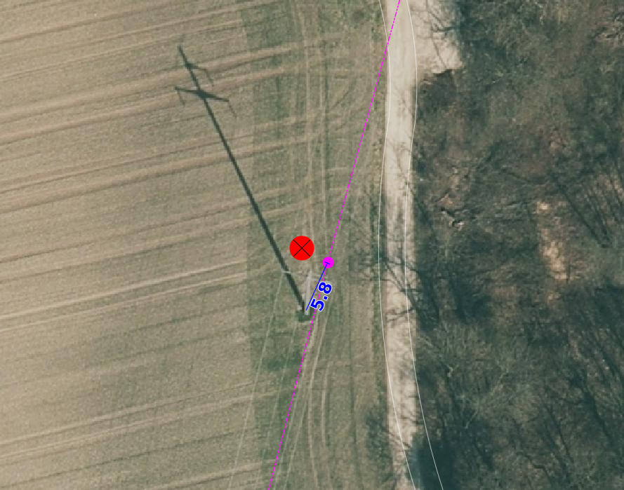
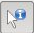

Seltene Objekte
===============
.. index:: seltene Objekte

In dieser Mängelgruppe werden Objekte überprüft, die eher selten vorkommen. 

.. note::
   Unter Berücksichtigung von Sonderregelungen (z.B. Gebäude und Strassen) sind überflüssige Unterteilungslinien zu löschen. 

Folgende Objekte werden geprüft:

==================  =====================================    
Topic  		    Art    
==================  =====================================
Bodenbedeckung      Flugplatz
Bodenbedeckung      uebrige_befestigte    
Bodenbedeckung      Sportanlage_befestigt 
Bodenbedeckung      Boeschungsbauwerke
Bodenbedeckung      Parkanlage_humusiert   
Bodenbedeckung      Sportanlage_humusiert 
Bodenbedeckung      Friedhof
Bodenbedeckung      Hoch_Flachmoor
Bodenbedeckung      uebrige_humusierte       
Bodenbedeckung      Fels
Bodenbedeckung      Geroell_Sand
Bodenbedeckung      uebrige_vegetationslose
Bodenbedeckung      Steinbruch
Bodenbedeckung      Kiesgrube
Bodenbedeckung      uebriger_Abbau
Bodenbedeckung      Deponie
Einzelobjekt        Brunnen
Einzelobjekt        Mast_Antenne
Einzelobjekt        Mast_Leitung
Einzelobjekt        Hochspannungsfreileitung
Einzelobjekt        Einzelner_Fels
Einzelobjekt        Gondelbahn_Sesselbahn
Einzelobjekt        Materialseilbahn
Einzelobjekt        Skilift
Einzelobjekt        Luftseilbahn
Einzelobjekt        Aussichtsturm
Einzelobjekt        Hochkamin
Einzelobjekt        Denkmal
Einzelobjekt        Uferverbauung
Einzelobjekt        Lawinenverbauung
Einzelobjekt        massiver_Sockel
Einzelobjekt        Ruine_archäologisches_Objekt
Einzelobjekt        Landungssteg
Einzelobjekt        Druckleitung
Einzelobjekt        Fähre
Einzelobjekt        Grotte_Höhleneingang
Einzelobjekt        Achse
Einzelobjekt        wichtiger_Einzelbaum
Einzelobjekt        Kruzifix_Bildstock
Einzelobjekt        weitere
==================  =====================================    

BB.uebrige_befestigte
---------------------
.. index:: übrige befestigte

Lagedifferenz / Objekt fehlt
^^^^^^^^^^^^^^^^^^^^^^^^^^^^
Wird eine Lagedifferenz bei Panzersperren zwischen der AV und dem aktuellen Othofoto grösser als die Toleranz (siehe :ref:`ref_Tz`) und der Feststellungsgenauigkeit detektiert, so ist das Objekt in der AV zu korrigieren. Das Objekt muss erfasst werden falls es in der amtlichen Vermessung fehlt.

Benötigte Layer in QGIS:

.. code-block:: none

   Bebautes Gebiet / Lagekontrolle

Objekt löschen / umattribuieren / Darstellung nicht nach Richtlinie  
^^^^^^^^^^^^^^^^^^^^^^^^^^^^^^^^^^^^^^^^^^^^^^^^^^^^^^^^^^^^^^^^^^^
Im Rahmen der PNF/Homogenisierung werden **keine** Änderungen vorgenommen.

BB. Flugplatz/ BB.Sportanlage_befestigt / BB.Sportanlage_humusiert / BB.Friedhof / BB.Parkanlage_humusiert / BB.uebrige_humusierte 
----------------------------------------------------------------------------------------------------------------------------------
.. index:: Flugplatz, Sportanlage_befestigt, Sportanlage_humusiert, Friedhof, Parkanlage_humusiert, Parkanlage_bestockt, übrige humusierte

Lagedifferenz
^^^^^^^^^^^^^
Wird eine Lagedifferenz zwischen der AV und dem aktuellen Orthofoto grösser als die Toleranz (siehe :ref:`ref_Tz`) detektiert, so ist das Objekt in der AV zu korrigieren. Liegt die Differenz innerhalb der Toleranz, wird das Objekt nicht angepasst.

Benötigte Layer im QGIS:

.. code-block:: none 

   Seltene Objekte / Lagekontrolle   
   
   
Beispiele:       
   
+-------------------------------------------------------------------------------------+------------------------------------------------------------------------------------+
|.. _seltene_Objekte_Sportplatz_befestigt_Lagedifferenz:                              |.. _seltene_Objekte_Sportplatz_befestigt_Lagedifferenz_korr:                        |
|                                                                                     |                                                                                    |
|.. figure:: _static/seltene_Objekte_Sportplatz_befestigt_Lagedifferenz.png           |.. figure:: _static/seltene_Objekte_Sportplatz_befestigt_Lagedifferenz_korr.png     |
|   :width: 550px                                                                     |   :width: 550px                                                                    |
|   :target: _static/seltene_Objekte_Sportplatz_befestigt_Lagedifferenz.png           |   :target: _static/seltene_Objekte_Sportplatz_befestigt_Lagedifferenz_korr.png     |
|                                                                                     |                                                                                    |
|   ``BB.Sportanlage_befestigt`` ist zu korrigieren, weil  die Lagedifferenz          |   ``BB.Sportanlage_befestigt`` ist zu korrigieren gemäss den rot                   |
|   grösser als die Toleranz (TS2: 1m) ist.                                           |   dargestellten Linien.                                                            | 
+-------------------------------------------------------------------------------------+------------------------------------------------------------------------------------+
|.. _seltene_Objekte_Sportplatz_befestigt_Lagedifferenz_nicht:                        |                                                                                    |
|                                                                                     |                                                                                    |
|.. figure:: _static/seltene_Objekte_Sportplatz_befestigt_Lagedifferenz_nicht.png     |                                                                                    | 
|   :width: 550px                                                                     |                                                                                    |
|   :target: _static/seltene_Objekte_Sportplatz_befestigt_Lagedifferenz_nicht.        |                                                                                    |
|                                                                                     |                                                                                    |
|   ``BB.Sportanlage_befestigt`` ist **nicht** zu korrigieren, weil die Lagedifferenz |                                                                                    |
|   kleiner als die Toleranz (TS2: 1.5m) ist.                                         |                                                                                    | 
+-------------------------------------------------------------------------------------+------------------------------------------------------------------------------------+

Objekt fehlt/löschen/umattribuieren      
^^^^^^^^^^^^^^^^^^^^^^^^^^^^^^^^^^^^^     
Ist auf dem aktuellen Orthofoto ein Flugplatz, Sportplatz, Friedhof oder eine Parkanlage, die das Flächenkriterium erfüllen, zu erkennen, sind diese im Rahmen der PNF/Homogenisierung neu zu erfassen. Falls in der AV ein Sportplatz, Friedhof oder eine Parkanlage vorhanden ist, welche auf dem aktuellen Orthofoto nicht mehr zu erkennen sind, sind dieses Objekt zu löschen oder evtl. einer anderen BB.Art zu zuweisen.  

Benötigte Layer im QGIS:    

.. code-block:: none

   Seltene Objekte / Lagekontrolle  

Darstellung nicht nach Richtlinie  
^^^^^^^^^^^^^^^^^^^^^^^^^^^^^^^^^     
Im Rahmen der PNF/Homogenisierung werden **keine** Änderungen vorgenommen.            
                                                                               
   
BB.Boeschungsbauwerk 
--------------------
.. index:: Boeschungsbauwerk

Lagedifferenz
^^^^^^^^^^^^^
Im Rahmen der PNF/Homogenisierung werden **keine** Änderungen vorgenommen.

Benötigte Layer im QGIS:    

.. code-block:: none

   Seltene Objekte / Lagekontrolle                             

                                                                                                                                                                          
Objekt fehlt/löschen/umattribuieren   
^^^^^^^^^^^^^^^^^^^^^^^^^^^^^^^^^^^  
Es werden **keine** neuen Objekte der Art ``BB.Böschungsbauwerk`` in der AV erfasst. Falls Objekte erfasst sind, welche gemäss *Handbuches der amtlichen Vermessung Kanton Solothurn* nicht als Böschungsbauwerk ausgeschieden werden, sind  diese zu löschen oder umzuattriuieren.   

Benötigte Layer im QGIS:    

.. code-block:: none

   Seltene Objekte / Lagekontrolle 
   Seltene Objekte / Checklayer / BB.Boeschungsbauwerk       
                                                          

Darstellung nicht nach Richtlinie  
^^^^^^^^^^^^^^^^^^^^^^^^^^^^^^^^^     
Im Rahmen der PNF/Homogenisierung werden keine Änderungen vorgenommen.   
   
   

BB.Hoch_Flachmoor       
-----------------
.. index:: Hochmoor, Flachmoor

Lagedifferenz                                                                                                                                                               
^^^^^^^^^^^^^
Wird eine Lagedifferenz zwischen der AV und dem aktuellen Orthofoto grösser als die Toleranz (siehe :ref:`ref_Tz`) detektiert, so ist das Objekt in der AV zu korrigieren. Liegt die Differenz innerhalb der Toleranz, wird das Objekt nicht angepasst.   

Benötigte Layer im QGIS:    

.. code-block:: none

   Seltene Objekte / Lagekontrolle      

Objekt fehlt/löschen/umattribuieren   
^^^^^^^^^^^^^^^^^^^^^^^^^^^^^^^^^^^^^   
Als Referenz für die Vollständigkeitskontrolle der Hoch- und Flachmoore dienen die Daten des Kantons (AfU) und Bundes (BAFU) (siehe :ref:`ref_RefDaten`), Abgrenzungen können von diesen Referenzdaten übernommen werden.

.. important:: 
   BB-Arten wie geschlossener Wald, Gewässer, Strasse, Weg, Bahn, Gebäude etc. gehen der BB-Art ``Hoch_Flachmoor`` vor.

Benötigte Layer im QGIS:       

.. code-block:: none

   Seltene Objekte / Lagekontrolle    
   Seltene Objekte / Lagekontrolle / Flachmoor (AFU)
   Seltene Objekte / Lagekontrolle / Flachmoor (BAFU) 
   Seltene Objekte / Lagekontrolle / Hochmoor (BAFU) 
   
.. note::
   Es gibt keine kantonalen Hochmoore.                                                           

Darstellung nicht nach Richtlinie  
^^^^^^^^^^^^^^^^^^^^^^^^^^^^^^^^^     
Im Rahmen der PNF/Homogenisierung werden keine Änderungen vorgenommen.   

   
BB.Fels / BB.Geroell_Sand / BB.uebrige_vegetationslose    
------------------------------------------------------ 
.. index:: Fels, Geröll, Sand, übrige vegetationslose

Lagedifferenz                                                              
^^^^^^^^^^^^^  
Möglichkeiten ??????????

1. ???Wird eine Lagedifferenz zwischen der AV und dem aktuellen Orthofoto grösser als die Toleranz (siehe :ref:`ref_Tz`) detektiert, so ist das Objekt in der AV zu korrigieren. Liegt die Differenz innerhalb der Toleranz, wird das Objekt nicht angepasst. Objekten, bei denen die Abgrenzungen auf dem Orthofoto nicht genau zu erkennen sind, sind so zu belassen.    
   
2. **Lagedifferenzen werden nicht korrigiert und werden zu einem späteren Zeitpunkt aus dem topografischen Landschaftsmodell übernommen.**

Benötigte Layer im QGIS:    

.. code-block:: none

   Seltene Objekte / Lagekontrolle   

Objekt fehlt/löschen/umattribuieren   
^^^^^^^^^^^^^^^^^^^^^^^^^^^^^^^^^^^
Ist auf dem aktuellen Orthofoto eine Fläche mit Fels, Geröll oder übrigen Vegetationslosen zu erkennen, die das Aufnahmekriterium gemäss ... erfüllt???, ist diese im Rahmen der PNF/Homogenisierung neu zu erfassen. Falls in der AV eine Fläche mit Fels, Geröll oder übrigen vegetationslos vorhanden ist, welche auf dem aktuellen Orthofoto nicht mehr zu erkennen ist, ist dieses Objekt zu löschen oder evtl. einer anderen BB.Art zu zuweisen.

????ACHTUNG: Abgrenzung zu Lagedifferenz, falls diese nicht korrigiert wird.                                      

Benötigte Layer im QGIS:    

.. code-block:: none

   Seltene Objekte / Lagekontrolle          
   
Darstellung nicht nach Richtlinie  
^^^^^^^^^^^^^^^^^^^^^^^^^^^^^^^^^     
Im Rahmen der PNF/Homogenisierung werden keine Änderungen vorgenommen.       
                      
  
BB.Steinbruch / BB.Kiesgrube / BB.uebriger_Abbau / BB.Deponie
-------------------------------------------------------------                
.. index:: Steinbruch, Kiesgrube, übriger Abbau, Deponie

Lagedifferenz  
^^^^^^^^^^^^^             
Wird eine Lagedifferenz zwischen der AV und dem aktuellen Orthofoto grösser als die Toleranz (siehe :ref:`ref_Tz`) detektiert, so ist das Objekt in der AV zu korrigieren. Liegt die Differenz innerhalb der Toleranz, wird das Objekt nicht angepasst.  

.. note::
   Lagedifferenzen aufgrund von Bauarbeiten, müssen über die laufende Nachführung abgerechnet werden.
 
Benötigte Layer im QGIS:    

.. code-block:: none

   Seltene Objekte / Lagekontrolle   

   
Objekt fehlt/löschen/umattribuieren                                                                      
^^^^^^^^^^^^^^^^^^^^^^^^^^^^^^^^^^^^^ 

Ist auf dem aktuellen Orthofoto ein Steinbruch, Kiesgrube, übriger Abbau oder eine Deponie zu erkennen, die/der das Flächenkriterium erfüllt, ist diese/ dieser im Rahmen der PNF/Homogenisierung neu zu erfassen. Falls in der AV ein Steinbruch, Kiesgrube, übriger Abbau oder eine Deponie vorhanden ist, welche auf dem aktuellen Orthofoto nicht mehr zu erkennen ist oder nicht mehr bewirtschaftet wird, ist dieses Objekt zu löschen oder evtl. einer anderen BB.Art zu zuweisen. 

.. important:: 
   In der AV sollen nur die bewirtschafteten Deponien und Abbauflächen erfasst werden.
   
.. note::
   Neue Objekte, müssen über die laufende Nachführung abgerechnet werden.

Benötigte Layer im QGIS:

.. code-block:: none

   Seltene Objekte / Lagekontrolle 
   Seltene Objekte / Lagekontrolle / Abbaustellen (AFU)

Darstellung nicht nach Richtlinie  
^^^^^^^^^^^^^^^^^^^^^^^^^^^^^^^^^     
Im Rahmen der PNF/Homogenisierung werden keine Änderungen vorgenommen.          
                          
   
EO.Brunnen                                                                                                                                                                                                                                                                                                                                                                                                                                                     
----------
.. index:: Brunnen

Lagedifferenz                                                                                    
^^^^^^^^^^^^^                                                               
Im Rahmen der PNF/Homogenisierung werden keine Lagedifferenzen korrigiert. Sind Lagedifferenzen vorhanden die mittels Orthofoto ermittelt werden können, ist der ``EO.Brunnen`` zu löschen.    
                                                                                                  
Objekt fehlt/löschen   
^^^^^^^^^^^^^^^^^^^^^                                                                                                                                                              
Brunnen mit öffentlichen Charakter, die in der AV nicht vorhanden sind, werden im Rahmen der PNF/Homogenisierung **nicht** erfasst. Private Brunnen die in der AV erfasst sind, sind zu löschen.      

Benötigte Layer im QGIS:    

.. code-block:: none

   Seltene Objekte / Lagekontrolle   
                                              
Darstellung nicht nach Richtlinie  
^^^^^^^^^^^^^^^^^^^^^^^^^^^^^^^^^     
Darzustellen ist die äusseren Umrandung der Brunnen inkl. Brunnenstock (siehe *Handbuch der amtlichen Vermessung Kanton Solothurn*). Falls mehr Details (z.B. einzelner Brunnenstock oder Füllbereich) des Brunnen dargestellt sind, sind diese zu korrigieren.

EO.Mast_Antenne / EO. Mast_Leitung / EO.Hochspannungsfreileitung
----------------------------------------------------------------
.. index:: Mast_Antenne, Mast_Leitung, Antenne, Leitung, Hochspannungsfreileitung

Lagedifferenz                                                                                                                                                               
^^^^^^^^^^^^^
Wird eine Lagedifferenz zwischen der AV und dem aktuellen Orthofoto grösser als die Toleranz (siehe :ref:`ref_Tz`) detektiert, so ist das Objekt in der AV zu korrigieren. Liegt die Differenz innerhalb der Toleranz, wird das Objekt nicht angepasst. 

Benötigte Layer im QGIS:       

.. code-block:: none   

   Seltene Objekte / Lagekontrolle    
 
Beispiel:

.. _seltene_Objekte_Mast_Leitung_Lagedifferenz:                           
                                                                                  

                                                                                  
   ``EO.Mast_Leitung`` ist zu korrigieren, weil die Lagedifferenz grösser als die Toleranz (TS3: 1.0 m) ist.                                        
      
   
  
Objekt fehlt/löschen/umattribuieren   
^^^^^^^^^^^^^^^^^^^^^^^^^^^^^^^^^^^    

|  Zur Vollständigkeitskontrolle der Hochspannungsfreileitung und deren Masten kann der Layer ``Freileitungen (ARP)`` verwendet werden. In QGIS ist mit dem Abfragetool (|pfeil| auf Objekt klicken ) das Attribut ``voltage`` zu überprüfen. Nur Leitungen mit > 50kV werden in der AV geführt. 
   Hochspannungsfreileitungen und deren Masten, die auf dem aktuellen Orthofoto nicht mehr vorhandnen sind oder bei deren die Spannung der Hochspannungsfreileitung < 50kV ist, sind zu löschen.
|  Als Volständigkeitskontrolle der Antennen dienen die Daten der Radio-/Fernsehsender und Mobilfunkantennen des Bundes. Auch hier sind die Objekte, die auf dem aktuellen Orthofoto nicht mehr zu erkennen sind, zu löschen.
|  Fehlende Masten bei Gondelbahnen und Sesselbahnen sind zu erfassen. Hingegen sind die erfassten Masten bei Materialseilbahnen und Skilifte zu löschen.
|  Objekte mit falscher Art sind umzuattribuieren.
                                                                        
        
Benötigte Layer im QGIS:       

.. code-block:: none   

   Seltene Objekte / Lagekontrolle    
   Seltene Objekte / Lagekontrolle / Freileitungen (ARP)
   Seltene Objekte / Lagekontrolle / Radio- und Fernsehsender
   Seltene Objekte / Lagekontrolle / Mobilfunkantennen UMTS
   Seltene Objekte / Lagekontrolle / Mobilfunkantennen GSM

   
Darstellung nicht nach Richtlinie 
^^^^^^^^^^^^^^^^^^^^^^^^^^^^^^^^^
Objekte der Arten ``EO.Mast_Antenne``, ``EO.Mast_Leitung`` und ``EO.Hochspannungsfreileitung``, die nicht gemäss *Handbuch der amtlichen Vermessung Kanton Solothurn* dargestellt sind, sind dementsprechend zu korrigieren.

Benötigte Layer im QGIS:       

.. code-block:: none    
   
   Seltene Objekte / Lagekontrolle  
   Seltene Objekte / Checklayer        

Beispiele:

+-------------------------------------------------------------------------------------+------------------------------------------------------------------------------------+
|.. _seltene_Objekte_Mast_Leitung_Richtlinien:                                        |.. _seltene_Objekte_Mast_Leitung_Richtlinien2:                                      |
|                                                                                     |                                                                                    |
|.. figure:: _static/seltene_Objekte_Mast_Leitung_Richtlinien.png                     |.. figure:: _static/seltene_Objekte_Mast_Leitung_Richtlinien2.png                   |
|   :width: 550px                                                                     |   :width: 550px                                                                    |
|   :target: _static/seltene_Objekte_Mast_Leitung_Richtlinien.png                     |   :target: _static/seltene_Objekte_Mast_Leitung_Richtlinien2.png                   |
|                                                                                     |                                                                                    |
|   ``EO.Mast_Leitung`` ist als Linie darzustellen und nicht als Symbol.              |   ``EO.Hochspannungsfreileitung`` ist nur mit einer Linie darzustellen.            |
+-------------------------------------------------------------------------------------+------------------------------------------------------------------------------------+     

EO.einzelner_Fels
-----------------                                                                      
.. index:: Fels, einzelner Fels 

Lagedifferenz
^^^^^^^^^^^^^
Im Rahmen der PNF/Homogenisierung werden **keine** Lagedifferenzen korrigiert.       
                                                                           

Objekt fehlt/löschen
^^^^^^^^^^^^^^^^^^^^^ 
Es werden keine **neuen** Objekte der Art ``EO.einzelner_Fels`` erfasst. Falls in der AV Objekte der Art ``EO.Einzelner Fels`` vorhanden sind, die keine erratische Blöcke oder kein wichtiger Einzelsfels sind, sind diese aus der AV zu löschen.

Darstellung nicht nach Richtlinie  
^^^^^^^^^^^^^^^^^^^^^^^^^^^^^^^^^     
Im Rahmen der PNF/Homogenisierung werden keine Änderungen vorgenommen.          
                          

EO. Gondelbahn_Sesselbahn / EO. Materialseilbahn / EO.Skilift 
-------------------------------------------------------------

Lagedifferenz                                                                                                                                                               
^^^^^^^^^^^^^
Wird eine Lagedifferenz zwischen der AV und dem aktuellen Orthofoto grösser als die Toleranz (siehe :ref:`ref_Tz`) detektiert, so ist das Objekt in der AV zu korrigieren. Liegt die Differenz innerhalb der Toleranz, wird das Objekt nicht angepasst. 

Benötigte Layer im QGIS:       

.. code-block:: none   

   Seltene Objekte / Lagekontrolle   

Objekt fehlt/löschen/umattribuieren    
^^^^^^^^^^^^^^^^^^^^^^^^^^^^^^^^^^^^^ 
Ist auf dem aktuellen Orthofoto eine Gondelbahn, Sesselbahn, Materialseilbahn oder ein Skilift zu erkennen, die nicht in der AV ist, ist diese/dieser im Rahmen der PNF/Homogenisierung neu zu erfassen. Falls in der AV eine Gondelbahn, Sesselbahn, Materialseilbahn oder ein Skilift vorhanden ist, welche auf dem aktuellen Orthofoto nicht mehr zu erkennen ist oder nicht mehr bewirtschaftet wird, ist dieses Objekt zu löschen oder evtl. einer anderen EO.Art zu zuweisen.

Benötigte Layer im QGIS:       

.. code-block:: none   

   Seltene Objekte / Lagekontrolle        
   
Darstellung nicht nach Richtlinie 
^^^^^^^^^^^^^^^^^^^^^^^^^^^^^^^^^
Der Elemententyp ist Linienelement.      
                                                                                                                                                                           
               
   
EO. Aussichtsturm / EO.Hochkamin / EO.Uferverbauung / EO.Lawinenverbauung / EO.massiver Sockel / EO.Ruine_archaeologisches_Objekt / EO.Landungssteg
---------------------------------------------------------------------------------------------------------------------------------------------------
.. index:: Aussichtsturm, Hochkamin, Uferverbauung, massiver Sockel, Ruine, archäologisches Objekt, Landungssteg

Lagedifferenz                                                                                                                                                               
^^^^^^^^^^^^^
Wird eine Lagedifferenz zwischen der AV und dem aktuelle Orthofoto grösser als die Toleranz (siehe :ref:`ref_Tz`) detektiert, so ist das Objekt in der AV zu korrigieren. Liegt die Differenz innerhalb der Toleranz, wird das Objekt nicht angepasst. 

Benötigte Layer im QGIS:       

.. code-block:: none   

   Seltene Objekte / Lagekontrolle  

Objekt fehlt/löschen/umattribuieren   
^^^^^^^^^^^^^^^^^^^^^^^^^^^^^^^^^^^ 
Ist auf dem aktuellen Orthofoto ein Objekt zu erkennen, das nicht in der AV ist, ist dieses im Rahmen der PNF/Homogenisierung **nicht** neu zu erfassen. Falls in der AV ein Objekt vorhanden ist, welches auf dem aktuellen Orthofoto nicht mehr zu erkennen ist oder den Aufnahmekriterien gemäss *Handbuch der amtlichen Vermessung Kanton Solothurn* nicht genügt, ist dieses Objekt zu löschen oder evtl. einer anderen EO.Art zu zuweisen.

Benötigte Layer im QGIS:       
                                                                                                                                                                  
.. code-block:: none   

   Seltene Objekte / Lagekontrolle      
   
Darstellung nicht nach Richtlinie    
^^^^^^^^^^^^^^^^^^^^^^^^^^^^^^^^^        
Im Rahmen der PNF/Homogenisierung werden **keine** Änderungen vorgenommen.
   
   
                                                                                                 
EO.Denkmal / EO.Grotte_Hoehleneingang / EO.wichtiger_Einzelbaum / EO.Kruzifix_Bildstock
---------------------------------------------------------------------------------------
.. index:: Denkmal, Grotte, Höhleneingang, wichtiger Einzelbau, Einzelbaum, Kruzifix, Bildstock

Lagedifferenz                                                                                                                                                               
^^^^^^^^^^^^^
Wird eine Lagedifferenz zwischen der AV und dem aktuellen Orthofoto grösser als die Toleranz (siehe :ref:`ref_Tz`) detektiert, so ist das Objekt in der AV zu korrigieren. Liegt die Differenz innerhalb der Toleranz, wird das Objekt nicht angepasst. 
                                                                                                                      
Benötigte Layer im QGIS:       

.. code-block:: none   

   Seltene Objekte / Lagekontrolle  

Objekt fehlt/löschen/umattribuieren   
^^^^^^^^^^^^^^^^^^^^^^^^^^^^^^^^^^^ 
Ist auf dem aktuellen Orthofoto ein Objekt zu erkennen, das nicht in der AV ist, ist dieses im Rahmen der PNF/Homogenisierung **nicht** neu zu erfassen. Falls in der AV eine Objekt vorhanden ist, welches auf dem aktuellen Orthofoto nicht mehr zu erkennen ist oder den Aufnahmekriterien gemäss *Handbuch der amtlichen Vermessung Kanton Solothurn* nicht genügt, ist dieses Objekt zu löschen oder evtl. einer anderen EO.Art zu zuweisen. Zur Überprüfung ob die Objekte der Art ``EO. Grotte_Hoehleneingang``, welche in der AV erfasst ist, wirklich existieren, kann eine Feldkontrolle sinnvoll sein oder eine Abklärung mit einer orstkundigen Person.

Benötigte Layer im QGIS:       

.. code-block:: none   

   Seltene Objekte / Lagekontrolle       

Darstellung nicht nach Richtlinie    
^^^^^^^^^^^^^^^^^^^^^^^^^^^^^^^^^         
Im Rahmen der PNF/Homogenisierung werden **keine** Änderungen vorgenommen.

EO. Druckleitung / EO.Faehre / EO. Achse
----------------------------------------
Lagedifferenz                                                                                                                                                               
^^^^^^^^^^^^^
Wird eine Lagedifferenz zwischen der AV und dem aktuellen Orthofoto grösser als die Toleranz (siehe :ref:`ref_Tz`) detektiert, so ist das Objekt in der AV zu korrigieren. Liegt die Differenz innerhalb der Toleranz, wird das Objekt nicht angepasst. 

Benötigte Layer im QGIS:       

.. code-block:: none   

   Seltene Objekte / Lagekontrolle  

Objekt fehlt/löschen/umattribuieren   
^^^^^^^^^^^^^^^^^^^^^^^^^^^^^^^^^^^ 
Ist auf dem aktuellen Orthofoto ein Objekt zu erkennen, das nicht in der AV ist, ist dieses im Rahmen der PNF/Homogenisierung **nicht** neu zu erfassen. Falls in der AV ein Objekt vorhanden ist, welches auf dem aktuellen Orthofoto nicht mehr zu erkennen ist oder den Aufnahmekriterien gemäss *Handbuch der amtlichen Vermessung Kanton Solothurn* nicht genügt, ist dieses Objekt zu löschen oder evtl. einer anderen EO.Art zu zuweisen.

Benötigte Layer im QGIS:       

.. code-block:: none   

   Seltene Objekte / Lagekontrolle    

Darstellung nicht nach Richtlinie    
^^^^^^^^^^^^^^^^^^^^^^^^^^^^^^^^^         
Im Rahmen der PNF/Homogenisierung werden **keine** Änderungen vorgenommen.

|

