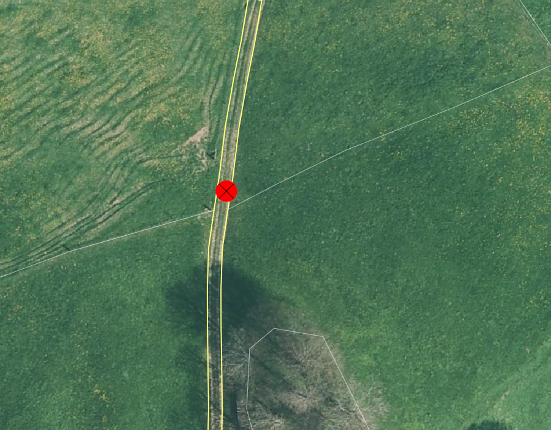
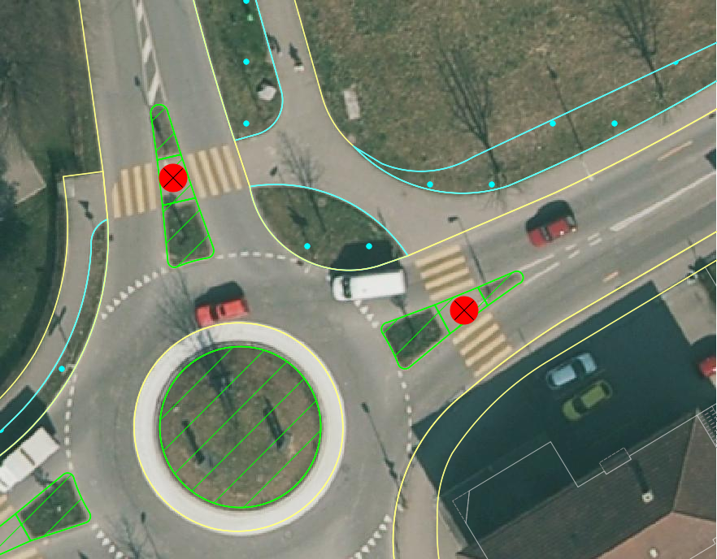
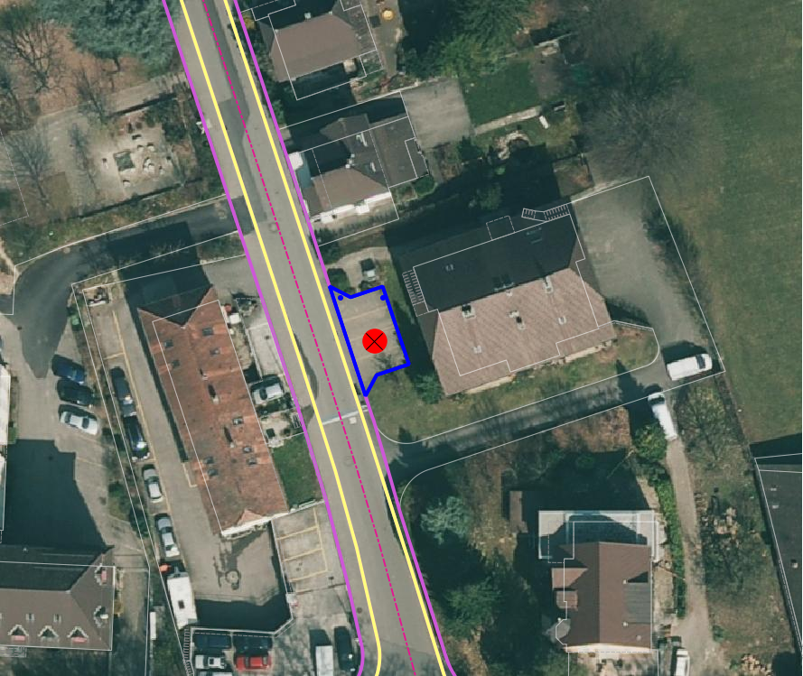

Strasse
=======
In dieser Gruppe werden alle Elemente der Strassen aus der amtlichen Vermessung auf deren Vollständigkeit und Richtigkeit in der Lage so wie in der Darstellung überprüft.

.. note::
   Unter Berücksichtigung von Sonderregelungen (z.B. Gebäude und Strassen) sind überflüssige Unterteilungslinien zu löschen.  

Folgende Objekte werden geprüft:

==================  ==================
Topic  		    Art    
==================  ================== 
Bodenbedeckung      Strasse_Weg
Bodenbedeckung      Trottoir
Bodenbedeckung      Verkehrsinsel
Bodenbedeckung      übrige_befestigte
Bodenbedeckung      übrige_humusierte
Einzelobjekt	    Lärmschutzwand
Einzelobjekt        Tunnel_Unterführung_Galerie
Einzelobjekt        Brücke_Passerelle
Einzelobjekt        Pfeiler
Einzelobejkt        schmaler_Weg
Einzelobjekt        Fahrspur
==================  ==================

BB.Strasse_Weg  
--------------  
.. index:: Strasse, Weg      
                               
Lagedifferenz  
^^^^^^^^^^^^^                        
                         
Wird eine Lagedifferenz zwischen der AV und dem aktuellen Orthofoto grösser als die Toleranz (siehe :ref:`ref_Tz`) festgestellt, so ist das Objekt in der AV zu korrigieren. Liegt die Differenz innerhalb der Toleranzwerte, wird das Objekt nicht angepasst. Ist die Lagekontrolle mit dem Orthofoto auf Grund von Interpretationsschwierigkeiten (z.B. durch Schatten oder Sichthindernisse wie Bäume) nicht möglich, ist eine Feldkontrolle sinnvoll. 

Benötigte Layer in QGIS:

.. code-block:: none

   Strasse / Lagekontrolle   
                                

Beispiele:
                              
+---------------------------------------------------------------------+-----------------------------------------------------------------------+
|.. _Strasse_Lagedifferenz_Kreuzung:                                  |.. _Strasse_Lagedifferenz_Kreuzung_korr:                               |
|                                                                     |                                                                       |
|.. figure:: _static/Strasse_Lagedifferenz_Kreuzung.png               |.. figure:: _static/Strasse_Lagedifferenz_Kreuzung_korr.png            |
|   :width: 550px                                                     |   :width: 550px                                                       |
|   :target: _static/Strasse_Lagedifferenz_Kreuzung.png               |   :target: _static/Strasse_Lagedifferenz_Kreuzung_korr.png            |
|                                                                     |                                                                       |
|   ``BB.Strasse_Weg`` (ohne Abschluss) ist zu korrigieren, weil die  |   ``BB.Strasse_Weg`` ist im Bereich der Toleranzüberschreitung zu     |
|   Lagedifferenz grösser als die Toleranz (TS3: 1.5m) ist.           |   korrigieren gemäss den rot dargestellten Linien.                    |
+---------------------------------------------------------------------+-----------------------------------------------------------------------+
|.. _Strasse_Lagedifferenz_TS2:                                       |.. _Strasse_Lagedifferenz_TS2_korr:                                    |
|                                                                     |                                                                       |
|.. figure:: _static/Strasse_Lagedifferenz_TS2.png                    |.. figure:: _static/Strasse_Lagedifferenz_TS2_korr.png                 |   
|   :width:  550px                                                    |   :width:  550px                                                      |
|   :target: _static/Strasse_Lagedifferenz_TS2.png                    |   :target: _static/Strasse_Lagedifferenz_TS2_korr.png                 |
|                                                                     |                                                                       |
|   ``BB.Strasse_Weg`` ist zu korrigieren, weil die Lagedifferenz     |   ``BB.Strasse_Weg`` ist zu korrigieren gemäss den rot dargestellten  |
|   grösser als die Toleranz (TS2: 0.5 m) ist.                        |   Linien.                                                             |
+---------------------------------------------------------------------+-----------------------------------------------------------------------+
|.. _Strasse_Lagedifferenz_TS3:                                       |.. _Strasse_Lagedifferenz_TS4:                                         |
|                                                                     |                                                                       |
|.. figure:: _static/Strasse_Lagedifferenz_TS3.png                    |.. figure:: _static/Strasse_Lagedifferenz_TS4.png                      |     
|   :width:  550px                                                    |   :width:  550px                                                      |
|   :target: _static/Strasse_Lagedifferenz_TS3.png                    |   :target: _static/Strasse_Lagedifferenz_TS4.png                      |
|                                                                     |                                                                       |
|   ``BB.Strasse_Weg`` ist **nicht** zu korrigieren, weil die         |   ``BB.Strasse_Weg`` ist **nicht** zu korrigieren, weil die           |
|   Lagedifferenz kleiner als die Toleranz (TS3: 1.5 m) ist.          |   Lagedifferenz kleiner als die Toleranz (TS4: 1.5 m) ist.            |
+---------------------------------------------------------------------+-----------------------------------------------------------------------+

Objekt fehlt/löschen  
^^^^^^^^^^^^^^^^^^^^
Ist auf dem aktuellen Orthofoto ein befestigtes Strasse_Weg-Objekt zu erkennen, das nicht als Bodenbedeckung oder als Einzelobjekt in der AV vorhanden ist, ist dieses im Rahmen der PNF/Homogenisierung neu zu erfassen. Ist in der AV ein befestigtes Strasse_Weg-Objekt vorhanden, das auf dem aktuellen Orthofoto nicht mehr zu erkennen ist und auch die Kriterien der ``EO.Fahrspur`` resp. ``EO.schmaler_Weg`` nicht erfüllt, ist dieses Objekt zu löschen. Ebenfalls zu löschen sind private befestigte Gartenwege.

Benötigte Layer in QGIS:

.. code-block:: none

   Strasse / Lagekontrolle

Beispiele:

+---------------------------------------------------------------------+-----------------------------------------------------------------------+
|.. _Strasse_fehlt:                                                   |.. _Strasse_loeschen:                                                  |
|                                                                     |                                                                       |
|.. figure:: _static/Strasse_fehlt_TS3.png                            |.. figure:: _static/Strasse_loeschen.png                               |
|   :width: 550px                                                     |   :width: 550px                                                       |
|   :target: _static/Strasse_fehlt_TS3.png                            |   :target: _static/Strasse_leoschen.png                               |
|                                                                     |                                                                       |
|   ``BB.Strasse_Weg`` fehlt in der  AV. ``BB.Strasse_Weg`` ist zu    |   ``BB.Strasse_Weg`` ist zu löschen                                   |
|   erfassen                                                          |                                                                       |
+---------------------------------------------------------------------+-----------------------------------------------------------------------+

Objekt umattribuieren
^^^^^^^^^^^^^^^^^^^^^                                                                                                                                                                                                                            
Mit dem aktuellen Orthofoto ist zu kontrollieren, ob alle befestigten Strassen und Wege als ``BB.Strasse_Weg`` erfasst sind. Andernfalls müssen die Strassen und Wege umattribuiert werden in ``BB.Strasse_Weg``, ``EO.Fahrspur`` oder ``EO.schmaler_Weg``.  
                                                                                                                                                                                                                                                                                                                                     
Benötigte Layer in QGIS:

.. code-block:: none

   Strasse / Lagekontrolle   
   
Beispiele:                            
                                                                                                                       
                                                                                    
.. _Strasse_umattribuieren:                                              
                                                                                    

                                                                                    
   ``BB.Strasse_Weg`` ist in ``EO.Fahrspur`` umzuattribuieren
   
              

Darstellung nicht nach Richtlinie  
^^^^^^^^^^^^^^^^^^^^^^^^^^^^^^^^^  
BB.Strasse_Weg unterbrochen
+++++++++++++++++++++++++++
Das Objekt ``BB.Strasse_Weg`` darf z.B. bei Hofdurchfahrten oder bei niveaugleichen Kreuzungen nicht unterbrochen sein. Ist dies der Fall, muss dies im Rahmen der PNF/Homogenisierung bereinigt werden. Ziel ist es ein zusammenhängendes Strassen- resp. Wegnetz zu erhalten. Genauere Erläuterungen über die Erfassung der Niveauübergänge sind im *Handbuch der amtlichen Vermessung Kanton Solothurn* zu finden.                 
    
Benötigte Layer in QGIS:

.. code-block:: none

   Strasse / Lagekontrolle 

BB.Strasse_Weg zu grosses Objekt
++++++++++++++++++++++++++++++++
Grosse Strassenobjekte (> 10'000 m2) der Art ``BB.Strasse_Weg`` sind zu unterteilen. Grosse Objekte bereiten bei verschiedenen Datenverarbeitungen Schwierigkeiten.

Benötigte Layer in QGIS:

.. code-block:: none 

   Stasse / Checklayer / BB.Strasse_Weg > 10000 m2 

.. _ref_strasse_mehrere_liegenschaften:

BB.Strasse_Weg bei Erschliessung mehrerer Liegenschaften 
++++++++++++++++++++++++++++++++++++++++++++++++++++++++
                                                                                                                                                                                                                                                                       
Strassen und Wege, die der Erschliessung mehrerer Liegenschaften oder mehrerer Gebäude dienen und die in der AV als ``BB.Gebaeudeerschliessung`` erfasst sind, werden im Rahmen der PNF/Homogenisierung **nicht** korrigiert (siehe :ref:`Beispiel <Strasse_ueber_mehrere_parz>`). 
          

Befestigte Strassenverengungen ohne Höhenunterschied und befahrbarer Teil des Kreisels (Pavé)    
+++++++++++++++++++++++++++++++++++++++++++++++++++++++++++++++++++++++++++++++++++++++++++++
Befestigte Strassenverengungen ohne Niveauunterschied gehören zu ``BB.Strasse_Weg`` (siehe :ref:`Beispiel <Strasse_Strassenveraengung>`). Dasselbe gilt für den befahrbarer Teil des Kreisels (Pavé) (siehe :ref:`Beispiel <Strasse_pave>`).                 

Benötigte Layer in QGIS:

.. code-block:: none                                                                                                        

   Strasse / Lagekontrolle   
  
  
Parallele Darstellung
+++++++++++++++++++++
Nicht parallele Darstellungen der ``BB.Strasse_Weg`` werden im Rahmen der PNF/Homogenisierung **nicht** korrigiert.

Durch Felspartien überdeckte Strassen
+++++++++++++++++++++++++++++++++++++                                                                                                                                                                                       
Bei den Strassen, die durch Felspartien überdeckt sind, gelten die Darstellungsrichtlinen gemäss *Handbuch der amtlichen Vermessung Kanton Solothurn*. Unterscheidet sich die Darstellung in der AV von der Richtlinie, ist sie entsprechend zu korrigieren.           
                                                                                                                                                                                                                                                             

Beispiele:       

+--------------------------------------------------------------------------------------+---------------------------------------------------------------------------------------+
|.. _Strasse_Hofdurchfahrt:                                                            | .. _Strasse_ueber_mehrere_parz:                                                       |
|                                                                                      |                                                                                       |
|.. figure:: _static/Strasse_Hofdurchfahrt.png                                         | .. figure:: _static/Strasse_ueber_mehrere_parz.png                                    |
|   :width: 550px                                                                      |    :width: 550px                                                                      |
|   :target: _static/Strasse_Hofdurchfahrt.png                                         |    :target: _static/Strasse_ueber_mehrere_parz.png                                    |                              
|                                                                                      |                                                                                       |
|   ``BB.Strasse_Weg`` darf bei Hofdurchfahrten nicht unterbrochen sein.               |    ``BB.Strasse_Weg`` bei Erschliessung mehrerer Liegenschaften wird nicht korrigiert.|                                                                               
+--------------------------------------------------------------------------------------+---------------------------------------------------------------------------------------+   
|.. _Strasse_Strassenveraengung:                                                       | .. _Strasse_pave:                                                                     |
|                                                                                      |                                                                                       | 
|.. figure:: _static/Strasse_Verkehrsveraengung.png                                    | .. figure:: _static/Strasse_pave.png                                                  |
|   :width: 550px                                                                      |    :width: 550px                                                                      |
|   :target: _static/Strasse_Verkehrsveraengung.png                                    |    :target: _static/Strasse_pave.png                                                  |
|                                                                                      |                                                                                       |
|   Befestigte Strassenverengungen ohne Niveauunterschied gehören zu                   |    Befahrbarer Teil des Kreisels (Pavé) gehört zu ``BB.Strasse_Weg``.                 | 
|   ``BB.Strasse_Weg``.                                                                |                                                                                       |
+--------------------------------------------------------------------------------------+---------------------------------------------------------------------------------------+         
                      

BB.Trottoir                                                                 
-----------  

.. index:: Trottoir

Lagedifferenz  
^^^^^^^^^^^^^
                                                                                                                                                                                 
Wird eine Lagedifferenz zwischen der AV und dem aktuellen Orthofoto grösser als die Toleranz (siehe :ref:`ref_Tz`) detektiert, so ist das Objekt in der AV zu korrigieren. Liegt die Differenz innerhalb der Toleranz, wird das Objekt nicht angepasst.

Benötigte Layer in QGIS:

.. code-block:: none 

   Strasse / Lagekontrolle   
                                

Beispiele:
                              
+---------------------------------------------------------------------+-----------------------------------------------------------------------+
|.. _Trottoir_Lagedifferenz:                                          |.. _Trottoir_Lagedifferenz_korr:                                       |
|                                                                     |                                                                       |
|.. figure:: _static/Strasse_Trottoir_Lagedifferenz.png               |.. figure:: _static/Strasse_Trottoir_Lagedifferenz_korr.png            |
|   :width: 550px                                                     |   :width: 550px                                                       |
|   :target: _static/Strasse_Trottoir_Lagedifferenz.png               |   :target: _static/Strasse_Trottoir_Lagedifferenz_korr.png            |
|                                                                     |                                                                       |
|   ``BB.Trottoir`` ist zu korrigieren, weil die Lagedifferenz        |   ``BB.Trottoir`` ist  gemäss den rot dargestellten Linien zu         |
|   grösser als die Toleranz (TS2: 0.5m) ist.                         |   korrigieren.                                                        |
+---------------------------------------------------------------------+-----------------------------------------------------------------------+ 
                                                                                                                                            

Objekt fehlt/löschen/umattribuieren      
^^^^^^^^^^^^^^^^^^^^^^^^^^^^^^^^^^^^^    

Ist auf dem aktuellen Orthofoto ein Trottoir zu erkennen, das nicht in der AV vorhanden ist, ist dieses im Rahmen der PNF/Homogenisierung neu zu erfassen. Falls in der AV ein Trottoir vorhanden ist, das auf dem aktuellen Orthofoto nicht mehr zu erkennen ist, ist dieses Objekt zu löschen oder evtl. einer anderen BB.Art zu zuweisen. 

Benötigte Layer in QGIS:

.. code-block:: none                                                                             
                                                                                                                                        
  Strasse / Lagekontrolle                                                                                                                                                         
  

Darstellung nicht nach Richtlinie    
^^^^^^^^^^^^^^^^^^^^^^^^^^^^^^^^^                                        

Bei Strasseneinfahrten geht das ``BB.Trottoir`` der ``BB.Strasse_Weg`` vor, wenn sich dieses baulich oder niveaumässig von der Strasse abhebt. 

BB.Verkehrsinsel                                                                
----------------  

.. index:: Verkehrsinsel 

Lagedifferenz  
^^^^^^^^^^^^^
                                                                                                                                                                                 
Wird eine Lagedifferenz zwischen der AV und dem aktuellen Orthofoto grösser als die Toleranz (siehe :ref:`ref_Tz`) festgestellt, so ist das Objekt in der AV zu korrigieren. Liegt die Differenz innerhalb der Toleranz wird das Objekt nicht angepasst.

Benötigte Layer in QGIS:

.. code-block:: none 

   Strasse / Lagekontrolle   
                                

                                                                                                                                       
Objekt fehlt/löschen     
^^^^^^^^^^^^^^^^^^^^    

Ist auf dem aktuellen Orthofoto eine Verkehrsinsel zu erkennen, die nicht in der AV vorhanden ist, ist diese im Rahmen der PNF/Homogenisierung neu zu erfassen. 
Falls in der AV eine Verkehrsinsel vorhanden ist, welche auf dem aktuellen Orthofoto nicht mehr zu erkennen ist, ist dieses Objekt zu löschen. Ebenfalls zu löschen sind temporär angelegte Verkehrsinseln oder befestigte Verkehrsinsel ohne Niveauunterschied, die in der AV erfasst sind.
 
                                                                                                                                                                                       
Benötigte Layer in QGIS:

.. code-block:: none                                                                                                                                                                                                                                                                                                       
                                                                                                                                        
  Strasse/ Lagekontrolle                                                                                                                                                         

.. _ref_ver:  
                                                                                                                                                                                                                                                                                        
Objekt umattribuieren
^^^^^^^^^^^^^^^^^^^^^
Verkehrsinseln sind komplett von ``BB.Strasse_Weg`` umgeben. Strassenverengungen, die humusiert sind, werden als ``BB.uebrige_humusierte`` attribuiert.
Bei humusierten Trennstreifen z.B. bei Autobahnen oder zwischen Strassen und z.B. Radwegen ist die Bodenbedeckung ``BB.uebrige_humusierte`` und **nicht** ``BB.Verkehrsinsel``.

Benötigte Layer in QGIS:

.. code-block:: none     
                         
   Strasse / Lagekontrolle 

Beispiele:                            
 
+--------------------------------------------------------------------------------------+-------------------------------------------------------------------------------+
|.. _Verkehrsinsel_Strassenveraengung:                                                 |.. _Verkehrsinsel_Trennstreifen:                                               |
|                                                                                      |                                                                               |
|.. figure:: _static/Strasse_Verkehrsinsel_Strassenveraengung.png                      |.. figure:: _static/Strasse_Verkehrsinsel_Trennstreifen.png                    |
|   :width: 550px                                                                      |   :width: 550px                                                               |
|   :target: _static/Strasse_Verkehrsinsel_Strassenveraengung.png                      |   :target: _static/Strasse_Verkehrsinsel_Trennstreifen.png                    |
|                                                                                      |                                                                               |
|   Humusierte Strassenverenegungen sind als ``BB.uebrige_humusierte`` zu attribuieren |   Humusierte Trenstreifen sind als ``BB.uebrige_humusierte`` zu attribuieren  | 
+--------------------------------------------------------------------------------------+-------------------------------------------------------------------------------+   

                                                                                         
Darstellung nicht nach Richtlinie    
^^^^^^^^^^^^^^^^^^^^^^^^^^^^^^^^^                                    
Verkehrsinsel sind bei Fussgängerstreifen nicht zu unterbrechen und müssen dementsprechend korrigiert werden.       

Benötigte Layer in QGIS:

.. code-block:: none     
                         
   Strasse / Lagekontrolle 

Beispiele:                            
                                                                                                                       
                                                                                    
.. _Verkehrsinsel_Fussgaengerstreifen:                                              
                                                                                    

                                                                                    
   ``BB.Verkehrsinsel`` ist bei Fussgängerstreifen **nicht** zu unterteilen
 

BB.übrige_befestigte
---------------------

Lagedifferenz
^^^^^^^^^^^^^
Im Rahmen der PNF/Homogenisierung werden keine Änderungen vorgenommen.         
   

Objekt fehlt/löschen/umattribuieren      
^^^^^^^^^^^^^^^^^^^^^^^^^^^^^^^^^^^^^     
Ist auf dem aktuellen Orthofoto eine übriger befestigte Fläche im Strassenbereich zu erkennen, ist diese im Rahmen der PNF/Homogenisierung **nicht** neu zu erfassen.
Falls in der AV eine ``BB.übrige_befestigte`` Fläche im Strassenbereich vorhanden ist, welche auf dem aktuellen Orthofoto nicht mehr zu erkennen sind, sind dieses Objekt zu löschen oder evtl. einer anderen BB.Art zu zuweisen.  
Parkplätze die das Flächenkriterium von 100m2 nicht erfüllen gehören nicht zu  ``BB.übrige_befestigte Fläche``, sodern sind zu löschen.

Benötigte Layer im QGIS:    

.. code-block:: none

   Seltene Objekte / Lagekontrolle  
   

.. _strasse_uebrige_befestigte_loeschen:                                              
                                                                                    

                                                                                    
   ``BB.übrige_befestigte`` ist zu löschen.
   

Darstellung nicht nach Richtlinie  
^^^^^^^^^^^^^^^^^^^^^^^^^^^^^^^^^     
Im Rahmen der PNF/Homogenisierung werden keine Änderungen vorgenommen.         
   
   
   
BB.übrige_humusierte   
--------------------

Lagedifferenz
^^^^^^^^^^^^^
Wird eine Lagedifferenz zwischen der AV und dem aktuellen Orthofoto grösser als die Toleranz (siehe :ref:`ref_Tz`) festgestellt, so ist das Objekt in der AV zu korrigieren. Liegt die Differenz innerhalb der Toleranz wird das Objekt nicht angepasst.

Benötigte Layer in QGIS:

.. code-block:: none 

   Strasse / Lagekontrolle         

Objekt fehlt/löschen/umattribuieren      
^^^^^^^^^^^^^^^^^^^^^^^^^^^^^^^^^^^     
Ist auf dem aktuellen Orthofoto eine übriger humusierte Fläche (z.B. humusierte Trennstreifen zwischen Strassen und Radwegen) im Strassenbereich zu erkennen, ist diese im Rahmen der PNF/Homogenisierung neu zu erfassen.
Falls in der AV eine ``BB.übrige_humusierte`` Fläche im Strassenbereich vorhanden ist, welche auf dem aktuellen Orthofoto nicht mehr zu erkennen sind, sind dieses Objekt zu löschen oder evtl. einer anderen BB.Art zu zuweisen. (siehe Verkehrsinsel :ref:`ref_ver`)

Benötigte Layer im QGIS:    

.. code-block:: none

   Seltene Objekte / Lagekontrolle  
   
Darstellung nicht nach Richtlinie  
^^^^^^^^^^^^^^^^^^^^^^^^^^^^^^^^^     
Im Rahmen der PNF/Homogenisierung werden keine Änderungen vorgenommen.         

.. _ref_laermschutz:

EO.Lärmschutzwand               
-----------------

.. index:: Lärmschutzwand

Lagedifferenz  
^^^^^^^^^^^^^

Im Rahmen der PNF/Homogenisierung werden **keine** Änderungen vorgenommen.

Objekt fehlt
^^^^^^^^^^^^
Ist auf dem aktuellen Orthofoto eine Lärmschutzwand zu erkennen, die nicht in der AV erfasst ist, muss überprüft werden, ob sie die Aufnahmekriterien gemäss *Handbuch der amtlichen Vermessung Kanton Solothurn* erfüllt. Falls dies der Fall ist, ist die Lärmschutzwand terrestrisch zu erfassen.
                                                                                                   
.. note::
   Fehlende Lärmschutzwände sind über die laufende Nachführung abzurechnen.   
   
Benötigte Layer in QGIS:

.. code-block:: none     
                         
   Strasse / Lagekontrolle   

Objekt löschen/umattribuieren  
^^^^^^^^^^^^^^^^^^^^^^^^^^^^^^
Falls in der AV eine Lärmschutzwand vorhanden ist, welche auf dem aktuellen Orthofoto nicht mehr zu erkennen ist, ist dieses Objekt zu löschen. Ist die Lärmschutzwand in der AV als ``EO.Mauer`` erfasst, ist das Objekt auf "EO.Lärmschutzwand" umzuattribuieren.   

Benötigte Layer in QGIS:

.. code-block:: none
        
    Strasse / Lagekontrolle 
    
.. note::
   Lärmschutzwände sind auf dem Orthofoto durch ihren Schattenwurf zu erkennen.   
      

EO.Tunnel_Unterführung_Galerie 
------------------------------
.. index:: Tunnel, Unterführung, Galerie  

Lagekontrolle             
^^^^^^^^^^^^^                                                                                                                                                                 
Wird lediglich durch eine Plausibilitätsprüfung (z.B. Treffen die Geometrien ``BB.Strasse_Weg`` und ``EO.Tunnel_Unterfuehrung_Galerie`` aufeinander) kontrolliert. Die Lage wird nicht mittels einer Feldkontrolle kontrolliert. Korrekturen in der Lage werden im Rahmen der PNF/Homogenisierung selten bis nie durchgeführt. 

Benötigte Layer in QGIS:

.. code-block:: none
    
    Strasse / Lagekontrolle 

Objekt fehlt/umattribuieren/löschen   
^^^^^^^^^^^^^^^^^^^^^^^^^^^^^^^^^^^                  
Falls ``BB.Strasse_Weg`` durch einen Tunnel, Galerie oder Unterführung unterbrochen wird, darf das ``EO.Tunnel_Unterführung_Galerie`` nicht fehlen. 
Objekte die in der AV als ``EO.Tunnel_Unterfuehrung_Galerie`` erfasst sind, aber gemäss Handbuch nicht zu ``EO.Tunnel_Unterfuehrung_Galerie`` gehören, sind umzuattribuieren oder zu löschen.

Benötigte Layer in QGIS:

.. code-block:: none
    
    Strasse / Lagekontrolle 

Darstellung nicht nach Richtlinie    
^^^^^^^^^^^^^^^^^^^^^^^^^^^^^^^^^   
Falls in der AV  nicht jede Röhre des Tunnels einzeln dargestellt ist, wird dies im Rahmen der PNF/Homogenisierung **nicht** korrigiert. 

Benötigte Layer in QGIS:

.. code-block:: none
    
    Strasse / Lagekontrolle            
                                                    
EO.Bruecke_Passerelle                                   
---------------------
.. index:: Brücke, Passerelle

Lagekontrolle  
^^^^^^^^^^^^^ 
Wird lediglich durch eine Plausibilitätsprüfung kontrolliert. Die Lage wird nicht mittels einer Feldkontrolle kontrolliert. Korrekturen in der Lage werden im Rahmen der PNF/Homogenisierung selten bis nie durchgeführt. 

Benötigte Layer in QGIS:

.. code-block:: none
    
    Strasse / Lagekontrolle 

 
Objekt fehlt/umattribuieren/löschen
^^^^^^^^^^^^^^^^^^^^^^^^^^^^^^^^^^^
Fehlende Objekte sind zu erfassen gemäss *Handbuch der amtlichen Vermessung Kanton Solothurn*. Objekte, die in der AV als ``EO.Bruecke_Passerelle`` erfasst sind, aber gemäss Handbuch nicht zu ``EO.Bruecke_Passerelle`` gehören, sind umzuattribuieren oder zu löschen.

Benötigte Layer in QGIS:

.. code-block:: none
    
    Strasse / Lagekontrolle 
    
Darstellung nicht nach Richtlinie    
^^^^^^^^^^^^^^^^^^^^^^^^^^^^^^^^^       
Bei Brücken gilt die Vogelperspektive. Eine Korrektur der Ausdehnung auf die Widerlager oder die lichte Weite wird **nicht** vorgenommen.    
    
.. code-block:: none
    
    Strasse / Lagekontrolle     
    

EO.Pfeiler    
----------
.. index:: Pfeiler

Lagekontrolle             
^^^^^^^^^^^^^                                                                                                                                                                 
Wird lediglich durch eine Plausibilitätsprüfung (z.B. liegen die Pfeiler innerhalb der ``EO.Brücke_Passerelle``) kontrolliert. Die Lage wird **nicht** mittels einer Feldkontrolle kontrolliert. Korrekturen in der Lage werden im Rahmen der PNF/Homogenisierung selten bis nie durchgeführt.       

Benötigte Layer in QGIS:

.. code-block:: none
    
    Strasse / Lagekontrolle 

Objekt fehlt/umattribuieren/löschen/Darstellung nicht nach Richtlinie  
^^^^^^^^^^^^^^^^^^^^^^^^^^^^^^^^^^^^^^^^^^^^^^^^^^^^^^^^^^^^^^^^^^^^^   
Im Rahmen der PNF/Homogenisierung werden **keine** neuen ``EO.Pfeiler`` erfasst. Pfeiler mit einer Seitenlänge < 50cm sind aus der AV zu löschen. Pfeiler, die nicht der richtigen Art zugewiesen sind, sind umzuattribuieren.      
                                 

Benötigte Layer in QGIS:
    
.. code-block:: none
    
    Strasse / Lagekontrolle                                                      
    Strasse / Checklayer / Pfeiler < 0.25 m2       
     
    
EO.schmaler_Weg
---------------   

.. index:: Weg, Wanderweg

Lagekontrolle 
^^^^^^^^^^^^^ 
Wird eine Lagedifferenz zwischen der AV und dem aktuellen Orthofoto grösser als die Toleranz (siehe :ref:`ref_Tz`) festgestellt, so ist das Objekt in der AV zu korrigieren. 
Liegt die Differenz innerhalb der Toleranz wird das Objekt nicht angepasst. Ist der Verlauf auf dem Orthofoto nicht klar ersichtlich oder der Verlauf ändert sich jährlich (z.B. Graswege), ist **keine** Korrektur vorzunehmen.
     

Benötigte Layer in QGIS:

.. code-block:: none

   Strasse / Lagekontrolle   
                                

Beispiele:
                                                                                                                                                            
+----------------------------------------------------------------------------+-----------------------------------------------------------------------+       
|.. _Strasse_schmaler_weg:                                                   |.. _Lagedifferenz_schmaler_Weg:                                        |       
|                                                                            |                                                                       |       
|.. figure:: _static/Strasse_schmaler_weg.png                                |.. figure:: _static/Strasse_Lagedifferenz_schmaler_Weg.png             |       
|   :width: 550px                                                            |   :width: 550px                                                       |       
|   :target: _static/Strasse_schmaler_weg.png                                |   :target: _static/Strasse_Lagedifferenz_schmaler_Weg.png             |       
|                                                                            |                                                                       |       
|   ``EO.schmaler_Weg`` ist **nicht** zu korrigieren, weil auf dem Orthofoto |   ``EO.schmaler_Weg`` ist zu korrigieren, weil die Lagedifferenz      |       
|   der Verlauf nicht klar ersichtlich ist.                                  |   grösser als die Toleranz (TS4: 3 m) ist und weil der Verlauf auf    | 
|									     |   dem Orthofoto klar zu erkennen ist.                                 |              
+----------------------------------------------------------------------------+-----------------------------------------------------------------------+       
                                                                                                                                                               

                                                                                        
Objekt fehlt/löschen  
^^^^^^^^^^^^^^^^^^^^
Ist ein Wanderweg im Layer *Wanderwege* vorhanden, der nicht in der AV erfasst ist, ist dieser im Rahmen der PNF/Homogenisierung neu ab dem Orthofoto zu digitalisieren. Es werden nur offizielle Wanderwege neu erfasst. Wanderwege dürfen nicht unterbrochen sein. Das heisst, Wanderwege sind auch darzustellen, wenn sie im Feld nicht ersichtlich sind (z.B. bei Graswegen). Falls Wanderwege in der AV vorhanden sind, die nicht mehr existieren, werden diese gelöscht. 

Benötigte Layer in QGIS:
                                                                                                                                                         
.. code-block:: none

   Strasse / Lagekontrolle
   

Objekt umattribieren
^^^^^^^^^^^^^^^^^^^^                                                                                                                                                                                                                            
Sind in der TS2  Objekte als ``EO.schmaler_Weg`` erfasst, sind diese neu als ``BB.Strasse_Weg`` zu erfassen. Fusswege im TS2, sind immer der Bodenbedeckung (``BB.Strasse_Weg``) zuzuweisen.

                                                                                                                                                                                                                                                                                                                                     
Benötigte Layer in QGIS:

.. code-block:: none

   Strasse / Checklayer / EO.schmaler_Weg in TS 2   

    
Darstellung nicht nach Richtlinie    
^^^^^^^^^^^^^^^^^^^^^^^^^^^^^^^^^       
Der Elemententyp bei ``EO.schmaler_Weg`` ist Linienelement.  
    
.. code-block:: none
    
    Strasse / Lagekontrolle      

EO.Fahrspur                     
----------- 
.. index:: Fahrspur

Lagekontrolle 
^^^^^^^^^^^^^
Wird eine Lagedifferenz zwischen der AV und dem aktuellen Orthofoto grösser als die Toleranz (siehe :ref:`ref_Tz`) festgestellt, so ist das Objekt in der AV zu korrigieren. Liegt die Differenz innerhalb der Toleranz, wird das Objekt nicht angepasst. Ist der Verlauf auf dem Orthofoto nicht klar ersichtlich, ist keine Korrektur vorzunehmen. 

Benötigte Layer in QGIS:
                                                                                                                                                         
.. code-block:: none

   Strasse / Lagekontrolle

Objekt fehlt/löschen  
^^^^^^^^^^^^^^^^^^^^
Neue Fahrspuren werden im Rahmen der PNF/Homogenisierung **nicht** erhoben. ``EO.Fahrspuren``, die nicht mehr existieren, sind zu löschen. Für die Kontrolle, ob eine Fahrspur noch existiert, kann eine Feldkontolle sinnvoll sein. 

Benötigte Layer in QGIS:

.. code-block:: none

   Strasse / Lagekontrolle   
                                

Beispiele:
              
+--------------------------------------------------------------------------------------+---------------------------------------------------------------------------------------+
|.. _Strasse_Fahrspur_fehlt:                                                           | .. _Strasse_Fahrspur_loeschen:                                                        |
|                                                                                      |                                                                                       |                                                                                                   
|.. figure:: _static/Strasse_Fahrspur_fehlt.png                                        | .. figure:: _static/Strasse_Fahrspur_loeschen.png                                     |
|   :width: 550px                                                                      |    :width: 550px                                                                      |
|   :target: _static/Strasse_Fahrspur_fehlt.png                                        |    :target: _static/Strasse_Fahrspur_loeschen.png                                     |                              
|                                                                                      |                                                                                       |
|   ``EO.Fahrspur`` wird **nicht** erfasst.                                            |    ``EO.Fahrspur`` ist zu löschen.                                                    |
|                                                                                      |                                                                                       |
+--------------------------------------------------------------------------------------+---------------------------------------------------------------------------------------+ 
                                                                                 
           

Objekt umattribieren
^^^^^^^^^^^^^^^^^^^^                                                                                                                                                                                                                            
Befestigte ``EO.Fahrspuren`` sind in ``BB.Strasse_Weg`` und ``EO.Fahrspuren``, die als Fusswege genutzt werden, sind in ``EO.schmaler_Weg`` umzuattribuieren.
                                                                                                                                                                                                                                                                                                                                     
Benötigte Layer in QGIS:

.. code-block:: none

   Strasse / Lagekontrolle   
   
Beispiele:                            
                                                                                                                       
+--------------------------------------------------------------------------------------+-----------------------------------------------------------------------------------------+                                                                                 
|.. _Strasse_Fahrspur_umattribuieren:                                                  | .. _Strasse_Fahrspur_umattribuieren_korr:                                               | 
|                                                                                      |                                                                                         | 
|.. figure:: _static/Strasse_Fahrspur_umattribuieren.png                               | .. figure:: _static/Strasse_Fahrspur_umattribuieren_korr.png                            | 
|   :width: 550px                                                                      |    :width: 550px                                                                        | 
|   :target: _static/Strasse_Fahrspur_umattribuieren.png                               |    :target: _static/Strasse_Fahrspur_umattribuieren_korr.png                            | 
|                                                                                      |                                                                                         | 
|   ``EO.Fahrspur`` ist in ``EO.schmaler_Weg`` umzuattribuieren                        |    ``EO.schmaler_Weg`` ist aus der Geometrie ``EO.Fahrspur`` zu konstruieren oder       | 
|                                                                                      |    ab dem Orthofoto zu digitalisieren                                                   |
+--------------------------------------------------------------------------------------+-----------------------------------------------------------------------------------------+ 
        
    
Darstellung nicht nach Richtlinie    
^^^^^^^^^^^^^^^^^^^^^^^^^^^^^^^^^       
Der Elemententyp bei ``EO.Fahrspur`` ist Flächenelement.  
    
.. code-block:: none
    
    Strasse / Lagekontrolle      

